# 🏗️ Laravel Accounting Platform - Architecture Diagrams

> **Comprehensive Visual Architecture Documentation**

Professional system architecture diagrams with clean, consistent styling for the Laravel Accounting Platform.

---

## 📋 Table of Contents

- [🎯 System Overview](#-system-overview)
- [🗄️ Database Architecture](#️-database-architecture)
- [🔄 Data Flow Diagrams](#-data-flow-diagrams)
- [🏢 Multi-Tenant Architecture](#-multi-tenant-architecture)
- [🔐 Security Architecture](#-security-architecture)
- [⚡ Performance Architecture](#-performance-architecture)
- [🚀 Deployment Architecture](#-deployment-architecture)

---

## 🎯 System Overview

### **🌐 High-Level Architecture**

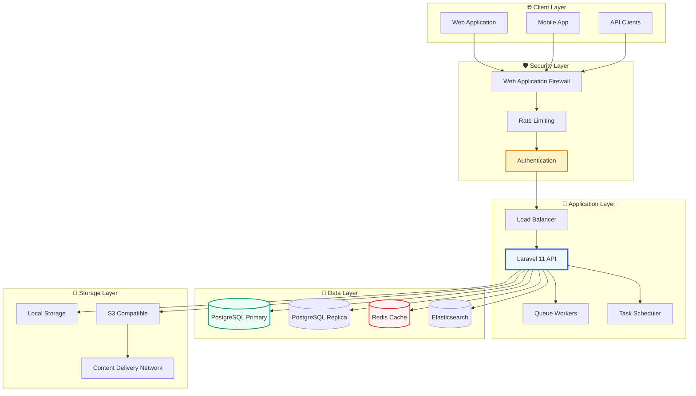

### **🔧 Service Architecture**

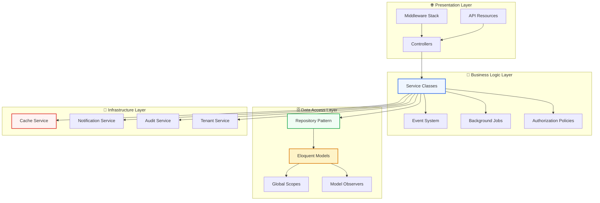

---

## 🗄️ Database Architecture

### **📊 Entity Relationship Diagram**

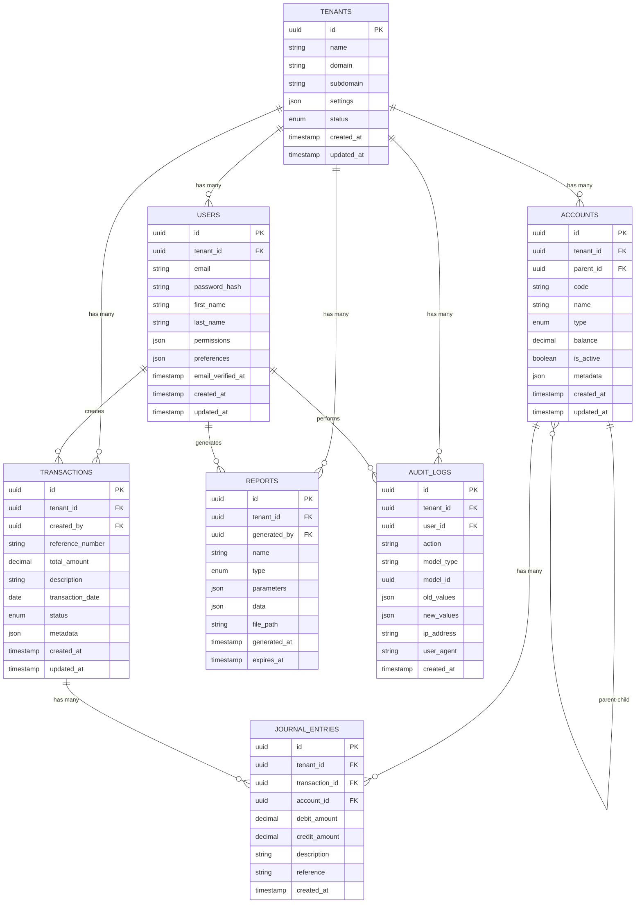

### **🔍 Database Indexing Strategy**

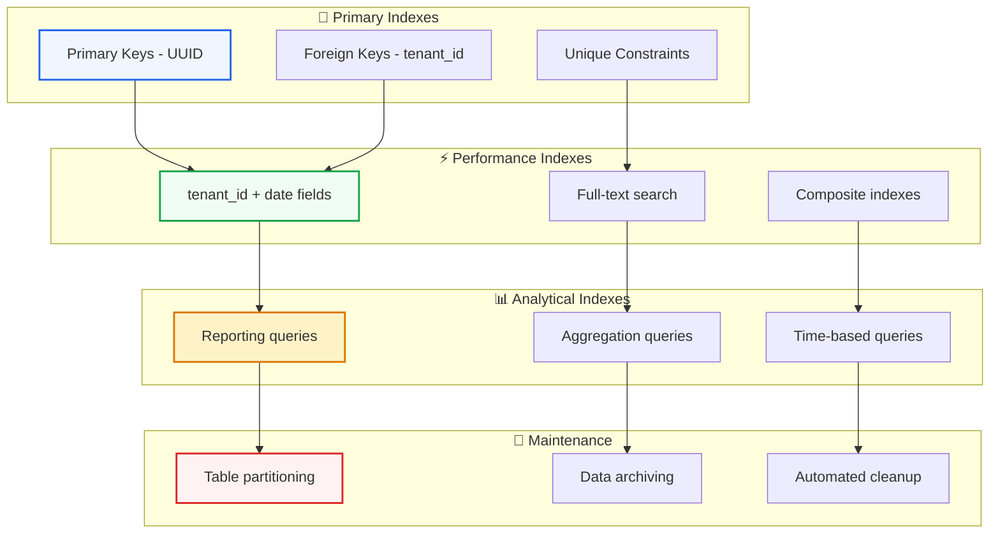

---

## 🔄 Data Flow Diagrams

### **💰 Transaction Processing Flow**

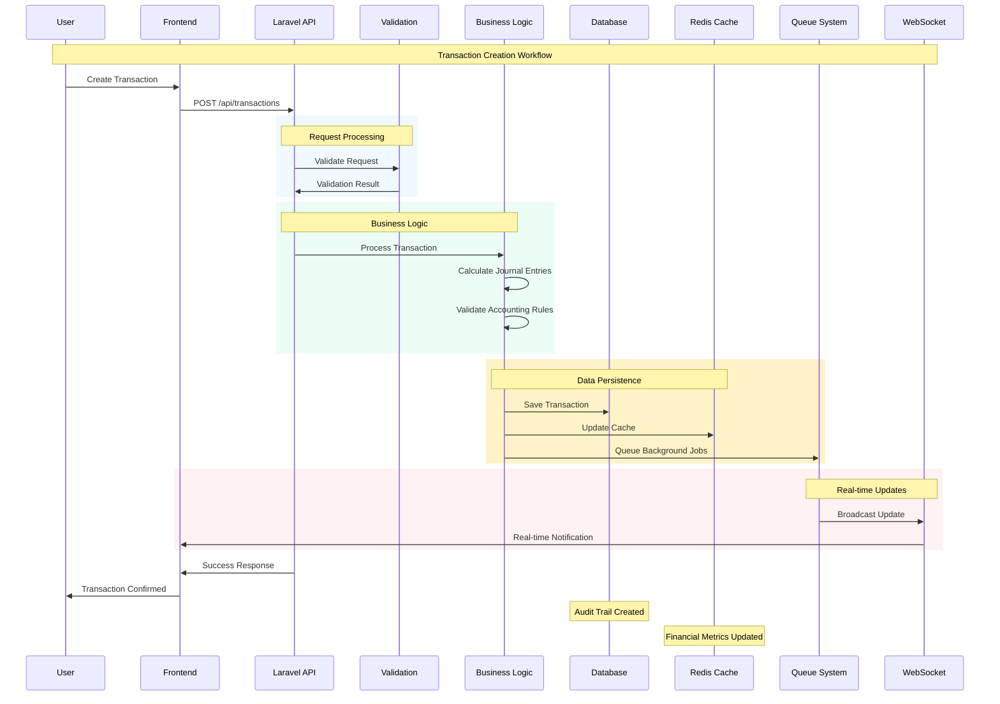

### **📊 Report Generation Flow**

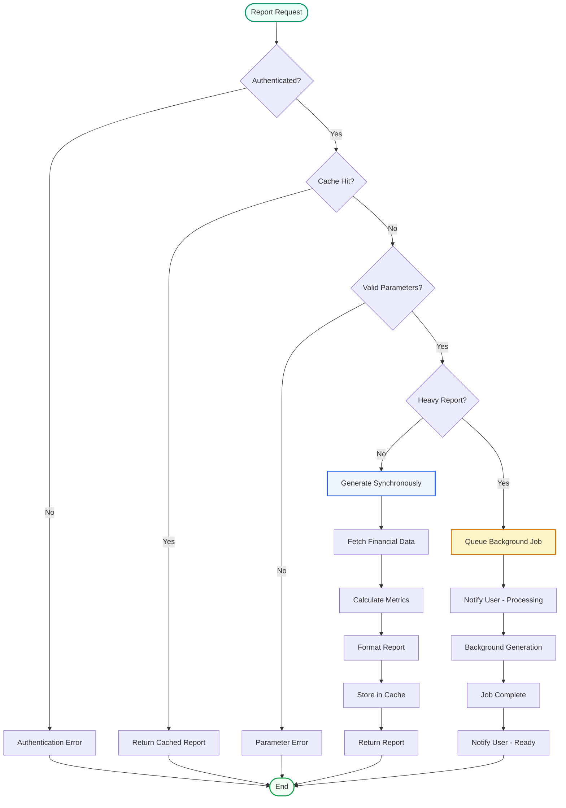

---

## 🏢 Multi-Tenant Architecture

### **🔧 Tenant Isolation Model**

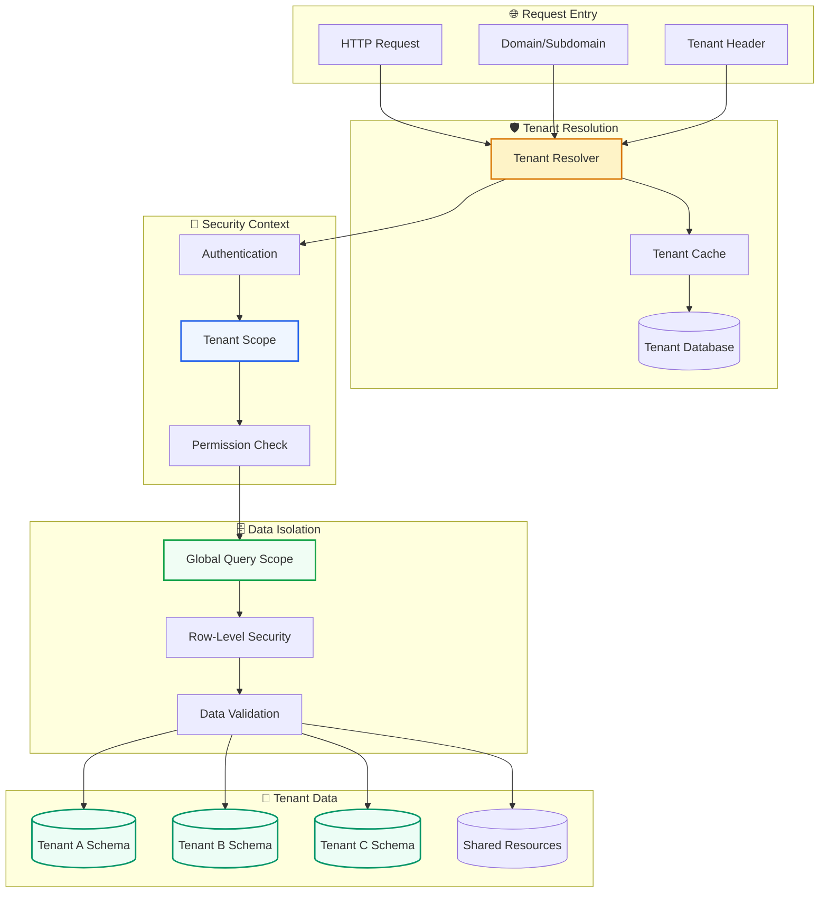

### **🏗️ Multi-Tenant Database Strategy**

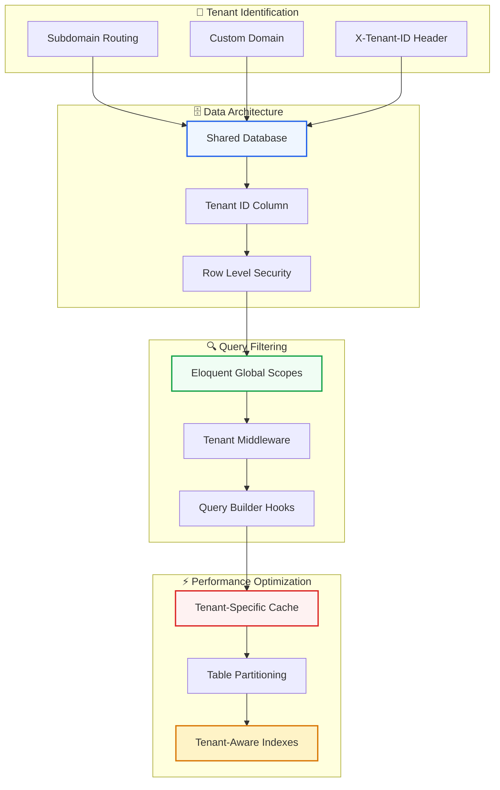

---

## 🔐 Security Architecture

### **🛡️ Authentication & Authorization Flow**

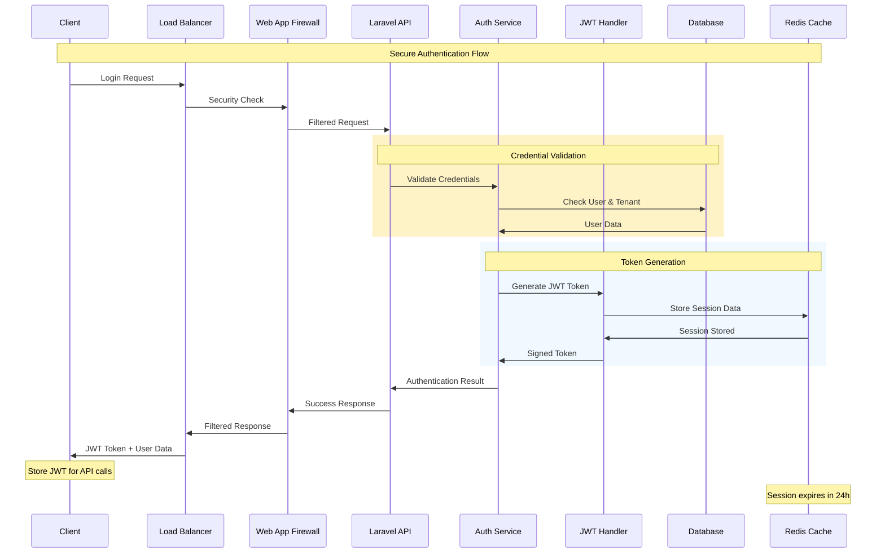

### **🔒 Security Layers**

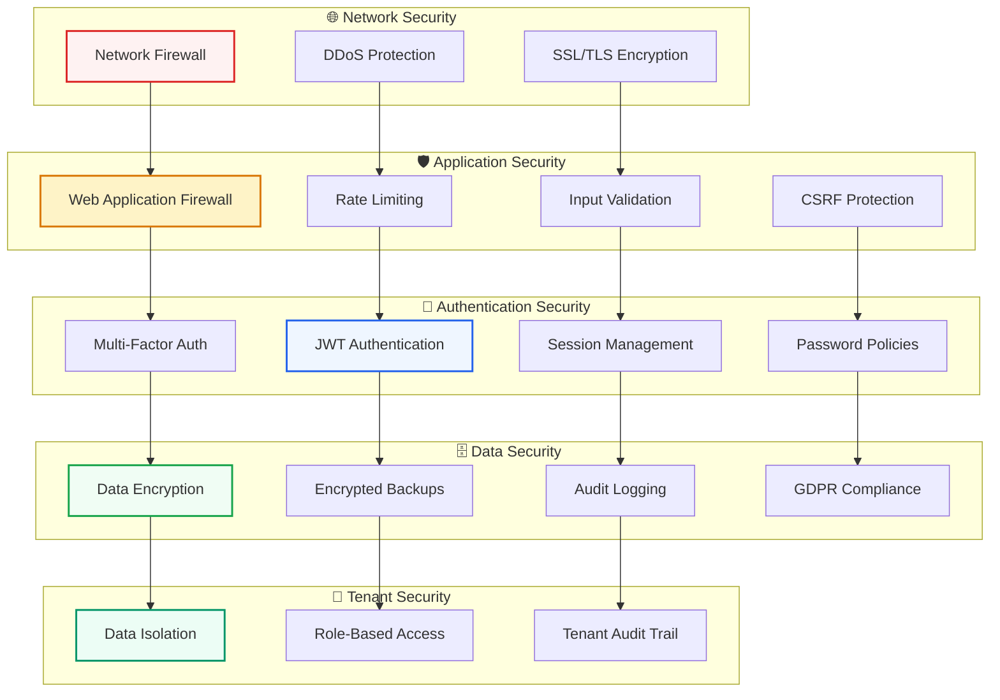

---

## ⚡ Performance Architecture

### **🚀 Caching Strategy**

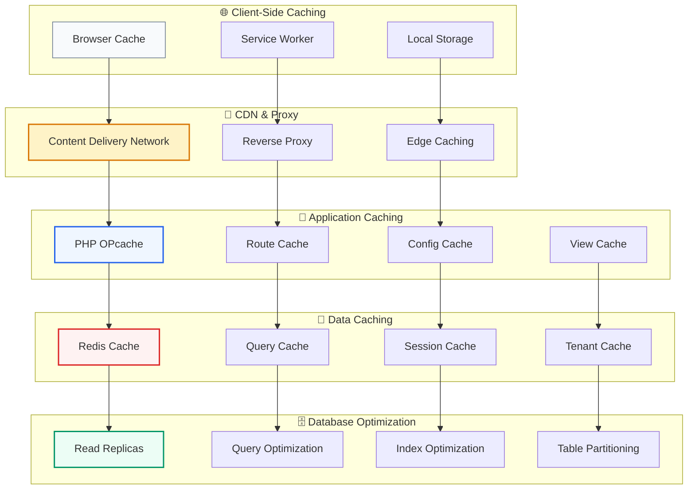

### **📊 Performance Monitoring**

```mermaid
graph TB
    subgraph "📈 Application Metrics"
        RESPONSE_TIME[Response Time]
        THROUGHPUT[Request Throughput]
        ERROR_RATE[Error Rate]
        UPTIME[System Uptime]
    end
    
    subgraph "💾 Database Metrics"
        QUERY_TIME[Query Performance]
        CONNECTION_POOL[Connection Pool]
        SLOW_QUERIES[Slow Query Log]
        DEADLOCKS[Deadlock Detection]
    end
    
    subgraph "⚡ Cache Metrics"
        HIT_RATIO[Cache Hit Ratio]
        MEMORY_USAGE[Memory Usage]
        EVICTION_RATE[Eviction Rate]
        KEY_DISTRIBUTION[Key Distribution]
    end
    
    subgraph "🏢 Business Metrics"
        TENANT_USAGE[Tenant Usage]
        FEATURE_ADOPTION[Feature Adoption]
        USER_ACTIVITY[User Activity]
        FINANCIAL_VOLUME[Transaction Volume]
    end
    
    subgraph "🔔 Alerting System"
        THRESHOLD[Threshold Alerts]
        ANOMALY[Anomaly Detection]
        ESCALATION[Alert Escalation]
        NOTIFICATION[Notification Channels]
    end
    
    RESPONSE_TIME --> THRESHOLD
    THROUGHPUT --> ANOMALY
    ERROR_RATE --> ESCALATION
    UPTIME --> NOTIFICATION
    
    QUERY_TIME --> THRESHOLD
    CONNECTION_POOL --> ANOMALY
    SLOW_QUERIES --> ESCALATION
    DEADLOCKS --> NOTIFICATION
    
    HIT_RATIO --> THRESHOLD
    MEMORY_USAGE --> ANOMALY
    EVICTION_RATE --> ESCALATION
    KEY_DISTRIBUTION --> NOTIFICATION
    
    TENANT_USAGE --> THRESHOLD
    FEATURE_ADOPTION --> ANOMALY
    USER_ACTIVITY --> ESCALATION
    FINANCIAL_VOLUME --> NOTIFICATION
    
    style RESPONSE_TIME fill:#eff6ff,stroke:#2563eb,stroke-width:2px
    style QUERY_TIME fill:#ecfdf5,stroke:#059669,stroke-width:2px
    style HIT_RATIO fill:#fef2f2,stroke:#dc2626,stroke-width:2px
    style TENANT_USAGE fill:#fef3c7,stroke:#d97706,stroke-width:2px
    style THRESHOLD fill:#f0f9ff,stroke:#0369a1,stroke-width:2px
```

---

## 🚀 Deployment Architecture

### **☁️ Cloud Infrastructure**

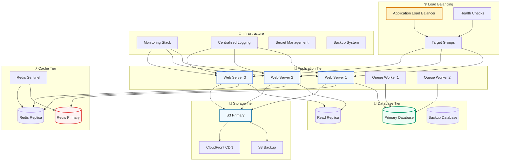

### **🔄 CI/CD Pipeline**

```mermaid
flowchart LR
    subgraph "📝 Development"
        DEV[Developer]
        GIT[Git Repository]
        BRANCH[Feature Branch]
    end
    
    subgraph "🧪 Testing"
        UNIT[Unit Tests]
        INTEGRATION[Integration Tests]
        E2E[E2E Tests]
        SECURITY[Security Scan]
    end
    
    subgraph "🏗️ Build"
        BUILD[Build Assets]
        DOCKER[Docker Image]
        REGISTRY[Container Registry]
    end
    
    subgraph "🚀 Deployment"
        STAGING[Staging Environment]
        PRODUCTION[Production Environment]
        ROLLBACK[Rollback Strategy]
    end
    
    subgraph "📊 Monitoring"
        HEALTH[Health Checks]
        METRICS[Performance Metrics]
        ALERTS[Alert System]
    end
    
    DEV --> GIT
    GIT --> BRANCH
    BRANCH --> UNIT
    
    UNIT --> INTEGRATION
    INTEGRATION --> E2E
    E2E --> SECURITY
    
    SECURITY --> BUILD
    BUILD --> DOCKER
    DOCKER --> REGISTRY
    
    REGISTRY --> STAGING
    STAGING --> PRODUCTION
    PRODUCTION --> ROLLBACK
    
    PRODUCTION --> HEALTH
    HEALTH --> METRICS
    METRICS --> ALERTS
    
    style DEV fill:#f8fafc,stroke:#64748b,stroke-width:1px
    style UNIT fill:#ecfdf5,stroke:#059669,stroke-width:2px
    style BUILD fill:#eff6ff,stroke:#2563eb,stroke-width:2px
    style PRODUCTION fill:#fef3c7,stroke:#d97706,stroke-width:2px
    style HEALTH fill:#f0fdf4,stroke:#16a34a,stroke-width:2px
```

---

**Built with professional architecture design principles for enterprise-grade Laravel applications**

*Clean, consistent, and comprehensive visual documentation for complex system architecture.*
