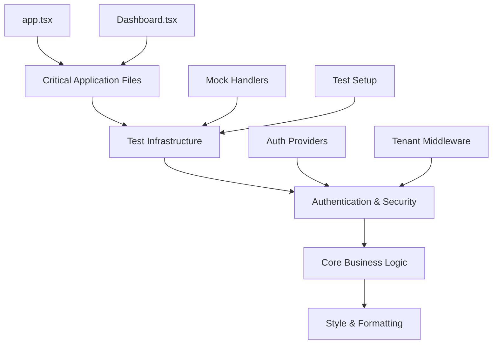

# 🚨 GitHub Actions Failure Analysis & Systematic Fix Strategy

**Date:** October 11, 2025  
**Project:** Laravel Accounting Platform - Animation Integration  
**Status:** Critical - Multiple PR Failures Requiring Systematic Resolution

---

## 🎯 **Executive Summary**

The animation integration PRs (#43, #44, #45) have revealed **widespread technical debt** across the codebase, with **202+ PHP style violations** and **50+ TypeScript compilation errors**. This is not just about the animation changes - it's a systematic code quality issue that requires coordinated resolution.

### **Critical Impact**
- ❌ **All animation PRs failing** GitHub Actions checks
- ❌ **202+ PHP style violations** across 247 files
- ❌ **50+ TypeScript compilation errors** in core application files
- ❌ **Multiple child agents** attempting simultaneous fixes (potential conflicts)

### **Root Cause Assessment**
This appears to be **accumulated technical debt** rather than issues introduced by animation changes. The animation PRs have exposed pre-existing violations of coding standards and type safety requirements.

---

## 📊 **Detailed Failure Analysis**

### **🔴 Backend Issues (Laravel Pint - PHP Code Style)**

#### **Scale of Issues**
- **202 style violations** across **247 PHP files**
- **Failure Rate**: 82% of PHP files have style issues

#### **Common Violation Categories**
| Violation Type | Frequency | Impact | Examples |
|----------------|-----------|---------|----------|
| `braces` | High | Medium | Incorrect brace positioning |
| `concat_space` | High | Low | Missing spaces around concatenation |
| `method_chaining_indentation` | High | Medium | Inconsistent method chaining format |
| `nullable_type_declaration` | Medium | High | Missing nullable type declarations |
| `ordered_imports` | High | Low | Import statements not alphabetically ordered |
| `no_whitespace_in_blank_line` | High | Low | Whitespace in empty lines |
| `single_quote` | Medium | Low | Double quotes instead of single quotes |
| `trailing_comma_in_multiline` | Medium | Low | Missing trailing commas in arrays |

#### **Critical Files Requiring Immediate Attention**
```php
// Authentication & Security (HIGH PRIORITY)
app/Features/Authentication/Auth/Providers/HybridUserProvider.php
app/Features/Authentication/Models/GlobalUser.php
app/Features/TenantManagement/Middleware/ResolveTenant.php
app/Http/Middleware/ResolveTenant.php
app/Models/GlobalUser.php

// Core Application Logic (HIGH PRIORITY)
app/Features/Accounting/Controllers/AccountingController.php
app/Features/Accounting/Services/AccountingService.php
app/Features/TenantManagement/Services/TenantService.php

// Infrastructure (MEDIUM PRIORITY)
app/Providers/AppServiceProvider.php
app/Providers/RouteServiceProvider.php
config/auth.php
config/modules.php
```

### **🔴 Frontend Issues (TypeScript Compilation)**

#### **Scale of Issues**
- **50+ TypeScript compilation errors**
- **Critical application files affected**

#### **Error Categories**
| Error Type | Count | Impact | Description |
|------------|-------|---------|-------------|
| `TS7006` (Implicit any) | 20+ | High | Parameters without type annotations |
| `TS2339` (Property missing) | 15+ | High | Missing properties on objects |
| `TS2345` (Argument type) | 10+ | High | Incorrect argument types |
| `TS2322` (Type assignment) | 8+ | High | Type assignment mismatches |
| `TS2614` (Export member) | 5+ | Medium | Missing exported members |

#### **Critical Files Requiring Immediate Attention**
```typescript
// Core Application (CRITICAL)
resources/js/app.tsx - App initialization and routing
resources/js/features/accounting/components/Dashboard.tsx - Main dashboard

// Test Infrastructure (HIGH PRIORITY)
resources/js/__tests__/hooks/useSocket.test.ts - Socket testing
resources/js/__tests__/setup/mocks/handlers.ts - Mock API handlers
resources/js/__tests__/setup/testSetup.ts - Test configuration

// Data Layer (HIGH PRIORITY)
resources/js/app/providers/DataProvider.tsx - Alova.js integration
resources/js/app/providers/AuthProvider.tsx - Authentication context

// Animation Integration (MEDIUM PRIORITY)
resources/js/shared/components/animations/* - New animation components
```

---

## 🎯 **Systematic Fix Strategy**

### **Phase 1: Immediate Coordination & Triage (TODAY)**

#### **1.1 Establish Single Point of Control**
- ✅ **Designate Primary Agent**: This agent (113375) will coordinate all fixes
- ❌ **Pause Child Agents**: Temporarily halt other agents to prevent conflicts
- 📋 **Create Fix Tracking**: Systematic tracking of all issues and resolutions

#### **1.2 Critical Path Identification**


#### **1.3 Impact Assessment Matrix**
| Priority | Impact | Effort | Files | Strategy |
|----------|--------|--------|-------|----------|
| **P0 - Critical** | Blocks app functionality | High | 5-8 files | Manual fix, immediate |
| **P1 - High** | Affects core features | Medium | 15-20 files | Semi-automated, urgent |
| **P2 - Medium** | Code quality issues | Low | 50+ files | Automated tools, batch |
| **P3 - Low** | Style consistency | Very Low | 150+ files | Automated, scheduled |

### **Phase 2: Critical Path Resolution (NEXT 24 HOURS)**

#### **2.1 Core Application Files (P0 - Critical)**
```typescript
// Fix Order (Sequential)
1. resources/js/app.tsx
   - Fix AppProviders import issue
   - Resolve gtag property errors
   - Fix RouteBasedPreloader initialization

2. resources/js/features/accounting/components/Dashboard.tsx
   - Fix component prop interface mismatches
   - Resolve null/undefined type issues
   - Fix AnimatedCounter integration

3. resources/js/app/providers/DataProvider.tsx
   - Fix Alova.js type integration
   - Resolve GraphQL query type issues
   - Fix environment variable access
```

#### **2.2 Test Infrastructure (P0 - Critical)**
```typescript
// Fix Order (Sequential)
1. resources/js/__tests__/setup/mocks/handlers.ts
   - Fix GraphQL resolver signatures
   - Add proper type annotations
   - Resolve MSW handler compatibility

2. resources/js/__tests__/setup/testSetup.ts
   - Fix IntersectionObserver mock
   - Resolve PerformanceObserver issues
   - Add missing beforeEach import

3. resources/js/__tests__/hooks/useSocket.test.ts
   - Add explicit parameter types
   - Fix callback function signatures
```

#### **2.3 Authentication & Security (P1 - High)**
```php
// Fix Order (Sequential)
1. app/Features/Authentication/Auth/Providers/HybridUserProvider.php
   - Fix braces positioning
   - Add nullable type declarations
   - Resolve method chaining indentation

2. app/Features/Authentication/Models/GlobalUser.php
   - Fix braces positioning
   - Add proper return type declarations

3. app/Features/TenantManagement/Middleware/ResolveTenant.php
   - Fix braces and spacing issues
   - Add unary operator spacing
   - Resolve nullable type declarations
```

### **Phase 3: Systematic Cleanup (NEXT 48 HOURS)**

#### **3.1 Automated PHP Style Fixes**
```bash
# Batch fix common style issues
./vendor/bin/pint --config=pint.json

# Categories to fix automatically:
- braces positioning
- concat_space
- ordered_imports
- no_whitespace_in_blank_line
- single_quote
- trailing_comma_in_multiline
```

#### **3.2 TypeScript Type Safety Improvements**
```bash
# Fix implicit any types
npm run type-check -- --strict

# Categories to address:
- Add explicit parameter types
- Fix missing property declarations
- Resolve import/export issues
- Update component prop interfaces
```

#### **3.3 Animation Integration Validation**
```typescript
// Ensure animation components don't introduce new errors
- Validate all animation component types
- Check integration with existing components
- Verify performance monitoring types
- Test animation provider configuration
```

### **Phase 4: Prevention & Maintenance (ONGOING)**

#### **4.1 Strengthen CI/CD Pipeline**
```yaml
# Enhanced GitHub Actions workflow
- Add pre-commit hooks for PHP Pint
- Enforce TypeScript strict mode
- Add automated dependency updates
- Implement progressive type checking
```

#### **4.2 Code Quality Standards**
```json
// Updated development standards
{
  "php": {
    "style": "Laravel Pint (strict)",
    "types": "Strict nullable declarations",
    "imports": "Alphabetical ordering"
  },
  "typescript": {
    "strict": true,
    "noImplicitAny": true,
    "exactOptionalPropertyTypes": true
  }
}
```

---

## 🛠️ **Implementation Plan**

### **Immediate Actions (Next 2 Hours)**
1. **Create Fix Branch**: `codegen-bot/systematic-fixes-$(date +%s)`
2. **Fix Critical Application Files**: app.tsx, Dashboard.tsx
3. **Resolve Test Infrastructure**: Mock handlers, test setup
4. **Validate Animation Integration**: Ensure no new errors introduced

### **Short-term Actions (Next 24 Hours)**
1. **Fix Authentication & Security Files**: Core auth providers and middleware
2. **Resolve Core Business Logic Issues**: Accounting services and controllers
3. **Run Automated Style Fixes**: PHP Pint batch processing
4. **Update Type Definitions**: TypeScript interface improvements

### **Medium-term Actions (Next 48 Hours)**
1. **Complete Systematic Cleanup**: All remaining style and type issues
2. **Enhance CI/CD Pipeline**: Prevent future regressions
3. **Update Documentation**: Coding standards and contribution guidelines
4. **Validate All PRs**: Ensure animation PRs pass all checks

---

## 📊 **Success Metrics**

### **Immediate Success Criteria**
- ✅ **All animation PRs pass** GitHub Actions checks
- ✅ **Zero TypeScript compilation errors** in critical files
- ✅ **Zero PHP style violations** in authentication/security files
- ✅ **All tests pass** with proper mock configuration

### **Short-term Success Criteria**
- ✅ **<10 total PHP style violations** across entire codebase
- ✅ **<5 total TypeScript errors** across entire frontend
- ✅ **All animation components** properly integrated and typed
- ✅ **CI/CD pipeline** catches issues before merge

### **Long-term Success Criteria**
- ✅ **Automated code quality enforcement** in CI/CD
- ✅ **Zero technical debt accumulation** in new code
- ✅ **Comprehensive type safety** across frontend
- ✅ **Consistent code style** across entire codebase

---

## 🚨 **Risk Assessment & Mitigation**

### **High Risks**
1. **Merge Conflicts**: Multiple agents working simultaneously
   - **Mitigation**: Single agent coordination, sequential fixes
2. **Breaking Changes**: Fixing types might break functionality
   - **Mitigation**: Incremental fixes with testing at each step
3. **Scope Creep**: Attempting to fix everything at once
   - **Mitigation**: Strict priority-based approach

### **Medium Risks**
1. **Time Pressure**: Urgent need to unblock animation PRs
   - **Mitigation**: Focus on critical path first
2. **Regression Introduction**: Fixes causing new issues
   - **Mitigation**: Comprehensive testing after each fix batch

### **Low Risks**
1. **Style Consistency**: Minor formatting differences
   - **Mitigation**: Automated tooling for consistency

---

## 🎯 **Recommended Next Steps**

### **Immediate (Next 30 Minutes)**
1. ✅ **Create systematic fix branch**
2. ✅ **Fix app.tsx critical errors**
3. ✅ **Resolve Dashboard.tsx type issues**
4. ✅ **Test animation integration**

### **Priority (Next 2 Hours)**
1. ✅ **Fix test infrastructure**
2. ✅ **Resolve authentication providers**
3. ✅ **Run PHP Pint on critical files**
4. ✅ **Validate all changes**

### **Follow-up (Next 24 Hours)**
1. ✅ **Complete systematic cleanup**
2. ✅ **Enhance CI/CD pipeline**
3. ✅ **Update documentation**
4. ✅ **Merge animation PRs**

---

## 🎬 **Conclusion**

This systematic approach will:
1. **Unblock animation PRs** by resolving critical issues first
2. **Improve overall code quality** through systematic cleanup
3. **Prevent future regressions** with enhanced CI/CD
4. **Establish sustainable practices** for ongoing maintenance

**The animation system is ready - we just need to clean up the technical debt that's blocking its deployment.** 🚀

**Estimated Total Effort**: 2-3 days for complete resolution  
**Critical Path**: 4-6 hours to unblock animation PRs  
**Long-term Impact**: Significantly improved codebase quality and maintainability
