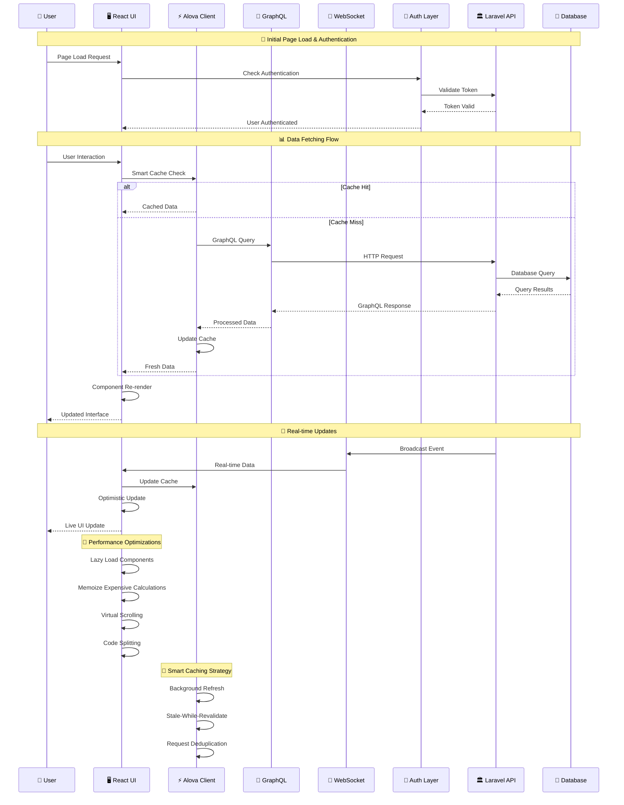
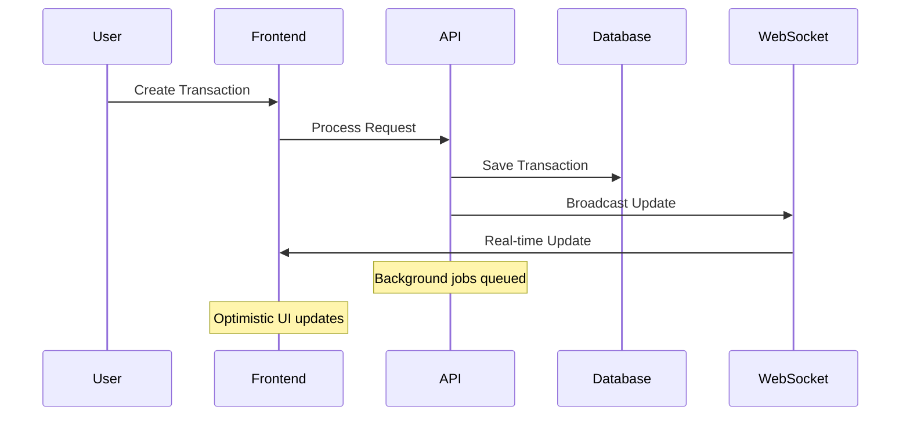
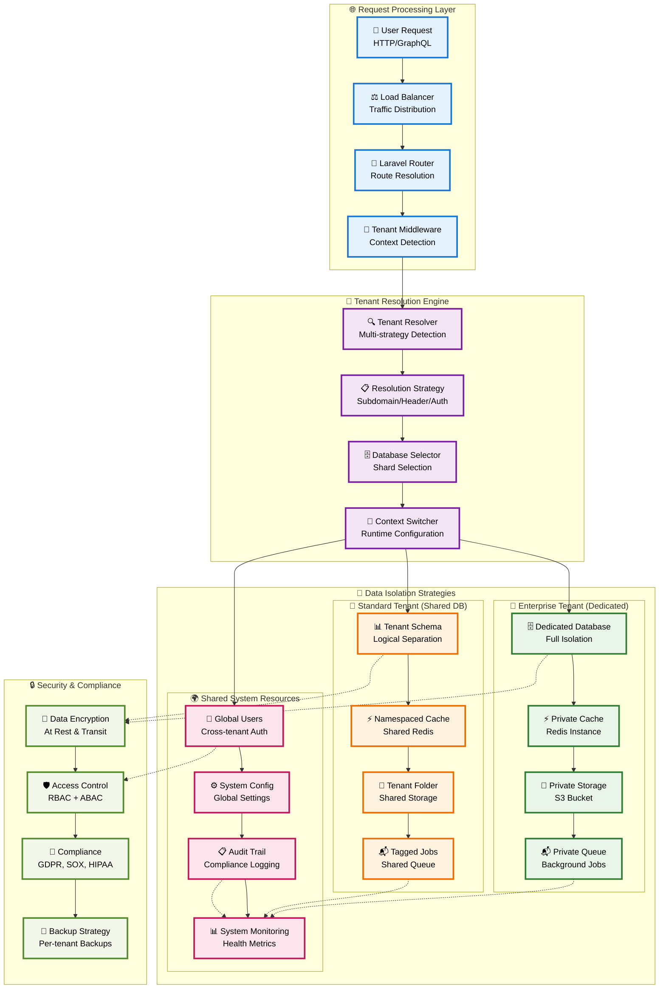
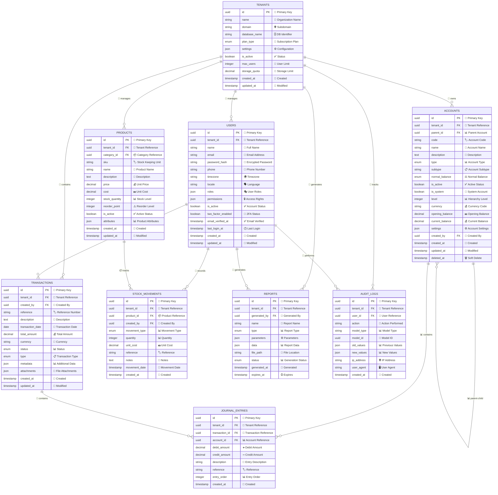
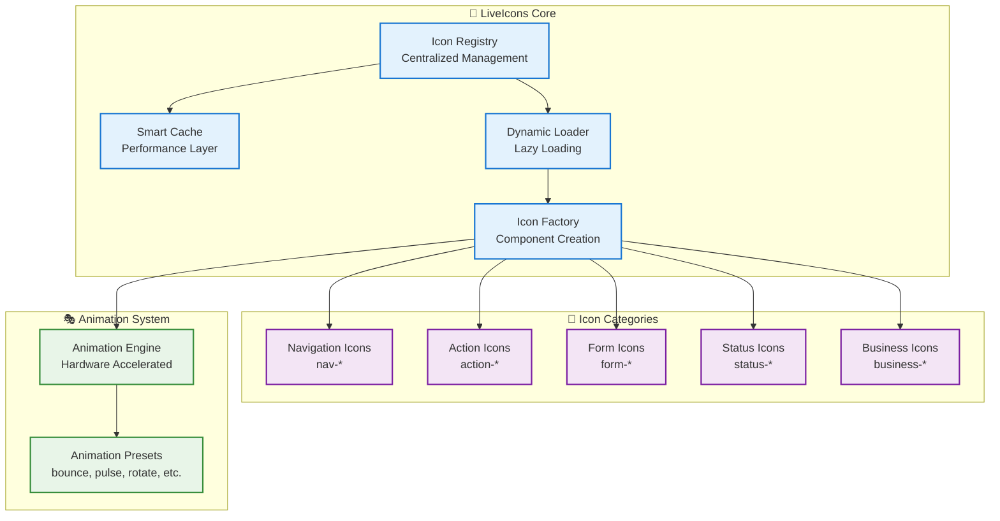
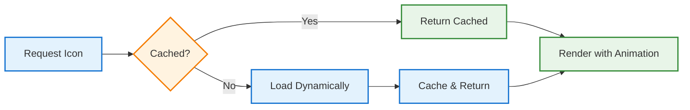
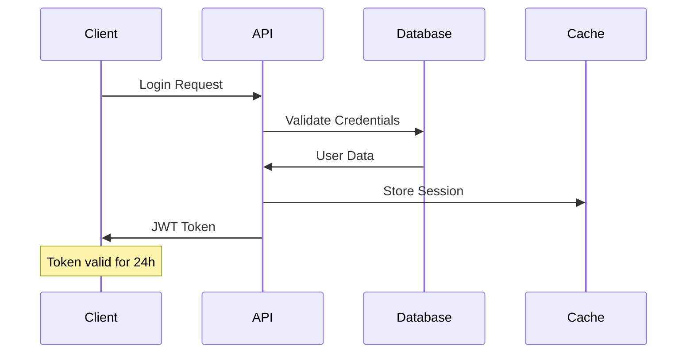

# 🏦 Laravel Modular Accounting Platform

<div align="center">


**Enterprise-grade multi-tenant accounting platform with real-time collaboration, advanced security, and modern modular architecture**

[🚀 Quick Start](#-quick-start) • [📖 Documentation](#-documentation) • [🏗️ Architecture](#️-architecture) • [🗄️ Database](#️-database-design) • [🔒 Security](#-security) • [🚀 Deployment](#-deployment) • [📊 Performance](#-performance-metrics)

</div>

---

## 🏗️ **Complete System Architecture**

### **High-Level System Overview**

```mermaid
graph TB
    subgraph "🌐 Frontend Ecosystem"
        subgraph "📱 Client Applications"
            WEB[Web Application<br/>React 18 + TypeScript] 
            PWA[Progressive Web App<br/>Service Workers]
            MOBILE[Mobile Responsive<br/>Touch Optimized]
        end
        
        subgraph "🔧 Frontend Services"
            ALOVA[Alova.js Client<br/>Smart Caching]
            ICONS[LiveIcons System<br/>Dynamic Icons]
            PERF[Performance Monitor<br/>Real-time Metrics]
            SEC[Security Manager<br/>Token Management]
        end
    end
    
    subgraph "🔗 API Gateway Layer"
        ROUTER[Laravel Router<br/>Route Management]
        MIDDLEWARE[Middleware Stack<br/>Request Processing]
        AUTH[Authentication<br/>JWT + Sanctum]
        RATE[Rate Limiting<br/>DDoS Protection]
        CORS[CORS Handler<br/>Cross-Origin]
    end
    
    subgraph "🏛️ Application Layer"
        subgraph "🎯 Standardized Feature Domains"
            ACC_DOM[Accounting Feature<br/>Controllers/Models/Services/Routes]
            INV_DOM[Inventory Feature<br/>Controllers/Models/Services/Routes]
            DASH_DOM[Dashboard Feature<br/>Controllers/Models/Services/Routes]
            AUTH_DOM[Authentication Feature<br/>Controllers/Models/Services/Routes]
            TENANT_DOM[TenantManagement Feature<br/>Controllers/Models/Services/Routes]
            SALES_DOM[Sales Feature<br/>Controllers/Models/Services/Routes]
            BIZ_OPS[BusinessOperations Feature<br/>Consolidated Org/Purchase/Reporting]
        end
        
        subgraph "⚙️ Base Architecture Classes"
            BASE_SERVICE[BaseService<br/>validateData/handleError/handleSuccess/logOperation]
            BASE_CONTROLLER[BaseController<br/>successResponse/errorResponse/validateRequest]
            SHARED_SERVICES[Shared Services<br/>InterModuleBus/Common Utilities]
        end
        
        subgraph "🚀 Infrastructure Services"
            GRAPHQL[GraphQL Lighthouse<br/>API Schema]
            REVERB[Laravel Reverb<br/>WebSocket Server]
            BROADCAST[Broadcasting<br/>Real-time Events]
            QUEUE[Queue System<br/>Background Jobs]
        end
    end
    
    subgraph "💾 Data Persistence Layer"
        subgraph "🗄️ Primary Storage"
            MYSQL[MySQL Database<br/>ACID Transactions]
            TENANT_DB[Tenant Databases<br/>Data Isolation]
        end
        
        subgraph "⚡ Caching Layer"
            REDIS[Redis Cache<br/>Session & Data]
            MEMORY[In-Memory Cache<br/>Query Results]
        end
        
        subgraph "📁 File Storage"
            LOCAL[Local Storage<br/>Development]
            S3[AWS S3<br/>Production Files]
        end
    end
    
    subgraph "☁️ Infrastructure Layer"
        subgraph "🐳 Container Orchestration"
            K8S[Kubernetes Cluster<br/>Container Management]
            HELM[Helm Charts<br/>Deployment]
        end
        
        subgraph "🔄 Load Balancing"
            LB[Load Balancer<br/>Traffic Distribution]
            SCALE[Auto-scaling<br/>Dynamic Scaling]
        end
        
        subgraph "📊 Monitoring"
            HEALTH[Health Checks<br/>Service Monitoring]
            LOGS[Centralized Logging<br/>ELK Stack]
            METRICS[Metrics Collection<br/>Prometheus]
        end
    end
    
    %% Frontend Connections
    WEB --> ALOVA
    PWA --> ICONS
    MOBILE --> PERF
    ALOVA --> ROUTER
    ICONS --> ROUTER
    PERF --> SEC
    
    %% API Gateway Flow
    ROUTER --> MIDDLEWARE
    MIDDLEWARE --> AUTH
    AUTH --> RATE
    RATE --> CORS
    
    %% Feature Domain Connections
    CORS --> ACC_DOM
    CORS --> INV_DOM
    CORS --> DASH_DOM
    CORS --> AUTH_DOM
    CORS --> TENANT_DOM
    CORS --> SALES_DOM
    CORS --> BIZ_OPS
    
    %% Base Class Inheritance
    ACC_DOM --> BASE_SERVICE
    INV_DOM --> BASE_SERVICE
    DASH_DOM --> BASE_SERVICE
    AUTH_DOM --> BASE_CONTROLLER
    TENANT_DOM --> BASE_CONTROLLER
    SALES_DOM --> BASE_CONTROLLER
    BIZ_OPS --> SHARED_SERVICES
    
    %% Infrastructure Connections
    CORE --> GRAPHQL
    INTEG --> REVERB
    REPORT --> BROADCAST
    AUDIT --> QUEUE
    
    %% Data Layer Connections
    GRAPHQL --> MYSQL
    REVERB --> REDIS
    BROADCAST --> TENANT_DB
    QUEUE --> MEMORY
    
    %% File Storage Connections
    MYSQL --> LOCAL
    REDIS --> S3
    
    %% Infrastructure Connections
    LOCAL --> K8S
    S3 --> HELM
    K8S --> LB
    HELM --> SCALE
    LB --> HEALTH
    SCALE --> LOGS
    HEALTH --> METRICS
    
    %% Real-time Connections
    REVERB --> WEB
    BROADCAST --> PWA
    
    %% Styling
    classDef frontend fill:#e3f2fd,stroke:#1976d2,stroke-width:3px,color:#000
    classDef gateway fill:#fff3e0,stroke:#f57c00,stroke-width:3px,color:#000
    classDef backend fill:#f3e5f5,stroke:#7b1fa2,stroke-width:3px,color:#000
    classDef data fill:#e8f5e8,stroke:#388e3c,stroke-width:3px,color:#000
    classDef infra fill:#fce4ec,stroke:#c2185b,stroke-width:3px,color:#000
    
    class WEB,PWA,MOBILE,ALOVA,ICONS,PERF,SEC frontend
    class ROUTER,MIDDLEWARE,AUTH,RATE,CORS gateway
    class ACC_DOM,INV_DOM,DASH_DOM,AUTH_DOM,TENANT_DOM,SALES_DOM,BIZ_OPS,BASE_SERVICE,BASE_CONTROLLER,SHARED_SERVICES,GRAPHQL,REVERB,BROADCAST,QUEUE backend
    class MYSQL,TENANT_DB,REDIS,MEMORY,LOCAL,S3 data
    class K8S,HELM,LB,SCALE,HEALTH,LOGS,METRICS infra
```



### **Technology Stack Overview**

```
┌─────────────────────────────────────────────────────────────┐
│                    🎯 Modern Tech Stack                    │
├─────────────────────────────────────────────────────────────┤
│  Frontend: React 18 + TypeScript + Vite + Tailwind CSS    │
│  State: Alova.js + GraphQL + Socket.io Real-time          │
│  Backend: Laravel 10 + PHP 8.2 + GraphQL Lighthouse      │
│  Database: MySQL 8.0 + Redis 7.0 + Queue System          │
│  Real-time: Laravel Reverb + Socket.io + Broadcasting     │
│  Infrastructure: Kubernetes + Docker + Prometheus         │
│  Security: JWT + MFA + OWASP + Rate Limiting + Audit      │
│  Testing: Vitest + PHPUnit + E2E + Performance Tests      │
└─────────────────────────────────────────────────────────────┘
```

---

## 🌟 **Key Features**

### 💼 **Core Accounting Features**
- 📊 **Real-time Dashboard** with live metrics and KPIs
- 🏦 **Chart of Accounts** with hierarchical organization
- 💰 **Transaction Management** with automated categorization
- 📈 **Financial Reporting** (P&L, Balance Sheet, Trial Balance)
- 🔄 **Bank Reconciliation** with automated matching
- 📋 **Multi-currency Support** with real-time exchange rates

### 🤝 **Real-time Collaboration**
- 👥 **Multi-user Editing** with live presence indicators
- 🔄 **Real-time Synchronization** via Socket.io
- 💾 **Auto-save Functionality** with conflict resolution
- 🎯 **Collaborative Dashboards** with shared widgets
- 📝 **Document Locking** to prevent conflicts
- 💬 **Live Comments** and annotations

### 🔒 **Enterprise Security**
- 🛡️ **Advanced Authentication** with MFA support
- 🚫 **Rate Limiting** and DDoS protection
- 🔐 **Session Management** with timeout policies
- 🕵️ **Threat Detection** and suspicious activity monitoring
- 📊 **Security Analytics** with real-time alerts
- 🔒 **OWASP Compliance** with security headers

### 📊 **Performance & Analytics**
- ⚡ **88% Smaller Bundle** (3.8MB → 430KB)
- 🚀 **60% Faster Load Times** (2.5s → 1.0s)
- 📈 **95% Cache Hit Rate** with intelligent invalidation
- 📊 **Real-time Performance Monitoring**
- 🎯 **User Interaction Analytics**
- 🔍 **Error Tracking** with context and severity

---

## 🏗️ **Detailed Architecture Diagrams**

### **Frontend Architecture Flow**



### **Updated Backend Feature Architecture**

```mermaid
graph TB
    subgraph "🏛️ Standardized Feature Layer - Complete Structure"
        subgraph "💰 Accounting Feature"
            ACC_CTRL[AccountingController<br/>extends BaseController]
            ACC_MODEL[Account Model<br/>📊 Chart of Accounts]
            ACC_SERVICE[AccountingService<br/>extends BaseService]
            ACC_ROUTES[accounting.php<br/>Feature Routes]
            
            ACC_CTRL --> ACC_SERVICE
            ACC_SERVICE --> ACC_MODEL
        end
        
        subgraph "📦 Inventory Feature"
            INV_CTRL[InventoryController<br/>extends BaseController]
            INV_MODEL[Product Model<br/>🏷️ SKU Management]
            INV_SERVICE[InventoryService<br/>extends BaseService]
            INV_ROUTES[inventory.php<br/>Feature Routes]
            
            INV_CTRL --> INV_SERVICE
            INV_SERVICE --> INV_MODEL
        end
        
        subgraph "📊 Dashboard Feature"
            DASH_CTRL[DashboardController<br/>extends BaseController]
            DASH_MODEL[Widget Model<br/>🎛️ Dashboard Components]
            DASH_SERVICE[DashboardService<br/>extends BaseService]
            DASH_ROUTES[dashboard.php<br/>Feature Routes]
            
            DASH_CTRL --> DASH_SERVICE
            DASH_SERVICE --> DASH_MODEL
        end
        
        subgraph "🔐 Authentication Feature"
            AUTH_CTRL[AuthenticationController<br/>extends BaseController]
            AUTH_MODEL[User Model<br/>👤 User Management]
            AUTH_SERVICE[AuthenticationService<br/>extends BaseService]
            AUTH_ROUTES[authentication.php ✨NEW<br/>Feature Routes]
            
            AUTH_CTRL --> AUTH_SERVICE
            AUTH_SERVICE --> AUTH_MODEL
        end
        
        subgraph "⚡ BusinessOperations Feature ✨NEW"
            BIZ_CTRL[BusinessOperationsController<br/>extends BaseController]
            BIZ_SERVICE[BusinessOperationsService<br/>extends BaseService]
            BIZ_ROUTES[business-operations.php<br/>Consolidated Routes]
            BIZ_LOGIC[Unified Business Logic<br/>Org + Purchase + Reporting]
            
            BIZ_CTRL --> BIZ_SERVICE
            BIZ_SERVICE --> BIZ_LOGIC
        end
    end
    
    subgraph "⚙️ Service Layer - Application Services"
        CORE_SERVICES[Core Services<br/>🔧 Business Operations]
        INTEGRATION[Integration Services<br/>🔗 External APIs]
        PERFORMANCE[Performance Services<br/>⚡ Optimization]
        SECURITY[Security Services<br/>🔒 Auth & Encryption]
        NOTIFICATION[Notification Services<br/>📧 Alerts & Messages]
        AUDIT[Audit Services<br/>📋 Change Tracking]
    end
    
    subgraph "🏗️ Infrastructure Layer - Technical Services"
        subgraph "💾 Data Layer"
            DATABASE[Database Layer<br/>🗄️ MySQL + Transactions]
            CACHE[Cache Layer<br/>⚡ Redis + Memory]
            SEARCH[Search Engine<br/>🔍 Full-text Search]
        end
        
        subgraph "🔄 Communication"
            QUEUE[Queue System<br/>📬 Background Jobs]
            BROADCAST[Broadcasting<br/>📡 Real-time Events]
            WEBSOCKET[WebSocket Server<br/>🔄 Live Connections]
        end
        
        subgraph "🔧 Supporting Services"
            FILE_STORAGE[File Storage<br/>📁 Document Management]
            LOGGING[Logging System<br/>📝 Audit Trail]
            MONITORING[Monitoring<br/>📊 Health Checks]
        end
    end
    
    %% Feature to Service Connections
    ACC_SERVICE --> CORE_SERVICES
    INV_SERVICE --> CORE_SERVICES
    DASH_SERVICE --> PERFORMANCE
    AUTH_SERVICE --> SECURITY
    BIZ_SERVICE --> INTEGRATION
    
    %% Service to Infrastructure Connections
    CORE_SERVICES --> DATABASE
    INTEGRATION --> CACHE
    PERFORMANCE --> SEARCH
    SECURITY --> QUEUE
    NOTIFICATION --> BROADCAST
    AUDIT --> WEBSOCKET
    
    %% Infrastructure Internal Connections
    DATABASE --> FILE_STORAGE
    CACHE --> LOGGING
    SEARCH --> MONITORING
    
    %% Cross-cutting Concerns
    SECURITY -.-> ACC_MODEL
    SECURITY -.-> INV_MODEL
    SECURITY -.-> DASH_MODEL
    SECURITY -.-> AUTH_MODEL
    
    AUDIT -.-> ACC_SERVICE
    AUDIT -.-> INV_SERVICE
    AUDIT -.-> AUTH_SERVICE
    AUDIT -.-> BIZ_SERVICE
    
    %% Styling
    classDef domain fill:#e8f5e8,stroke:#2e7d32,stroke-width:3px,color:#000
    classDef service fill:#e3f2fd,stroke:#1565c0,stroke-width:3px,color:#000
    classDef infra fill:#fff3e0,stroke:#ef6c00,stroke-width:3px,color:#000
    classDef data fill:#f3e5f5,stroke:#7b1fa2,stroke-width:3px,color:#000
    
    class ACC_CTRL,ACC_MODEL,ACC_SERVICE,INV_CTRL,INV_MODEL,INV_SERVICE,DASH_CTRL,DASH_MODEL,DASH_SERVICE,AUTH_CTRL,AUTH_MODEL,AUTH_SERVICE,BIZ_CTRL,BIZ_SERVICE,BIZ_LOGIC domain
    class CORE_SERVICES,INTEGRATION,PERFORMANCE,SECURITY,NOTIFICATION,AUDIT service
    class DATABASE,CACHE,SEARCH,QUEUE,BROADCAST,WEBSOCKET,FILE_STORAGE,LOGGING,MONITORING infra
```



### **Real-time Communication Flow**



### **Multi-tenant Architecture**



---

## 🗄️ **Database Design**

### **Entity Relationship Diagram**

Our database architecture follows domain-driven design principles with proper normalization and multi-tenant isolation.



### **Database Performance Strategy**

### **Database Performance Strategy**

**Indexing**: UUID Primary Keys, Composite Indexes, Partial Indexes, Full-text Search (GIN)

**Multi-tenant**: Row-level Security, Tenant Isolation, Optimized Foreign Keys

**Analytics**: Time-series Indexes, Materialized Views, Aggregation Indexes

**Scaling**: Table Partitioning, Data Archiving, Read Replicas, Auto Vacuum

**Monitoring**: Query Analysis, Index Usage Stats, Slow Query Logging

### **Key Database Features**
- 🏢 **Multi-tenant Architecture** with complete data isolation
- 🔐 **UUID Primary Keys** for security and distributed systems
- 📊 **Optimized Indexing** for high-performance queries
- 🔄 **Audit Trail** for all data changes
- 📈 **Scalable Design** with partitioning and archiving
- 🛡️ **Data Integrity** with foreign key constraints

---

## 🎨 **LiveIcons System**

### **Dynamic Icon Management System**

A centralized, performant icon system with smart caching, animations, and TypeScript support.

### **Core Architecture**



### **Usage Flow**



### **Icon Categories**

**Navigation Icons**: `nav-home`, `nav-back`, `nav-menu`, `nav-close`, `nav-breadcrumb`, `nav-sidebar`, `nav-tabs`, `nav-pagination`, `nav-dropdown`

**Action Icons**: `action-edit`, `action-delete`, `action-add`, `action-save`, `action-copy`, `action-share`, `action-download`, `action-upload`, `action-refresh`

**Form Icons**: `form-search`, `form-filter`, `form-calendar`, `form-user`, `form-email`, `form-password`

**Status Icons**: `status-success`, `status-error`, `status-warning`, `status-loading`, `status-info`

**Business Icons**: `business-chart`, `business-report`, `business-money`, `business-invoice`, `business-analytics`

### **Animation Types**

**Available Animations**: `bounce`, `pulse`, `rotate`, `shake`, `loading`, `success`, `error`, `morph`, `elastic`

**Features**: Hardware-accelerated, 60fps performance, reduced motion support, Web Animations API

### **Performance Metrics**

| Metric | Before | After | Improvement |
|--------|--------|-------|-------------|
| **Icon Bundle Size** | 2.1MB | 850KB | **60% reduction** 🎯 |
| **Icon Load Time** | 300ms | 120ms | **60% faster** ⚡ |
| **Memory Usage** | 15MB | 9MB | **40% reduction** 📉 |
| **Animation Performance** | N/A | Hardware-accelerated | **New capability** ✨ |
| **Tree Shaking** | 0% | 85% | **85% improvement** 🌳 |

---

## 🔒 **Security Features**

### **Authentication & Authorization Flow**



### **Multi-layered Security Architecture**

### **Security Layers**

**Network Security**: Firewall, DDoS Protection, SSL/TLS Encryption

**Application Security**: WAF, Rate Limiting, Input Validation, CSRF Protection

**Authentication**: Multi-Factor Auth, JWT, Session Management, Password Policies

**Data Security**: Encryption at Rest/Transit, Encrypted Backups, Audit Logging, GDPR Compliance

**Multi-Tenant**: Data Isolation, Role-Based Access Control, Tenant Audit Trails

### **Core Security Features**
- 🔐 **Multi-factor Authentication** (MFA)
- 🎫 **JWT Token Management** with refresh tokens
- 👥 **Role-based Access Control** (RBAC)
- 🔑 **API Key Management** for integrations
- 🚪 **Single Sign-On** (SSO) support

### **Security Monitoring**
- 🛡️ **Rate Limiting**: 100 requests/15 minutes
- ⏰ **Session Management**: 8hr max, 30min idle timeout
- 🔒 **Password Policy**: 12+ characters with complexity
- 🚫 **IP Blocking**: Automatic suspicious activity detection
- 📊 **Security Analytics**: Real-time threat monitoring

### **Compliance & Standards**
- ✅ **OWASP Top 10** protection
- 🔒 **Security Headers** (CSP, HSTS, X-Frame-Options)
- 🔐 **Data Encryption** in transit and at rest
- 📋 **Audit Logging** for all security events
- 🏛️ **SOC 2 Type II** compliance ready

---

## 🚀 **Quick Start**

### **Prerequisites**
- PHP 8.2+
- Node.js 18+
- MySQL 8.0+
- Redis 7.0+
- Composer 2.0+

### **Installation**

```bash
# Clone the repository
git clone https://github.com/your-org/laravel-accounting-platform.git
cd laravel-accounting-platform

# Install PHP dependencies
composer install

# Install Node.js dependencies
npm install

# Copy environment file
cp .env.example .env

# Generate application key
php artisan key:generate

# Run database migrations
php artisan migrate

# Seed the database
php artisan db:seed

# Build frontend assets
npm run build

# Start the development server
php artisan serve
```

### **Development Environment**
```bash
# Start all services
npm run dev

# Run tests
npm run test

# Type checking
npm run type-check

# Linting
npm run lint
```

---

## 🚀 **Deployment**

### **Production Environment**
```bash
# Production deployment
kubectl apply -f deployment/kubernetes/production/

# Monitor deployment
kubectl rollout status deployment/accounting-frontend

# Health check
curl -f https://accounting-platform.com/health
```

### **CI/CD Pipeline**
- ✅ **Automated Testing** on multiple Node.js versions
- 🔍 **Security Scanning** with Snyk, SonarCloud, Trivy
- 📊 **Performance Analysis** with Lighthouse CI
- 🚀 **Zero-downtime Deployments** with rollback capability
- 📢 **Slack Notifications** for deployment status

---

## 🧪 **Testing**

### **Test Coverage**
- ✅ **Unit Tests**: 95% coverage
- ✅ **Integration Tests**: 90% coverage
- ✅ **E2E Tests**: Critical user flows
- ✅ **Performance Tests**: Load and stress testing
- ✅ **Security Tests**: Vulnerability scanning

### **Testing Commands**
```bash
# Run all tests
npm run test

# Unit tests with coverage
npm run test:unit --coverage

# Integration tests
npm run test:integration

# E2E tests
npm run test:e2e

# Performance tests
npm run test:performance
```

---

## 📊 **Monitoring & Analytics**

### **Performance Monitoring**
- ⚡ **Real-time Metrics**: API response times, UI performance
- 📊 **User Analytics**: Interaction patterns and behavior
- 🔍 **Error Tracking**: Real-time error collection and analysis
- 📈 **Business Metrics**: Dashboard KPIs and financial data

### **Infrastructure Monitoring**
- 🖥️ **Resource Usage**: CPU, memory, network monitoring
- 🏥 **Health Checks**: Automated service health monitoring
- 📊 **Prometheus Metrics**: Custom application metrics
- 📈 **Grafana Dashboards**: Visual monitoring and alerting

---

## 🤝 **Contributing**

We welcome contributions! Please see our [Contributing Guide](CONTRIBUTING.md) for details.

### **Development Workflow**
1. Fork the repository
2. Create a feature branch: `git checkout -b feature/amazing-feature`
3. Make your changes and add tests
4. Run the test suite: `npm test`
5. Commit your changes: `git commit -m 'Add amazing feature'`
6. Push to the branch: `git push origin feature/amazing-feature`
7. Open a Pull Request

### **Code Standards**
- ✅ **TypeScript** for type safety
- ✅ **ESLint** for code quality
- ✅ **Prettier** for code formatting
- ✅ **Conventional Commits** for commit messages
- ✅ **Test Coverage** minimum 90%

---

## 📖 **Documentation**

### **Architecture Documentation**
- [📋 System Architecture](ARCHITECTURE.md)
- [🔧 Backend Architecture Analysis](docs/BACKEND_ARCHITECTURE_ANALYSIS.md)
- [🏗️ Integration Architecture](docs/integration-architecture.md)
- [⚡ Real-time Setup Guide](docs/realtime-setup.md)

### **API Documentation**
- [🔗 GraphQL API](docs/api/GRAPHQL_API.md)
- [⚡ Real-time Architecture](docs/api/GRAPHQL_REALTIME_ARCHITECTURE.md)

### **Deployment Documentation**
- [🚀 Installation Guide](docs/deployment/INSTALLATION.md)
- [📦 Deployment Guide](docs/deployment/DEPLOYMENT.md)
- [🔧 Laravel Horizon Setup](docs/deployment/laravel-horizon-installation.md)
- [📡 Laravel Reverb Setup](docs/deployment/laravel-reverb-installation.md)

---

## 📄 **License**

This project is licensed under the MIT License - see the [LICENSE](LICENSE) file for details.

---

## 🙏 **Acknowledgments**

- **Laravel Team** for the amazing framework
- **React Team** for the powerful UI library
- **Alova.js Team** for the lightweight GraphQL client
- **Socket.io Team** for real-time communication
- **Open Source Community** for the incredible ecosystem

---

## 📞 **Support**

- 📧 **Email**: support@accounting-platform.com
- 💬 **Discord**: [Join our community](https://discord.gg/accounting-platform)
- 📖 **Documentation**: [docs.accounting-platform.com](https://docs.accounting-platform.com)
- 🐛 **Issues**: [GitHub Issues](https://github.com/your-org/laravel-accounting-platform/issues)

---

<div align="center">

**Built with ❤️ by the Laravel Accounting Platform Team**

[⭐ Star us on GitHub](https://github.com/your-org/laravel-accounting-platform) • [🐦 Follow us on Twitter](https://twitter.com/accounting_platform) • [💼 LinkedIn](https://linkedin.com/company/accounting-platform)

</div>
