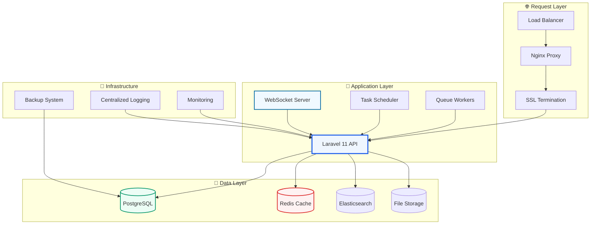
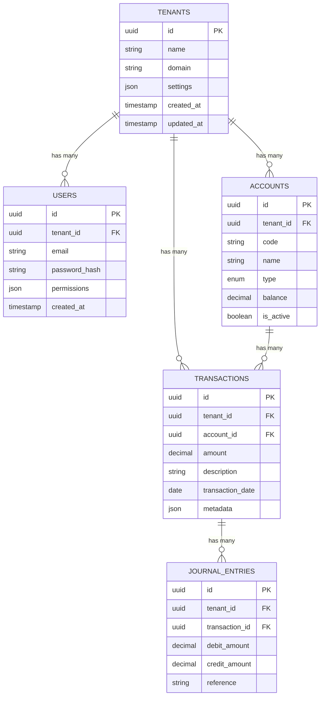
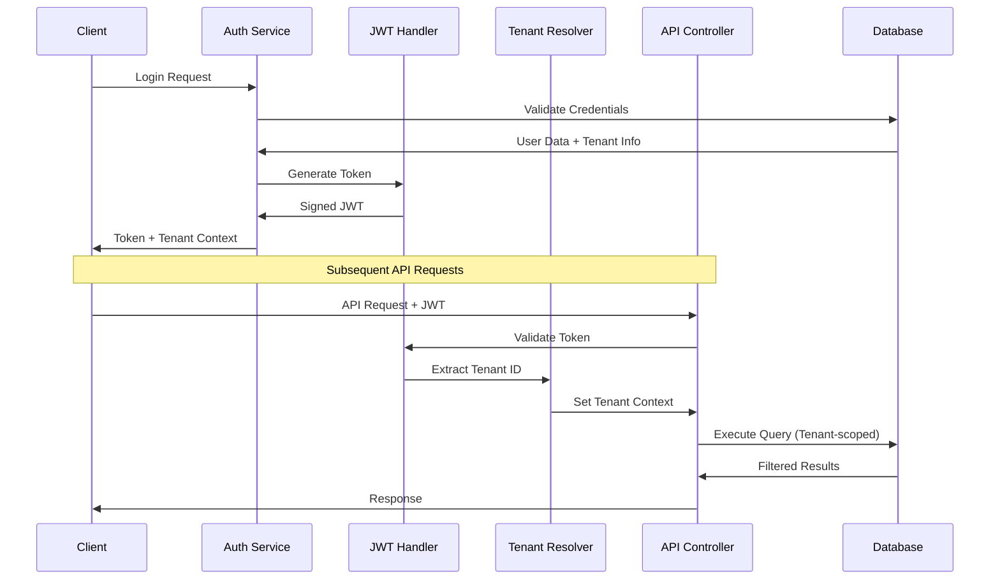
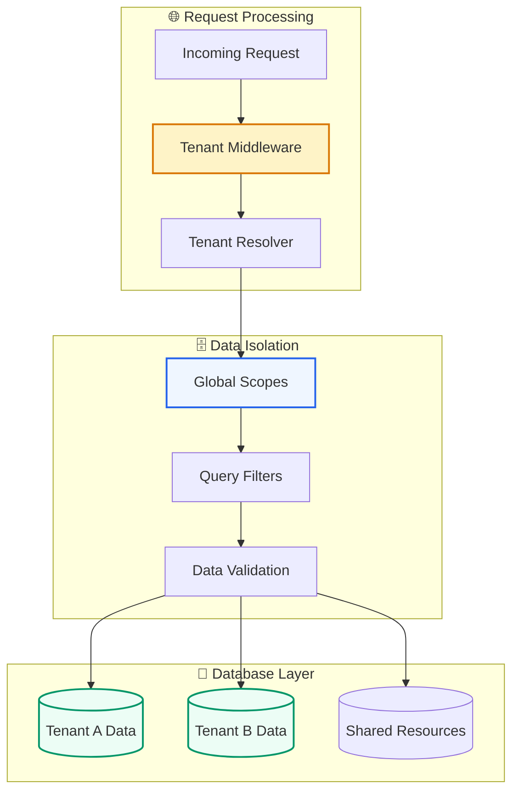
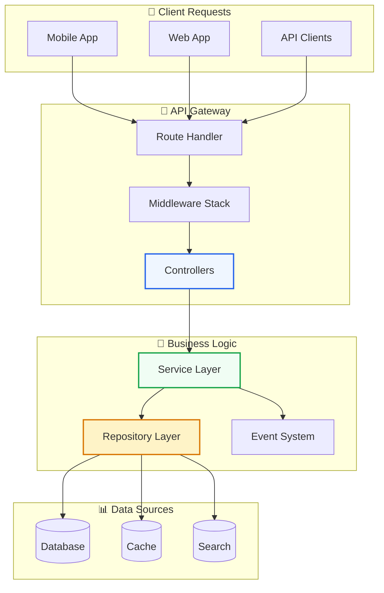
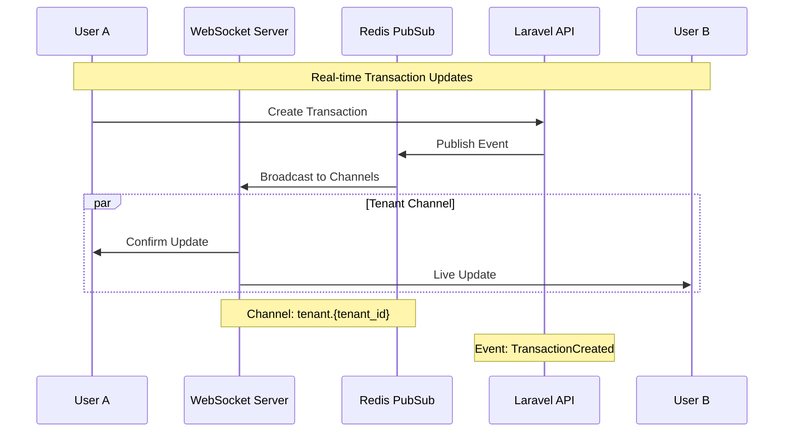
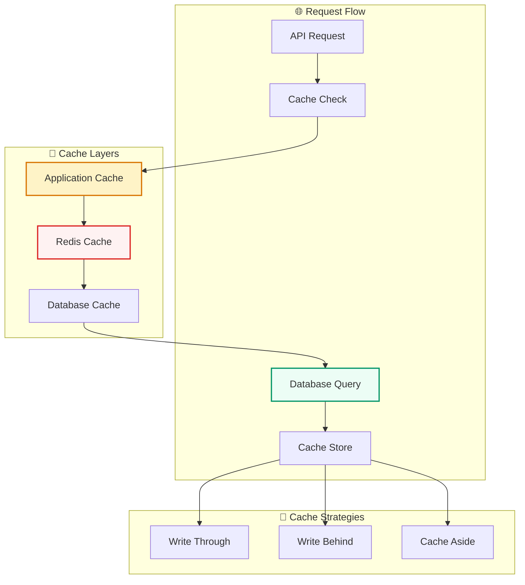

# 🚀 Laravel Accounting Platform - Server-Side Implementation Plan

> **Comprehensive Backend Architecture & Implementation Guide**

A detailed technical specification for implementing the Laravel 11 backend infrastructure supporting multi-tenant accounting operations, real-time collaboration, and enterprise-grade performance.

---

## 📋 Table of Contents

- [🏗️ Architecture Overview](#️-architecture-overview)
- [🗄️ Database Design](#️-database-design)
- [🔐 Authentication & Authorization](#-authentication--authorization)
- [🏢 Multi-Tenancy Implementation](#-multi-tenancy-implementation)
- [📡 API Architecture](#-api-architecture)
- [🔄 Real-Time Features](#-real-time-features)
- [⚡ Performance & Caching](#-performance--caching)
- [🛡️ Security Implementation](#️-security-implementation)
- [🚀 Deployment Strategy](#-deployment-strategy)
- [📊 Monitoring & Analytics](#-monitoring--analytics)

---

## 🏗️ Architecture Overview

### **🎯 Core Architecture Principles**



### **📦 Service Layer Architecture**

```php
<?php
// Core Service Structure
app/
├── Services/
│   ├── TenantService.php          # Multi-tenant management
│   ├── AccountingService.php      # Financial operations
│   ├── ReportingService.php       # Report generation
│   ├── NotificationService.php    # Real-time notifications
│   └── AuditService.php          # Audit trail management
├── Repositories/
│   ├── TenantRepository.php
│   ├── TransactionRepository.php
│   └── AccountRepository.php
└── Events/
    ├── TransactionCreated.php
    ├── ReportGenerated.php
    └── TenantUpdated.php
```

---

## 🗄️ Database Design

### **🏢 Multi-Tenant Database Schema**



### **📊 Database Optimization Strategy**

```sql
-- Tenant-aware indexes for performance
CREATE INDEX idx_transactions_tenant_date ON transactions(tenant_id, transaction_date);
CREATE INDEX idx_accounts_tenant_type ON accounts(tenant_id, type);
CREATE INDEX idx_users_tenant_email ON users(tenant_id, email);

-- Partitioning for large datasets
CREATE TABLE transactions_2024 PARTITION OF transactions
FOR VALUES FROM ('2024-01-01') TO ('2025-01-01');

-- Full-text search indexes
CREATE INDEX idx_transactions_search ON transactions 
USING gin(to_tsvector('english', description));
```

---

## 🔐 Authentication & Authorization

### **🛡️ Security Architecture**



### **🔑 Implementation Details**

```php
<?php
// JWT Authentication Service
class AuthenticationService
{
    public function authenticate(string $email, string $password): AuthResult
    {
        $user = User::where('email', $email)->first();
        
        if (!$user || !Hash::check($password, $user->password)) {
            throw new AuthenticationException('Invalid credentials');
        }
        
        $tenant = $user->tenant;
        $token = $this->generateJWT($user, $tenant);
        
        return new AuthResult($user, $tenant, $token);
    }
    
    private function generateJWT(User $user, Tenant $tenant): string
    {
        $payload = [
            'user_id' => $user->id,
            'tenant_id' => $tenant->id,
            'permissions' => $user->permissions,
            'exp' => time() + config('auth.jwt_ttl')
        ];
        
        return JWT::encode($payload, config('auth.jwt_secret'), 'HS256');
    }
}

// Multi-tenant middleware
class TenantMiddleware
{
    public function handle(Request $request, Closure $next)
    {
        $token = $request->bearerToken();
        $payload = JWT::decode($token, config('auth.jwt_secret'), ['HS256']);
        
        // Set tenant context for all database queries
        TenantScope::setTenantId($payload->tenant_id);
        
        return $next($request);
    }
}
```

---

## 🏢 Multi-Tenancy Implementation

### **🔧 Tenant Isolation Strategy**



### **🏗️ Implementation Code**

```php
<?php
// Global tenant scope for automatic filtering
class TenantScope implements Scope
{
    private static ?string $tenantId = null;
    
    public static function setTenantId(string $tenantId): void
    {
        self::$tenantId = $tenantId;
    }
    
    public function apply(Builder $builder, Model $model): void
    {
        if (self::$tenantId && $model->isTenantAware()) {
            $builder->where('tenant_id', self::$tenantId);
        }
    }
}

// Base tenant-aware model
abstract class TenantAwareModel extends Model
{
    protected static function booted(): void
    {
        static::addGlobalScope(new TenantScope());
        
        static::creating(function ($model) {
            if (!$model->tenant_id) {
                $model->tenant_id = TenantScope::getCurrentTenantId();
            }
        });
    }
    
    public function isTenantAware(): bool
    {
        return in_array('tenant_id', $this->fillable);
    }
}

// Tenant service for management operations
class TenantService
{
    public function createTenant(array $data): Tenant
    {
        DB::transaction(function () use ($data) {
            $tenant = Tenant::create($data);
            
            // Create default accounts for new tenant
            $this->createDefaultAccounts($tenant);
            
            // Setup tenant-specific configurations
            $this->setupTenantConfiguration($tenant);
            
            return $tenant;
        });
    }
    
    private function createDefaultAccounts(Tenant $tenant): void
    {
        $defaultAccounts = [
            ['code' => '1000', 'name' => 'Cash', 'type' => 'asset'],
            ['code' => '1200', 'name' => 'Accounts Receivable', 'type' => 'asset'],
            ['code' => '2000', 'name' => 'Accounts Payable', 'type' => 'liability'],
            ['code' => '3000', 'name' => 'Owner\'s Equity', 'type' => 'equity'],
            ['code' => '4000', 'name' => 'Revenue', 'type' => 'revenue'],
            ['code' => '5000', 'name' => 'Expenses', 'type' => 'expense'],
        ];
        
        foreach ($defaultAccounts as $account) {
            Account::create(array_merge($account, ['tenant_id' => $tenant->id]));
        }
    }
}
```

---

## 📡 API Architecture

### **🔗 RESTful API Design**



### **🛠️ API Implementation**

```php
<?php
// API Resource Controllers
class TransactionController extends Controller
{
    public function __construct(
        private TransactionService $transactionService,
        private TransactionRepository $repository
    ) {}
    
    public function index(Request $request): JsonResponse
    {
        $filters = $request->validated();
        $transactions = $this->repository->paginate($filters);
        
        return TransactionResource::collection($transactions);
    }
    
    public function store(StoreTransactionRequest $request): JsonResponse
    {
        $transaction = $this->transactionService->create($request->validated());
        
        // Broadcast real-time update
        broadcast(new TransactionCreated($transaction));
        
        return new TransactionResource($transaction);
    }
    
    public function show(Transaction $transaction): JsonResponse
    {
        $this->authorize('view', $transaction);
        
        return new TransactionResource($transaction->load('journalEntries'));
    }
}

// GraphQL Schema Definition
class TransactionType extends ObjectType
{
    public function fields(): array
    {
        return [
            'id' => ['type' => Type::nonNull(Type::id())],
            'amount' => ['type' => Type::nonNull(Type::float())],
            'description' => ['type' => Type::string()],
            'account' => [
                'type' => AccountType::class,
                'resolve' => fn($transaction) => $transaction->account
            ],
            'journalEntries' => [
                'type' => Type::listOf(JournalEntryType::class),
                'resolve' => fn($transaction) => $transaction->journalEntries
            ]
        ];
    }
}

// API Rate Limiting
class ApiRateLimitMiddleware
{
    public function handle(Request $request, Closure $next): Response
    {
        $key = 'api_rate_limit:' . $request->user()->id;
        $limit = 1000; // requests per hour
        
        if (RateLimiter::tooManyAttempts($key, $limit)) {
            return response()->json([
                'error' => 'Rate limit exceeded',
                'retry_after' => RateLimiter::availableIn($key)
            ], 429);
        }
        
        RateLimiter::hit($key, 3600); // 1 hour
        
        return $next($request);
    }
}
```

---

## 🔄 Real-Time Features

### **⚡ WebSocket Implementation**



### **🔌 WebSocket Server Setup**

```php
<?php
// WebSocket Event Broadcasting
class TransactionCreated implements ShouldBroadcast
{
    use Dispatchable, InteractsWithSockets, SerializesModels;
    
    public function __construct(
        public Transaction $transaction
    ) {}
    
    public function broadcastOn(): array
    {
        return [
            new PrivateChannel('tenant.' . $this->transaction->tenant_id),
            new PrivateChannel('user.' . auth()->id())
        ];
    }
    
    public function broadcastWith(): array
    {
        return [
            'transaction' => new TransactionResource($this->transaction),
            'type' => 'transaction.created',
            'timestamp' => now()->toISOString()
        ];
    }
}

// Real-time notification service
class NotificationService
{
    public function sendRealTimeUpdate(string $channel, array $data): void
    {
        Redis::publish($channel, json_encode([
            'event' => $data['event'],
            'data' => $data['payload'],
            'timestamp' => microtime(true)
        ]));
    }
    
    public function broadcastToTenant(string $tenantId, string $event, array $data): void
    {
        $channel = "tenant.{$tenantId}";
        $this->sendRealTimeUpdate($channel, [
            'event' => $event,
            'payload' => $data
        ]);
    }
}
```

---

## ⚡ Performance & Caching

### **🚀 Caching Strategy**



### **⚡ Performance Implementation**

```php
<?php
// Advanced caching service
class CacheService
{
    private const DEFAULT_TTL = 3600; // 1 hour
    private const FINANCIAL_DATA_TTL = 300; // 5 minutes
    
    public function remember(string $key, callable $callback, ?int $ttl = null): mixed
    {
        $ttl = $ttl ?? self::DEFAULT_TTL;
        
        return Cache::tags(['tenant:' . TenantScope::getCurrentTenantId()])
            ->remember($key, $ttl, $callback);
    }
    
    public function getFinancialData(string $key, callable $callback): mixed
    {
        return $this->remember($key, $callback, self::FINANCIAL_DATA_TTL);
    }
    
    public function invalidateTenantCache(string $tenantId): void
    {
        Cache::tags(['tenant:' . $tenantId])->flush();
    }
}

// Database query optimization
class TransactionRepository
{
    public function getMonthlyReport(string $tenantId, Carbon $month): Collection
    {
        $cacheKey = "monthly_report:{$tenantId}:{$month->format('Y-m')}";
        
        return app(CacheService::class)->getFinancialData($cacheKey, function () use ($tenantId, $month) {
            return Transaction::where('tenant_id', $tenantId)
                ->whereBetween('transaction_date', [
                    $month->startOfMonth(),
                    $month->endOfMonth()
                ])
                ->with(['account', 'journalEntries'])
                ->orderBy('transaction_date')
                ->get();
        });
    }
}

// Queue optimization for heavy operations
class GenerateFinancialReportJob implements ShouldQueue
{
    use Dispatchable, InteractsWithQueue, Queueable, SerializesModels;
    
    public function handle(ReportingService $reportingService): void
    {
        $report = $reportingService->generateIncomeStatement(
            $this->tenantId,
            $this->startDate,
            $this->endDate
        );
        
        // Cache the generated report
        Cache::put(
            "report:{$this->tenantId}:{$this->reportType}:{$this->period}",
            $report,
            now()->addHours(24)
        );
        
        // Notify user of completion
        broadcast(new ReportGenerated($this->user, $report));
    }
}
```

This is the first part of the comprehensive server-side implementation plan. The document covers the core architecture, database design, authentication, multi-tenancy, API design, real-time features, and performance optimization with clean, professional diagrams and detailed code examples.
