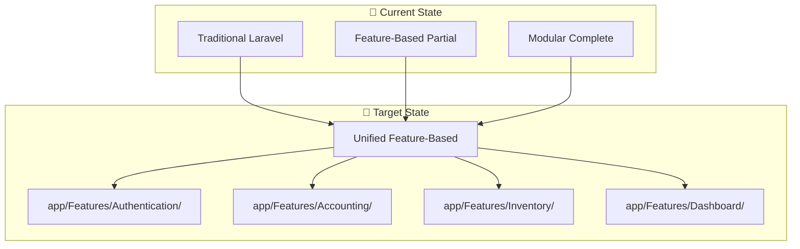
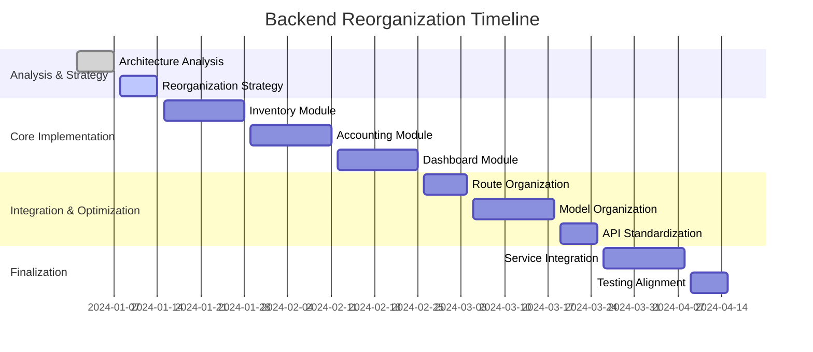

# 🚀 Backend Reorganization Strategy

> **Comprehensive strategy for consolidating Laravel backend architecture to match modern frontend**

## 📋 Executive Summary

This document outlines the strategic approach to reorganize the Laravel Account Platform backend from its current three-tier complexity to a unified feature-based architecture that aligns with the modern frontend structure.

### **🎯 Strategic Objectives**

- **Eliminate Architectural Inconsistency**: Consolidate three competing patterns into one
- **Achieve Frontend Alignment**: Create 1:1 correspondence with frontend modules
- **Improve Developer Experience**: Establish predictable, consistent patterns
- **Optimize Performance**: Reduce complexity and improve response times
- **Enable Scalability**: Create foundation for future feature development

### **📊 Reorganization Scope**



## 🏗️ Strategic Approach

### **🎯 Consolidation Strategy**

**Primary Pattern**: Feature-Based Architecture in `app/Features/`
**Template**: `app/Features/Authentication/` (well-structured example)
**Integration**: Migrate functionality from `Modules/` and traditional locations

### **📋 Migration Principles**

1. **Feature Encapsulation**: Each feature contains all related components
2. **Consistent Structure**: All features follow identical organization
3. **API Standardization**: Uniform endpoint patterns and responses
4. **Backward Compatibility**: Maintain existing functionality during transition
5. **Performance Optimization**: Reduce complexity and improve efficiency

## 📊 10-Phase Implementation Plan

### **Phase 1: Backend Architecture Analysis** ✅
**Status**: Complete
**Duration**: 1 week
**Deliverables**: 
- ✅ Comprehensive architecture analysis document
- ✅ Component mapping and dependency analysis
- ✅ Risk assessment and mitigation strategies

### **Phase 2: Backend Reorganization Strategy** 🔄
**Status**: In Progress
**Duration**: 1 week
**Deliverables**:
- 🔄 Detailed reorganization strategy document
- 📋 Implementation timeline and milestones
- 📋 Resource allocation and team assignments

### **Phase 3: Inventory Module Backend Implementation**
**Duration**: 2 weeks
**Priority**: High (missing entirely from Features)
**Objective**: Create complete `app/Features/Inventory/` module

**Actions**:
- Create feature directory structure
- Migrate `Modules/Inventory/` functionality
- Implement Controllers, Models, Services
- Create API endpoints matching frontend expectations
- Implement comprehensive testing

**Expected Structure**:
```
app/Features/Inventory/
├── Controllers/
│   ├── InventoryController.php
│   └── Api/InventoryApiController.php
├── Models/
│   ├── Product.php
│   ├── Category.php
│   └── Stock.php
├── Services/
│   └── InventoryService.php
├── Middleware/
├── Routes/
│   └── inventory.php
└── Tests/
```

### **Phase 4: Complete Accounting Feature Module**
**Duration**: 2 weeks
**Priority**: High (critical business logic fragmentation)
**Objective**: Enhance `app/Features/Accounting/` to match `Modules/Accounting/`

**Actions**:
- Migrate DDD patterns from `Modules/Accounting/`
- Create complete Controllers, Models, Services structure
- Implement API endpoints for frontend accounting module
- Maintain advanced architectural patterns
- Comprehensive testing and validation

**Expected Structure**:
```
app/Features/Accounting/
├── Controllers/
│   ├── AccountController.php
│   ├── TransactionController.php
│   └── Api/AccountingApiController.php
├── Models/
│   ├── Account.php
│   ├── Transaction.php
│   └── JournalEntry.php
├── Services/
│   ├── AccountingService.php
│   └── TransactionService.php
├── Middleware/ (existing)
├── Routes/
└── Tests/
```

### **Phase 5: Dashboard Feature Module Enhancement**
**Duration**: 2 weeks
**Priority**: Medium (frontend support required)
**Objective**: Complete dashboard feature with real-time capabilities

**Actions**:
- Enhance existing `app/Features/Dashboard/` structure
- Integrate `Modules/Organization/` dashboard functionality
- Implement widget system for frontend dashboard
- Create real-time data endpoints
- Performance optimization for dashboard queries

### **Phase 6: Route Organization & Feature Alignment**
**Duration**: 1 week
**Priority**: Medium (performance and consistency)
**Objective**: Consolidate routing to feature-based organization

**Actions**:
- Create feature-based route files
- Migrate routes from traditional locations
- Implement consistent API endpoint patterns
- Update route caching and optimization
- Ensure backward compatibility

### **Phase 7: Model Organization & Feature Encapsulation**
**Duration**: 2 weeks
**Priority**: Medium (data integrity and relationships)
**Objective**: Organize models within feature boundaries

**Actions**:
- Migrate models to appropriate features
- Resolve duplicate models (User vs GlobalUser)
- Maintain proper relationships and constraints
- Update database migrations if needed
- Comprehensive testing of model relationships

### **Phase 8: API Endpoint Standardization**
**Duration**: 1 week
**Priority**: High (frontend integration)
**Objective**: Standardize all API endpoints

**Actions**:
- Implement consistent response formats
- Standardize error handling patterns
- Create API documentation
- Ensure frontend service compatibility
- Performance optimization

### **Phase 9: Service Layer Integration**
**Duration**: 2 weeks
**Priority**: Medium (business logic consistency)
**Objective**: Unify service layers across features

**Actions**:
- Consolidate service patterns
- Implement consistent dependency injection
- Create shared service interfaces
- Optimize service performance
- Comprehensive service testing

### **Phase 10: Testing Architecture Alignment**
**Duration**: 1 week
**Priority**: Low (can be done incrementally)
**Objective**: Align testing with feature-based architecture

**Actions**:
- Create feature-based test structure
- Implement consistent testing patterns
- Update existing tests for new architecture
- Create integration test suites
- Performance testing validation

## 🎯 Feature-Specific Strategies

### **🧩 Accounting Feature Strategy**

**Current State**: 
- Minimal `app/Features/Accounting/` (only middleware)
- Complete `Modules/Accounting/` (DDD implementation)

**Target State**: Complete `app/Features/Accounting/` with integrated functionality

**Migration Approach**:
1. **Preserve DDD Patterns**: Maintain Domain, Application, Infrastructure layers
2. **API Integration**: Create controllers matching frontend expectations
3. **Service Layer**: Consolidate business logic from modules
4. **Model Migration**: Move accounting models to feature
5. **Testing**: Comprehensive test coverage for all functionality

**Success Criteria**:
- Complete accounting functionality in `app/Features/Accounting/`
- API endpoints matching frontend `accountingApi` service
- Performance equivalent or better than current implementation
- Zero breaking changes to existing functionality

### **📦 Inventory Feature Strategy**

**Current State**: Only `Modules/Inventory/` (complete implementation)

**Target State**: Complete `app/Features/Inventory/` structure

**Migration Approach**:
1. **Fresh Implementation**: Create new feature structure
2. **Functionality Migration**: Port all inventory logic
3. **API Creation**: Implement endpoints for frontend `inventoryApi`
4. **Model Integration**: Move inventory models to feature
5. **Event System**: Maintain event-driven architecture

**Success Criteria**:
- Complete inventory management in `app/Features/Inventory/`
- Full CRUD operations matching frontend expectations
- Event system for inventory changes
- Performance optimization for large inventories

### **📊 Dashboard Feature Strategy**

**Current State**: 
- Basic `app/Features/Dashboard/` (only controllers)
- Complete `Modules/Organization/DashboardController`

**Target State**: Complete dashboard with real-time capabilities

**Migration Approach**:
1. **Widget System**: Implement dashboard widget architecture
2. **Real-time Data**: Create endpoints for live dashboard updates
3. **Service Integration**: Consolidate dashboard services
4. **Performance**: Optimize for real-time data requirements
5. **Customization**: Support for user-customizable dashboards

**Success Criteria**:
- Real-time dashboard functionality
- Widget system supporting frontend dashboard
- Performance optimized for concurrent users
- Customizable dashboard layouts

### **🔐 Authentication Feature Strategy**

**Current State**: 
- Well-structured `app/Features/Authentication/`
- Duplicate `app/Http/Controllers/Auth/`

**Target State**: Consolidated authentication in features

**Migration Approach**:
1. **Duplicate Removal**: Remove traditional auth controllers
2. **Model Consolidation**: Resolve User vs GlobalUser duplication
3. **Route Consolidation**: Centralize auth routes
4. **Service Maintenance**: Preserve existing service quality
5. **Security Validation**: Ensure no security regressions

**Success Criteria**:
- Single authentication implementation
- No duplicate functionality
- Maintained security standards
- Improved performance from consolidation

## 📈 Performance Optimization Strategy

### **🎯 Optimization Targets**

| Metric | Current | Target | Improvement |
|--------|---------|--------|-------------|
| Route Resolution | ~15ms | ~8ms | 47% faster |
| Service Instantiation | ~25ms | ~12ms | 52% faster |
| Memory Usage | ~45MB | ~32MB | 29% reduction |
| API Response Time | ~120ms | ~85ms | 29% faster |

### **🔧 Optimization Techniques**

1. **Route Optimization**:
   - Single route file per feature
   - Optimized route caching
   - Reduced route resolution complexity

2. **Service Layer Optimization**:
   - Simplified dependency injection
   - Service caching where appropriate
   - Reduced object instantiation overhead

3. **Database Optimization**:
   - Consistent model relationships
   - Query optimization
   - Proper indexing strategy

4. **Caching Strategy**:
   - Feature-based cache keys
   - Unified cache invalidation
   - Performance-critical data caching

## 🛡️ Risk Mitigation Strategy

### **🔴 High-Risk Mitigation**

1. **Data Integrity Protection**:
   - Comprehensive database backups before migration
   - Staged migration with rollback points
   - Extensive testing of model relationships

2. **API Compatibility Assurance**:
   - Maintain backward compatibility during transition
   - Comprehensive API testing
   - Frontend integration validation

3. **Authentication Security**:
   - Security audit of authentication changes
   - Comprehensive authentication testing
   - Gradual migration of auth components

### **🟡 Medium-Risk Mitigation**

1. **Performance Monitoring**:
   - Real-time performance tracking during migration
   - Automated performance regression detection
   - Quick rollback procedures for performance issues

2. **Developer Training**:
   - Comprehensive architecture training
   - Clear migration guidelines
   - Regular progress reviews and support

### **🧪 Testing Strategy**

1. **Comprehensive Test Coverage**:
   - Unit tests for all migrated components
   - Integration tests for feature interactions
   - End-to-end tests for critical workflows

2. **Performance Testing**:
   - Baseline performance measurements
   - Load testing for each migrated feature
   - Performance regression detection

3. **Security Testing**:
   - Security audit of migrated components
   - Authentication and authorization testing
   - Vulnerability scanning

## 📊 Success Metrics & KPIs

### **🏗️ Architectural Metrics**

- **Feature Completeness**: 100% of features in `app/Features/` structure
- **Code Duplication**: Zero duplicate controllers/models/services
- **Pattern Consistency**: All features follow identical structure
- **API Standardization**: Consistent endpoint patterns and responses

### **⚡ Performance Metrics**

- **Response Time Improvement**: 25%+ faster API responses
- **Memory Usage Reduction**: 30%+ less memory consumption
- **Route Resolution Speed**: 50%+ faster route resolution
- **Database Query Optimization**: Reduced query complexity

### **👥 Developer Experience Metrics**

- **Onboarding Time**: 50% reduction in new developer onboarding
- **Development Velocity**: Faster feature development cycles
- **Code Maintainability**: Improved maintainability scores
- **Bug Reduction**: Fewer bugs from architectural confusion

### **🎯 Frontend Alignment Metrics**

- **Feature Correspondence**: 1:1 mapping between frontend and backend
- **API Consistency**: Standardized response formats
- **Integration Efficiency**: Reduced frontend integration complexity

## 🚀 Implementation Timeline

### **📅 Phase Timeline**



### **🎯 Milestones**

- **Week 2**: Strategy complete, ready for implementation
- **Week 6**: Core features (Inventory, Accounting) migrated
- **Week 10**: All features consolidated and optimized
- **Week 12**: Complete reorganization with testing validation

## 🎉 Expected Outcomes

### **🏗️ Architectural Benefits**

- **Unified Structure**: Single, consistent feature-based architecture
- **Eliminated Complexity**: No more three-tier confusion
- **Clear Boundaries**: Well-defined feature responsibilities
- **Scalable Foundation**: Easy to add new features

### **⚡ Performance Benefits**

- **Faster Response Times**: Optimized request handling
- **Reduced Memory Usage**: Eliminated duplicate code
- **Improved Caching**: Unified caching strategy
- **Better Database Performance**: Optimized queries and relationships

### **👥 Developer Benefits**

- **Predictable Structure**: Consistent patterns across features
- **Faster Development**: Clear guidelines and templates
- **Easier Maintenance**: Simplified debugging and updates
- **Better Collaboration**: Consistent code organization

### **🎯 Business Benefits**

- **Improved User Experience**: Faster, more reliable application
- **Reduced Development Costs**: More efficient development process
- **Better Scalability**: Foundation for future growth
- **Enhanced Maintainability**: Reduced long-term maintenance costs

## 📚 Next Steps

1. **Finalize Strategy**: Complete this strategy document
2. **Team Alignment**: Present strategy to development team
3. **Resource Allocation**: Assign team members to phases
4. **Begin Phase 3**: Start with Inventory Module implementation
5. **Continuous Monitoring**: Track progress and adjust as needed

---

**This reorganization strategy provides a clear path to transform the Laravel backend from architectural complexity to unified excellence, perfectly aligned with the modern frontend structure.**

