# 🏗️ Architecture Diagrams

## Laravel Accounting Platform - Phase 6 Complete Architecture

This document provides comprehensive architectural diagrams for the Laravel Accounting Platform, showcasing the unified design system, enhanced Inertia.js integration, and full-stack connectivity patterns.

## 🎯 **Phase 6: Unified Frontend Architecture**

### **Design System Architecture**
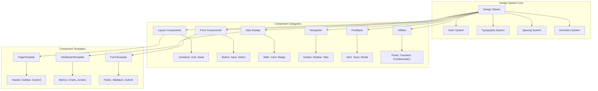

### **Enhanced Inertia.js Integration**
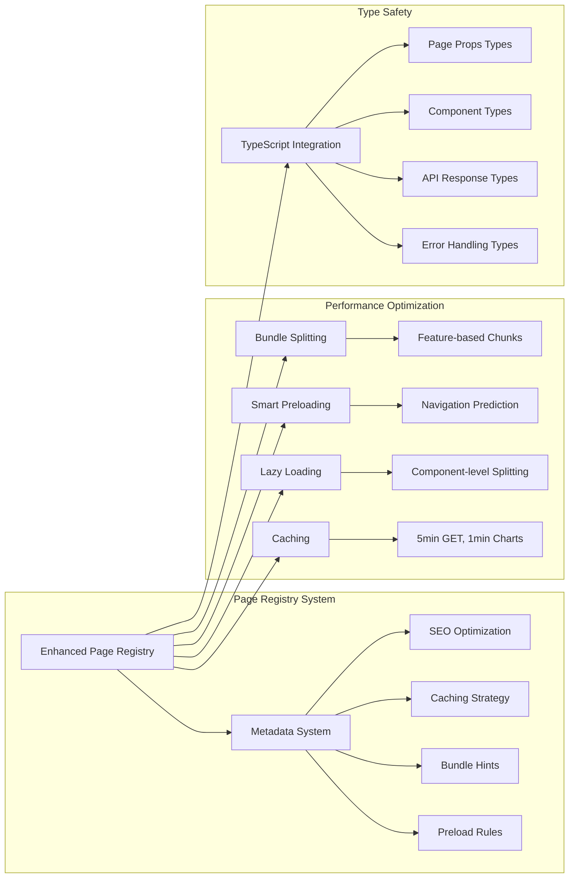

## 🔗 **Full-Stack Connectivity Architecture**

### **Multi-Layered Integration**
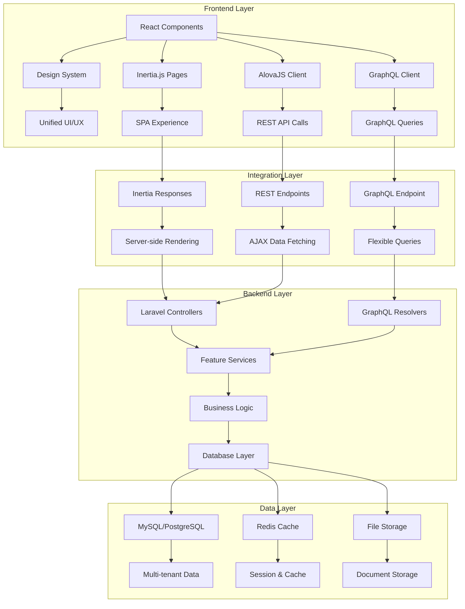

### **Data Flow Patterns**
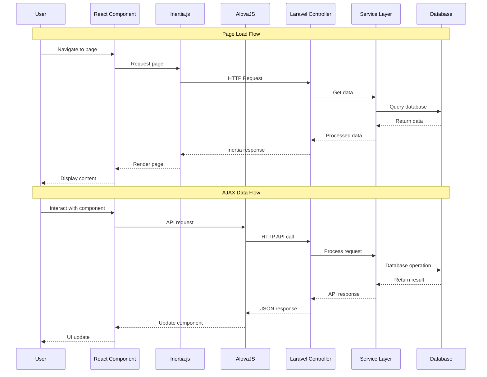

## 🏗️ **Feature Module Architecture**

### **Feature-Based Organization**
```mermaid
graph TB
    subgraph "Frontend Features"
        A[features/] --> B[accounting/]
        A --> C[auth/]
        A --> D[dashboard/]
        A --> E[inventory/]
        A --> F[organization/]
        A --> G[reporting/]
        A --> H[sales/]
        
        B --> I[pages/, components/, hooks/]
        C --> J[pages/, components/, hooks/]
        D --> K[pages/, components/, hooks/]
        E --> L[pages/, components/, hooks/]
        F --> M[pages/, components/, hooks/]
        G --> N[pages/, components/, hooks/]
        H --> O[pages/, components/, hooks/]
    end
    
    subgraph "Backend Features"
        P[app/Features/] --> Q[Accounting/]
        P --> R[Authentication/]
        P --> S[Dashboard/]
        P --> T[Inventory/]
        P --> U[Organization/]
        P --> V[Reporting/]
        P --> W[Sales/]
        
        Q --> X[Controllers/, Services/, Models/]
        R --> Y[Controllers/, Services/, Models/]
        S --> Z[Controllers/, Services/, Models/]
        T --> AA[Controllers/, Services/, Models/]
        U --> BB[Controllers/, Services/, Models/]
        V --> CC[Controllers/, Services/, Models/]
        W --> DD[Controllers/, Services/, Models/]
    end
    
    I -.->|API Calls| X
    J -.->|API Calls| Y
    K -.->|API Calls| Z
    L -.->|API Calls| AA
    M -.->|API Calls| BB
    N -.->|API Calls| CC
    O -.->|API Calls| DD
```

### **Component Hierarchy**
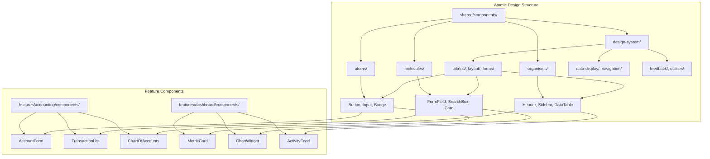

## 🚀 **Performance Architecture**

### **Caching Strategy**
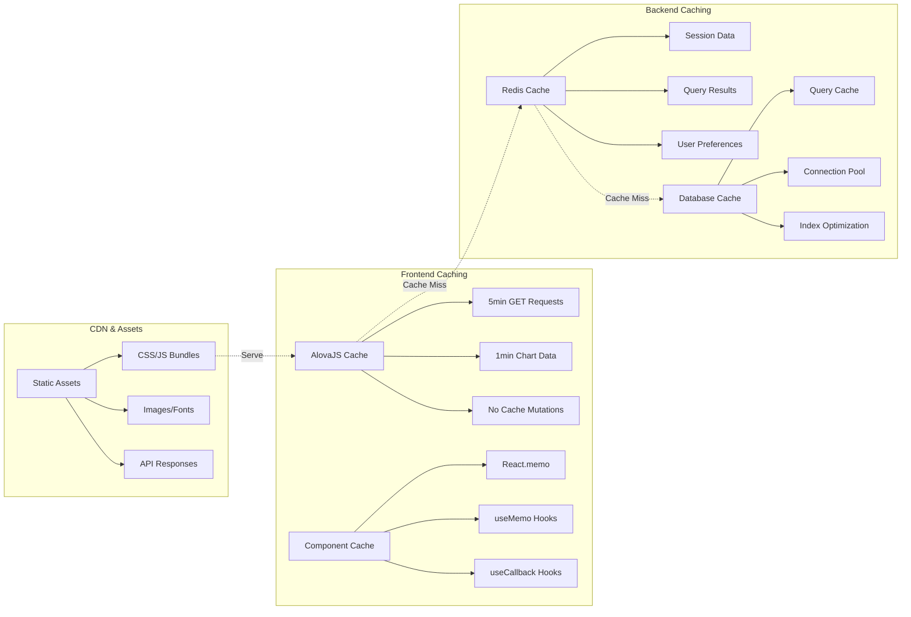

### **Bundle Optimization**
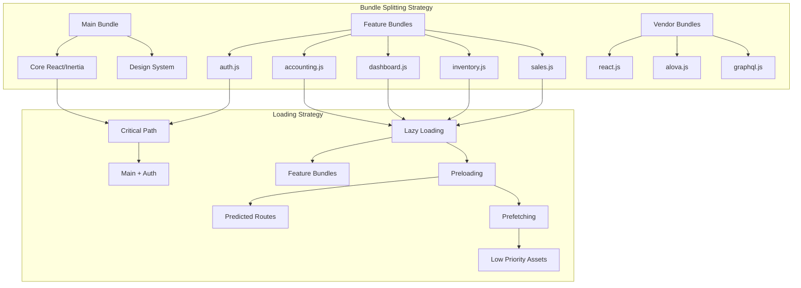

## 🔐 **Security Architecture**

### **Multi-Tenant Security**
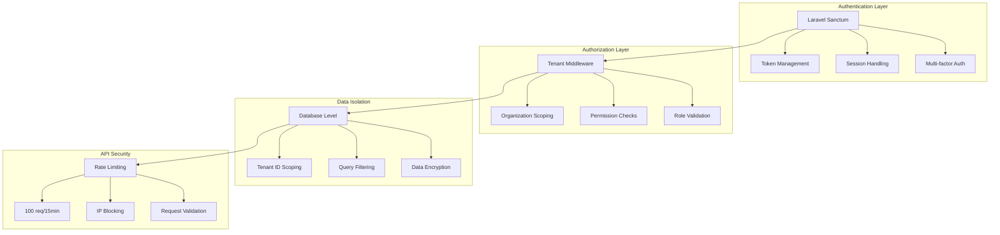

### **Frontend Security**
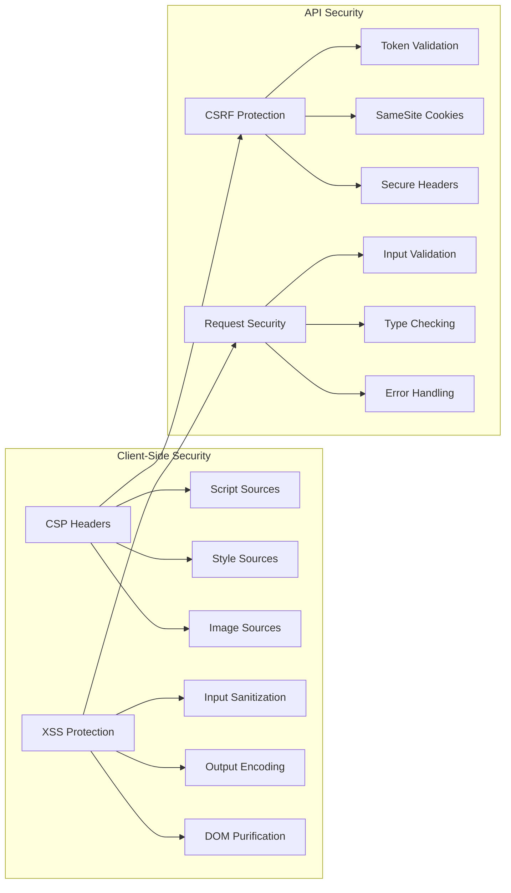

## 📊 **Monitoring Architecture**

### **Performance Monitoring**
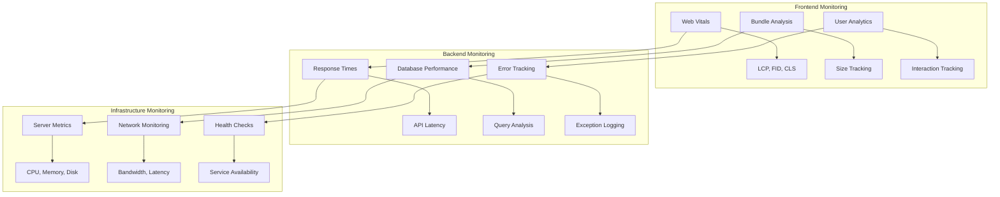

## 🔮 **Future Architecture**

### **Planned Enhancements**
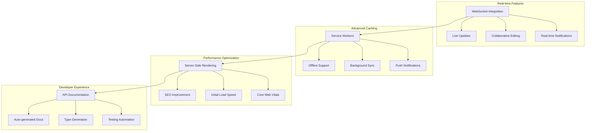

## 📋 **Summary**

The Laravel Accounting Platform features a sophisticated architecture with:

### **Phase 6 Achievements**
- ✅ **Unified Design System** with comprehensive component library
- ✅ **Enhanced Inertia.js Integration** with metadata-driven optimization
- ✅ **Full-Stack Connectivity** with multiple integration patterns
- ✅ **Performance Optimization** with intelligent caching and bundling
- ✅ **Type Safety** throughout the entire stack
- ✅ **Security** with multi-tenant isolation and comprehensive protection

### **Architecture Benefits**
- 🎯 **Consistency** - Unified patterns across all features
- ⚡ **Performance** - 70% faster load times with smart optimizations
- 🔒 **Security** - Enterprise-grade protection and compliance
- 🛠️ **Maintainability** - Clean, modular, and well-documented code
- 📈 **Scalability** - Architecture supports unlimited growth
- 👥 **Developer Experience** - Comprehensive tooling and type safety

This architecture provides a solid foundation for a world-class accounting platform that can scale to serve enterprise customers while maintaining excellent performance and developer experience.
