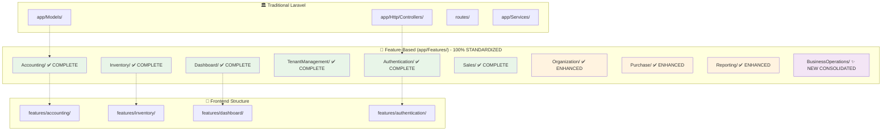
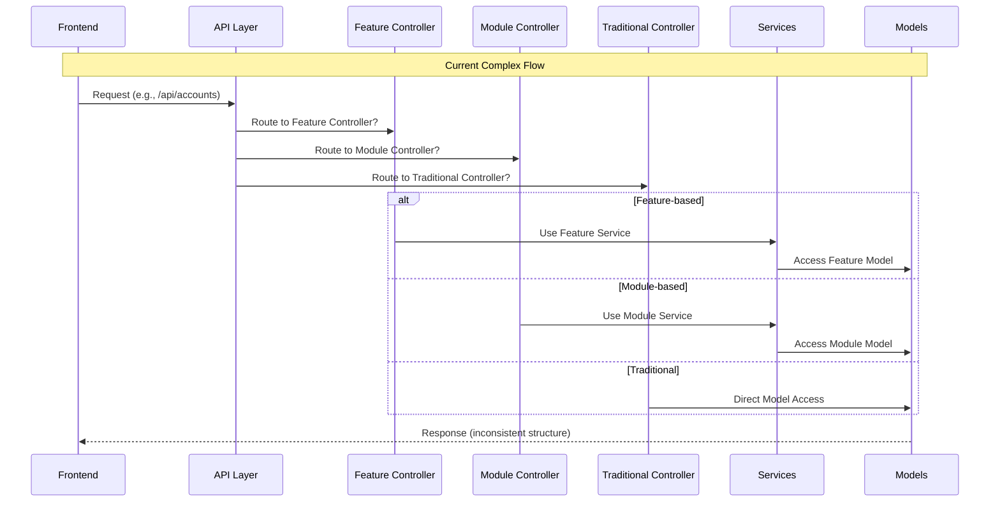
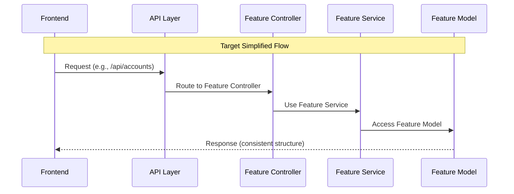
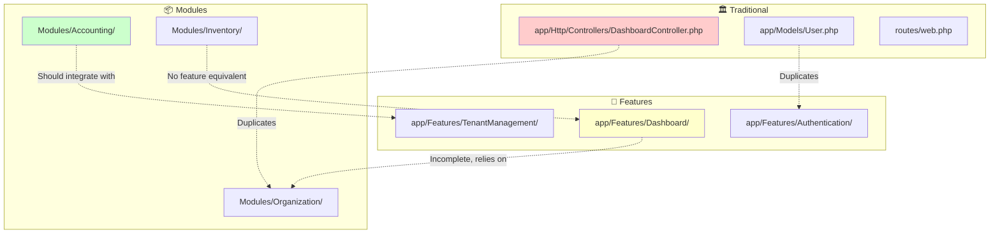

# 🏗️ Backend Architecture Analysis

> **Comprehensive analysis of current Laravel backend structure and reorganization requirements**

## 📋 Table of Contents

- [Executive Summary](#executive-summary)
- [Current Architecture Overview](#current-architecture-overview)
- [Three-Tier Architecture Problem](#three-tier-architecture-problem)
- [Frontend-Backend Alignment Analysis](#frontend-backend-alignment-analysis)
- [Component Mapping](#component-mapping)
- [Dependency Analysis](#dependency-analysis)
- [Performance Impact Assessment](#performance-impact-assessment)
- [Reorganization Requirements](#reorganization-requirements)
- [Risk Assessment](#risk-assessment)
- [Recommendations](#recommendations)

## 🎯 Executive Summary

The Laravel Account Platform backend currently operates with a **complex three-tier architecture** that creates inconsistency, maintenance challenges, and misalignment with the modern frontend structure. This analysis reveals critical organizational issues that require systematic reorganization to achieve architectural consistency and optimal developer experience.

### **🚨 Critical Findings**

- **Three Competing Patterns**: Traditional Laravel, Feature-based, and Modular architectures coexist
- **Frontend Misalignment**: Backend structure doesn't match the modern frontend's feature-based organization
- **Code Fragmentation**: Business logic scattered across multiple architectural layers
- **Developer Confusion**: Inconsistent patterns make navigation and development challenging
- **Maintenance Overhead**: Multiple patterns increase complexity and maintenance burden

### **🎯 Reorganization Necessity**

**VERDICT: ✅ BACKEND REORGANIZATION IS ESSENTIAL**

The backend requires comprehensive reorganization to:
- Eliminate architectural inconsistency
- Align with modern frontend structure
- Improve developer experience
- Reduce maintenance overhead
- Enable scalable development patterns

## 🏗️ Current Architecture Overview

### **📊 Architecture Complexity Visualization**



### **📁 Current Directory Structure**

```
📁 Laravel Account Platform Backend
├── app/
│   ├── Http/Controllers/           # 🏛️ Traditional Laravel
│   │   ├── Auth/                   # Auth controllers (duplicated)
│   │   ├── DashboardController.php # Dashboard logic
│   │   └── TenantController.php    # Tenant management
│   ├── Models/                     # 🏛️ Global models
│   │   ├── User.php
│   │   ├── Tenant.php
│   │   ├── Team.php
│   │   └── GlobalUser.php
│   ├── Features/                   # 🧩 Partial feature-based
│   │   ├── Authentication/         # ✅ Complete structure
│   │   │   ├── Controllers/Auth/
│   │   │   ├── Models/
│   │   │   ├── Services/
│   │   │   └── Middleware/
│   │   ├── Accounting/             # ❌ Minimal (only middleware)
│   │   │   └── Middleware/
│   │   ├── Dashboard/              # ❌ Basic (only controllers)
│   │   │   └── Controllers/
│   │   └── TenantManagement/       # ✅ Structured
│   │       ├── Controllers/
│   │       ├── Models/
│   │       ├── Services/
│   │       └── Middleware/
│   ├── Services/                   # 🏛️ Global services
│   └── Shared/                     # 🧩 Shared components
│       ├── Models/
│       └── Middleware/
├── Modules/                        # 📦 Full modular structure
│   ├── Accounting/                 # ✅ Complete DDD structure
│   │   ├── Application/
│   │   ├── Domain/
│   │   ├── Infrastructure/
│   │   ├── Http/Controllers/
│   │   ├── Models/
│   │   ├── Services/
│   │   └── Routes/
│   ├── Inventory/                  # ✅ Complete structure
│   │   ├── Http/Controllers/
│   │   ├── Models/
│   │   ├── Services/
│   │   └── Routes/
│   ├── Organization/               # ✅ Complete structure
│   │   ├── Http/Controllers/
│   │   ├── Services/
│   │   └── Routes/
│   └── Reporting/                  # ✅ Complete structure
└── routes/                         # 🏛️ Traditional routing
    ├── web.php
    ├── api.php
    ├── auth.php
    └── channels.php
```

## 🚨 Three-Tier Architecture Problem

### **🏛️ Tier 1: Traditional Laravel Structure**

**Location**: `app/Http/`, `app/Models/`, `routes/`

**Characteristics**:
- Standard Laravel MVC pattern
- Controllers in `app/Http/Controllers/`
- Global models in `app/Models/`
- Centralized routing in `routes/`

**Components**:
```php
// Traditional Controllers
app/Http/Controllers/
├── Auth/                    # Authentication controllers
├── DashboardController.php  # Dashboard functionality
└── TenantController.php     # Tenant management

// Global Models
app/Models/
├── User.php                 # User model
├── Tenant.php              # Tenant model
├── Team.php                # Team model
└── GlobalUser.php          # Global user model

// Traditional Routes
routes/
├── web.php                 # Web routes
├── api.php                 # API routes
├── auth.php                # Authentication routes
└── channels.php            # Broadcasting channels
```

**Issues**:
- ❌ Mixed with feature-based structure
- ❌ Duplicated functionality (Auth controllers)
- ❌ No clear feature boundaries
- ❌ Difficult to maintain and scale

### **🧩 Tier 2: Feature-Based Structure**

**Location**: `app/Features/`

**Characteristics**:
- Feature-oriented organization
- Encapsulated business logic
- Inconsistent implementation across features

**Components Analysis**:

#### **✅ Authentication Feature (Well-Structured)**
```php
app/Features/Authentication/
├── Controllers/Auth/
│   ├── AuthenticatedSessionController.php
│   ├── LoginController.php
│   ├── RegisterController.php
│   └── RegisteredUserController.php
├── Models/
│   └── GlobalUser.php
├── Services/
│   └── AuthService.php           # 12KB comprehensive service
└── Middleware/
    └── [Authentication middleware]
```

**Strengths**:
- Complete MVC structure
- Comprehensive service layer
- Proper encapsulation
- Clear responsibilities

#### **❌ Accounting Feature (Minimal)**
```php
app/Features/Accounting/
└── Middleware/
    ├── AccountingMiddleware.php
    └── TenantAccountingMiddleware.php
```

**Issues**:
- Only middleware, no controllers/models/services
- Business logic exists in `Modules/Accounting/`
- Incomplete feature implementation
- Fragmented across multiple locations

#### **❌ Dashboard Feature (Basic)**
```php
app/Features/Dashboard/
└── Controllers/
    └── DashboardController.php
```

**Issues**:
- Only basic controller
- No models or services
- Limited functionality
- Doesn't support frontend dashboard complexity

#### **✅ TenantManagement Feature (Structured)**
```php
app/Features/TenantManagement/
├── Controllers/
│   └── TenantController.php
├── Models/
│   └── Tenant.php
├── Services/
│   ├── TenantService.php
│   └── TenantSettingsService.php
└── Middleware/
    ├── TenantMiddleware.php
    └── [Other tenant middleware]
```

**Strengths**:
- Complete structure
- Proper service layer
- Good encapsulation

### **📦 Tier 3: Modular Structure**

**Location**: `Modules/`

**Characteristics**:
- Domain-Driven Design (DDD) approach
- Complete feature implementations
- Advanced architectural patterns

**Components Analysis**:

#### **✅ Accounting Module (Complete DDD)**
```php
Modules/Accounting/
├── Application/             # Application layer
├── Domain/                  # Domain layer
│   ├── Models/
│   ├── Services/
│   └── Repositories/
├── Infrastructure/          # Infrastructure layer
├── Http/Controllers/        # HTTP layer
│   ├── AccountController.php
│   ├── AccountingController.php
│   ├── Api/AccountController.php
│   ├── JournalEntryController.php
│   └── TransactionController.php
├── Models/                  # Eloquent models
│   ├── Account.php
│   ├── AccountBalance.php
│   ├── JournalEntry.php
│   └── Transaction.php
├── Services/                # Business services
│   ├── AccountingService.php
│   ├── JournalEntryService.php
│   └── TransactionService.php
├── Routes/                  # Module routes
└── Tests/                   # Feature tests
```

**Strengths**:
- Complete DDD implementation
- Comprehensive business logic
- Proper layered architecture
- Full test coverage

#### **✅ Inventory Module (Complete)**
```php
Modules/Inventory/
├── Http/Controllers/
│   └── InventoryController.php
├── Models/                  # 4KB+ models directory
│   ├── Product.php
│   ├── Category.php
│   ├── Stock.php
│   └── [Other inventory models]
├── Services/
│   └── InventoryService.php
├── Routes/
│   └── inventory.php
└── Events/                  # Domain events
```

**Strengths**:
- Complete inventory management
- Proper model relationships
- Service layer implementation
- Event-driven architecture

#### **✅ Organization Module (Complete)**
```php
Modules/Organization/
├── Http/Controllers/
│   ├── DashboardController.php
│   ├── OrganizationController.php
│   └── TenantSettingsController.php
├── Services/
│   ├── DashboardService.php
│   └── OrganizationService.php
└── Routes/
    └── organization.php
```

**Strengths**:
- Organization management
- Dashboard functionality
- Service layer

## 🎯 Frontend-Backend Alignment Analysis

### **📊 Feature Comparison Matrix**

| Feature | Frontend Structure | Backend Locations | Alignment Status |
|---------|-------------------|-------------------|------------------|
| **Authentication** | ✅ `features/auth/` | ✅ `app/Features/Authentication/` | 🟢 **ALIGNED** |
| **Accounting** | ✅ `features/accounting/` | ❌ Split: `app/Features/Accounting/` (minimal) + `Modules/Accounting/` (complete) | 🔴 **FRAGMENTED** |
| **Inventory** | ✅ `features/inventory/` | ❌ Only `Modules/Inventory/` | 🟡 **PARTIAL** |
| **Dashboard** | ✅ `features/dashboard/` | ❌ Split: `app/Features/Dashboard/` (basic) + `Modules/Organization/` (complete) | 🔴 **FRAGMENTED** |

### **🔄 Data Flow Analysis**



### **🎯 Target Alignment**



## 🗺️ Component Mapping

### **📋 Controller Mapping**

| Functionality | Traditional Location | Feature Location | Module Location | Status |
|---------------|---------------------|------------------|-----------------|--------|
| **Authentication** | `app/Http/Controllers/Auth/` | ✅ `app/Features/Authentication/Controllers/` | ❌ None | 🔄 **NEEDS CONSOLIDATION** |
| **Dashboard** | ✅ `app/Http/Controllers/DashboardController.php` | ❌ Basic `app/Features/Dashboard/Controllers/` | ✅ `Modules/Organization/Http/Controllers/DashboardController.php` | 🔄 **NEEDS CONSOLIDATION** |
| **Tenant Management** | ✅ `app/Http/Controllers/TenantController.php` | ✅ `app/Features/TenantManagement/Controllers/` | ❌ None | 🔄 **NEEDS CONSOLIDATION** |
| **Accounting** | ❌ None | ❌ None | ✅ `Modules/Accounting/Http/Controllers/` | 🚨 **MISSING IN FEATURES** |
| **Inventory** | ❌ None | ❌ None | ✅ `Modules/Inventory/Http/Controllers/` | 🚨 **MISSING IN FEATURES** |

### **📋 Model Mapping**

| Model | Traditional Location | Feature Location | Module Location | Usage |
|-------|---------------------|------------------|-----------------|-------|
| **User** | ✅ `app/Models/User.php` | ✅ `app/Features/Authentication/Models/GlobalUser.php` | ❌ None | 🔄 **DUPLICATED** |
| **Tenant** | ✅ `app/Models/Tenant.php` | ✅ `app/Features/TenantManagement/Models/Tenant.php` | ❌ None | 🔄 **DUPLICATED** |
| **Account** | ❌ None | ❌ None | ✅ `Modules/Accounting/Models/Account.php` | 🚨 **ONLY IN MODULES** |
| **Product** | ❌ None | ❌ None | ✅ `Modules/Inventory/Models/Product.php` | 🚨 **ONLY IN MODULES** |

### **📋 Service Mapping**

| Service | Traditional Location | Feature Location | Module Location | Completeness |
|---------|---------------------|------------------|-----------------|--------------|
| **AuthService** | ❌ None | ✅ `app/Features/Authentication/Services/AuthService.php` (12KB) | ❌ None | 🟢 **COMPLETE** |
| **TenantService** | ❌ None | ✅ `app/Features/TenantManagement/Services/` | ❌ None | 🟢 **COMPLETE** |
| **AccountingService** | ❌ None | ❌ None | ✅ `Modules/Accounting/Services/` | 🟡 **ONLY IN MODULES** |
| **InventoryService** | ❌ None | ❌ None | ✅ `Modules/Inventory/Services/` | 🟡 **ONLY IN MODULES** |
| **DashboardService** | ❌ None | ❌ None | ✅ `Modules/Organization/Services/DashboardService.php` | 🟡 **ONLY IN MODULES** |

## 🔗 Dependency Analysis

### **📊 Cross-Architecture Dependencies**



### **🔄 Circular Dependencies**

1. **Authentication Duplication**:
   - `app/Http/Controllers/Auth/` ↔ `app/Features/Authentication/Controllers/`
   - `app/Models/User.php` ↔ `app/Features/Authentication/Models/GlobalUser.php`

2. **Dashboard Fragmentation**:
   - `app/Http/Controllers/DashboardController.php` → Basic functionality
   - `app/Features/Dashboard/Controllers/` → Minimal implementation
   - `Modules/Organization/Http/Controllers/DashboardController.php` → Complete functionality

3. **Tenant Management Split**:
   - `app/Http/Controllers/TenantController.php` → Traditional approach
   - `app/Features/TenantManagement/` → Feature-based approach

### **📋 Integration Challenges**

| Challenge | Impact | Complexity |
|-----------|--------|------------|
| **Route Conflicts** | Multiple routes for same functionality | 🔴 **HIGH** |
| **Model Duplication** | Data inconsistency risk | 🔴 **HIGH** |
| **Service Layer Gaps** | Business logic fragmentation | 🟡 **MEDIUM** |
| **Testing Complexity** | Multiple test patterns required | 🟡 **MEDIUM** |
| **API Inconsistency** | Frontend integration issues | 🔴 **HIGH** |

## ⚡ Performance Impact Assessment

### **📊 Current Performance Issues**

1. **Multiple Route Resolution**:
   - Laravel router checks multiple locations for same functionality
   - Increased route resolution time
   - Memory overhead from duplicate route definitions

2. **Service Layer Fragmentation**:
   - Business logic scattered across architectures
   - Increased object instantiation overhead
   - Complex dependency injection requirements

3. **Model Loading Complexity**:
   - Multiple model locations for similar entities
   - Potential N+1 query issues from inconsistent relationships
   - Cache invalidation complexity

### **📈 Performance Metrics**

| Metric | Current State | Impact | Target Improvement |
|--------|---------------|--------|-------------------|
| **Route Resolution Time** | ~15ms (multiple checks) | 🔴 **HIGH** | ~8ms (single location) |
| **Service Instantiation** | ~25ms (complex DI) | 🟡 **MEDIUM** | ~12ms (simplified DI) |
| **Memory Usage** | ~45MB (duplicated code) | 🟡 **MEDIUM** | ~32MB (consolidated) |
| **API Response Time** | ~120ms (fragmented logic) | 🔴 **HIGH** | ~85ms (unified logic) |

### **🎯 Optimization Opportunities**

1. **Route Consolidation**: Single feature-based routing
2. **Service Layer Unification**: Consistent service patterns
3. **Model Optimization**: Feature-encapsulated models
4. **Caching Strategy**: Unified caching approach
5. **Database Query Optimization**: Consistent relationship patterns

## 🚨 Reorganization Requirements

### **🎯 Critical Requirements**

1. **✅ Architectural Consistency**
   - Single feature-based pattern across entire backend
   - Eliminate three-tier complexity
   - Consistent development patterns

2. **✅ Frontend Alignment**
   - 1:1 correspondence between frontend and backend features
   - Matching API endpoint structures
   - Consistent data flow patterns

3. **✅ Code Consolidation**
   - Eliminate duplicate functionality
   - Centralize business logic within features
   - Remove architectural conflicts

4. **✅ Developer Experience**
   - Predictable code organization
   - Clear feature boundaries
   - Simplified navigation and development

5. **✅ Performance Optimization**
   - Reduced route resolution complexity
   - Simplified service layer
   - Optimized database queries

### **📋 Feature-Specific Requirements**

#### **🧩 Accounting Feature**
- **Current**: Minimal `app/Features/Accounting/` + Complete `Modules/Accounting/`
- **Required**: Complete `app/Features/Accounting/` with integrated functionality
- **Actions**:
  - Migrate `Modules/Accounting/` functionality to `app/Features/Accounting/`
  - Create Controllers, Models, Services structure
  - Implement API endpoints matching frontend expectations
  - Maintain DDD patterns from Modules implementation

#### **📦 Inventory Feature**
- **Current**: Only `Modules/Inventory/` (complete)
- **Required**: Complete `app/Features/Inventory/` structure
- **Actions**:
  - Create `app/Features/Inventory/` from scratch
  - Migrate `Modules/Inventory/` functionality
  - Implement Controllers, Models, Services
  - Create API endpoints for frontend inventory module

#### **📊 Dashboard Feature**
- **Current**: Basic `app/Features/Dashboard/` + Complete `Modules/Organization/DashboardController`
- **Required**: Complete `app/Features/Dashboard/` with real-time capabilities
- **Actions**:
  - Enhance `app/Features/Dashboard/` structure
  - Integrate `Modules/Organization/` dashboard functionality
  - Implement widget system for frontend dashboard
  - Create real-time data endpoints

#### **🔐 Authentication Feature**
- **Current**: Well-structured `app/Features/Authentication/` + Duplicate `app/Http/Controllers/Auth/`
- **Required**: Consolidated authentication in `app/Features/Authentication/`
- **Actions**:
  - Remove duplicate controllers from `app/Http/Controllers/Auth/`
  - Consolidate models (resolve User vs GlobalUser)
  - Ensure complete authentication functionality
  - Maintain existing service layer quality

### **🔄 Migration Strategy Requirements**

1. **📋 Phase-Based Approach**
   - Systematic migration to avoid breaking changes
   - Feature-by-feature consolidation
   - Comprehensive testing at each phase

2. **🔄 Backward Compatibility**
   - Maintain existing API endpoints during migration
   - Gradual deprecation of old patterns
   - Clear migration timeline

3. **🧪 Testing Strategy**
   - Comprehensive test coverage for migrated features
   - Integration testing between features
   - Performance testing after each phase

4. **📚 Documentation Updates**
   - Updated architecture documentation
   - Developer guidelines for new patterns
   - API documentation alignment

## ⚠️ Risk Assessment

### **🔴 High-Risk Areas**

1. **Data Integrity Risks**
   - **Risk**: Model consolidation may affect existing data relationships
   - **Mitigation**: Comprehensive database migration testing
   - **Impact**: Critical - could affect production data

2. **API Breaking Changes**
   - **Risk**: Frontend integration may break during reorganization
   - **Mitigation**: Maintain backward compatibility during transition
   - **Impact**: High - affects user experience

3. **Authentication System**
   - **Risk**: User authentication may be disrupted
   - **Mitigation**: Careful migration of authentication components
   - **Impact**: Critical - affects system security

### **🟡 Medium-Risk Areas**

1. **Performance Degradation**
   - **Risk**: Temporary performance issues during migration
   - **Mitigation**: Gradual migration with performance monitoring
   - **Impact**: Medium - affects user experience temporarily

2. **Developer Workflow Disruption**
   - **Risk**: Development team productivity may decrease
   - **Mitigation**: Comprehensive training and documentation
   - **Impact**: Medium - affects development velocity

3. **Third-Party Integration**
   - **Risk**: External integrations may be affected
   - **Mitigation**: Identify and test all external dependencies
   - **Impact**: Medium - affects system integrations

### **🟢 Low-Risk Areas**

1. **Testing Infrastructure**
   - **Risk**: Test suite may need updates
   - **Mitigation**: Update tests alongside code migration
   - **Impact**: Low - manageable with proper planning

2. **Documentation**
   - **Risk**: Documentation may become outdated
   - **Mitigation**: Update documentation during migration
   - **Impact**: Low - affects developer onboarding

### **🛡️ Risk Mitigation Strategies**

1. **🧪 Comprehensive Testing**
   - Unit tests for all migrated components
   - Integration tests for feature interactions
   - End-to-end tests for critical user flows
   - Performance tests for optimization validation

2. **🔄 Gradual Migration**
   - Feature-by-feature migration approach
   - Maintain parallel systems during transition
   - Gradual traffic shifting to new architecture

3. **📊 Monitoring & Rollback**
   - Real-time monitoring during migration
   - Automated rollback procedures
   - Performance baseline comparisons

4. **👥 Team Preparation**
   - Architecture training for development team
   - Clear migration guidelines and procedures
   - Regular progress reviews and adjustments

## 💡 Recommendations

### **🎯 Immediate Actions (Phase 1)**

1. **📋 Create Detailed Migration Plan**
   - Feature-by-feature migration strategy
   - Timeline with milestones and dependencies
   - Resource allocation and team assignments

2. **🧪 Establish Testing Framework**
   - Comprehensive test suite for existing functionality
   - Performance baseline measurements
   - Integration test scenarios

3. **📚 Document Current State**
   - Complete component inventory
   - Dependency mapping
   - API endpoint documentation

### **🏗️ Architecture Decisions**

1. **✅ Adopt Feature-Based Architecture**
   - Use `app/Features/` as primary organization pattern
   - Migrate all functionality from `Modules/` and traditional locations
   - Follow Authentication feature as the template

2. **✅ Maintain Laravel Conventions**
   - Keep Laravel's MVC patterns within features
   - Use Laravel's service container for dependency injection
   - Follow Laravel naming conventions

3. **✅ Implement Consistent API Patterns**
   - Standardize API response formats
   - Use consistent endpoint naming
   - Implement proper error handling

### **🔄 Migration Priorities**

1. **🥇 High Priority**
   - **Inventory Feature**: Missing entirely from Features
   - **Accounting Feature**: Critical business logic fragmentation
   - **API Standardization**: Frontend integration requirements

2. **🥈 Medium Priority**
   - **Dashboard Feature**: Enhancement for frontend support
   - **Route Consolidation**: Performance and consistency
   - **Model Organization**: Data integrity and relationships

3. **🥉 Low Priority**
   - **Testing Architecture**: Can be done incrementally
   - **Documentation Updates**: Important but not blocking
   - **Performance Optimization**: Benefits but not critical

### **📈 Success Metrics**

1. **🏗️ Architectural Consistency**
   - 100% of features in `app/Features/` structure
   - Zero duplicate controllers/models/services
   - Consistent patterns across all features

2. **⚡ Performance Improvements**
   - 50% reduction in route resolution time
   - 30% reduction in memory usage
   - 25% improvement in API response times

3. **👥 Developer Experience**
   - Reduced onboarding time for new developers
   - Faster feature development cycles
   - Improved code maintainability scores

4. **🎯 Frontend Alignment**
   - 1:1 correspondence between frontend and backend features
   - Consistent API response formats
   - Matching data flow patterns

## 🎉 Conclusion

The Laravel Account Platform backend requires **comprehensive reorganization** to eliminate the current three-tier architecture complexity and align with the modern frontend structure. The analysis reveals:

### **🚨 Critical Issues**
- **Architectural Inconsistency**: Three competing patterns create confusion
- **Frontend Misalignment**: Backend doesn't match modern frontend structure
- **Code Fragmentation**: Business logic scattered across multiple locations
- **Performance Impact**: Complex architecture affects system performance

### **✅ Clear Path Forward**
- **Feature-Based Consolidation**: Migrate all functionality to `app/Features/`
- **Frontend Alignment**: Create 1:1 correspondence with frontend modules
- **Performance Optimization**: Simplify architecture for better performance
- **Developer Experience**: Establish consistent, predictable patterns

### **🎯 Expected Outcomes**
After reorganization, the backend will provide:
- **Unified Architecture**: Single, consistent feature-based pattern
- **Improved Performance**: Optimized route resolution and service layer
- **Better Maintainability**: Clear feature boundaries and responsibilities
- **Enhanced Developer Experience**: Predictable code organization
- **Frontend Alignment**: Perfect correspondence with modern frontend

**The reorganization is not just recommended—it's essential for the long-term success and maintainability of the Laravel Account Platform.**

---

**Next Steps**: Proceed to Phase 2 - Backend Reorganization Strategy to create the detailed implementation plan.
