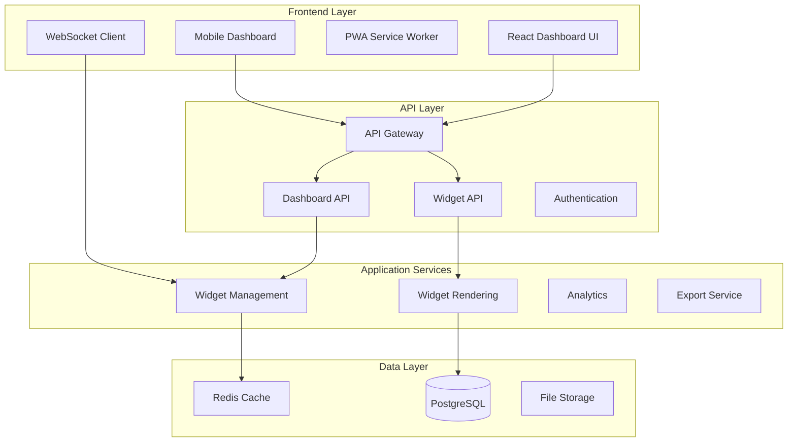
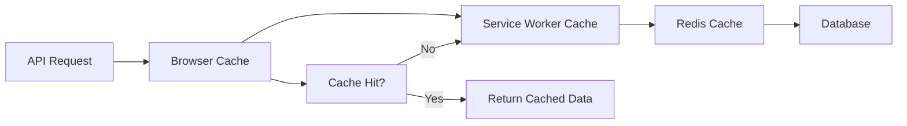

# Dashboard Module - Complete Implementation Guide

## 🎯 Overview

The Dashboard Module is a comprehensive, enterprise-grade dashboard system built with Laravel and React. It provides real-time data visualization, mobile optimization, and extensive customization capabilities for financial and business analytics.

## 🏗️ System Architecture



## ✨ Key Features

### 🖥️ Frontend Integration
- **REST API Service**: Complete integration with Laravel backend
- **GraphQL Compatibility**: Backward compatibility with existing GraphQL interface
- **Type Safety**: Full TypeScript support with comprehensive type definitions
- **Error Handling**: Robust error handling and user feedback

### ⚡ Real-time Updates
- **WebSocket Integration**: Live data synchronization
- **React Hooks**: Easy-to-use hooks for real-time data
- **Connection Management**: Auto-reconnection and heartbeat monitoring
- **Event-driven Architecture**: Efficient update propagation

### 📱 Mobile Optimization
- **Touch-first Design**: Optimized for mobile interaction
- **Swipe Gestures**: Intuitive navigation and widget management
- **Pull-to-refresh**: Native mobile interaction patterns
- **Responsive Layout**: Adaptive design for all screen sizes

### 🔄 Progressive Web App (PWA)
- **Offline Support**: Full functionality without internet connection
- **Service Worker**: Intelligent caching and background sync
- **Push Notifications**: Real-time alerts and updates
- **App-like Experience**: Native app feel in the browser

## 🚀 Quick Start

### Prerequisites

- PHP 8.1+
- Node.js 18+
- Laravel 10+
- Redis
- PostgreSQL

### Installation

1. **Backend Setup**
```bash
# Install PHP dependencies
composer install

# Run migrations
php artisan migrate

# Seed dashboard data
php artisan db:seed --class=DashboardSeeder
```

2. **Frontend Setup**
```bash
# Install Node dependencies
npm install

# Build assets
npm run build

# For development
npm run dev
```

3. **Configuration**
```bash
# Copy environment file
cp .env.example .env

# Configure database and Redis
# Set REDIS_HOST, DB_HOST, etc.

# Generate application key
php artisan key:generate
```

## 📊 Widget Types

The dashboard supports various widget types for different data visualization needs:

### Financial Widgets
- **Financial Summary**: Key financial metrics overview
- **Revenue Chart**: Revenue trends and forecasting
- **Expense Chart**: Expense tracking and analysis
- **Cash Flow**: Cash flow visualization
- **Budget Overview**: Budget vs actual comparison

### Analytics Widgets
- **KPI Metrics**: Key performance indicators
- **Performance Dashboard**: System performance metrics
- **User Analytics**: User behavior and engagement
- **Custom Metrics**: Configurable metric displays

## 🔧 API Reference

### Dashboard Endpoints

```http
GET    /api/dashboard              # Get complete dashboard
POST   /api/dashboard/refresh      # Refresh dashboard data
GET    /api/dashboard/performance  # Get performance insights
GET    /api/dashboard/recommendations # Get widget recommendations
PUT    /api/dashboard/customize    # Update layout/preferences
POST   /api/dashboard/export       # Export dashboard
```

### Widget Endpoints

```http
GET    /api/dashboard/widgets      # List widgets
POST   /api/dashboard/widgets      # Create widget
GET    /api/dashboard/widgets/{id} # Get widget
PUT    /api/dashboard/widgets/{id} # Update widget
DELETE /api/dashboard/widgets/{id} # Delete widget
POST   /api/dashboard/widgets/{id}/duplicate # Duplicate widget
POST   /api/dashboard/widgets/reorder # Reorder widgets
```

## 🎨 Frontend Components

### React Components

```typescript
// Main Dashboard Component
import { Dashboard } from '@/features/dashboard/pages/Dashboard';

// Mobile Dashboard
import { MobileDashboard } from '@/features/dashboard/components/mobile/MobileDashboard';

// Individual Widgets
import { FinancialSummaryWidget } from '@/features/dashboard/components/widgets/FinancialSummaryWidget';
```

### API Services

```typescript
// REST API Service
import { dashboardRestApi } from '@/features/dashboard/services/dashboardRestApi';

// WebSocket Service
import { dashboardWebSocket } from '@/features/dashboard/services/websocketService';

// Real-time Hooks
import { useRealTimeConnection, useWidgetRealTimeUpdates } from '@/features/dashboard/hooks/useRealTimeUpdates';
```

## 🔄 Real-time Integration

### WebSocket Connection

```typescript
import { useRealTimeConnection } from '@/features/dashboard/hooks/useRealTimeUpdates';

function DashboardComponent() {
  const { isConnected, connect, disconnect } = useRealTimeConnection({
    enabled: true,
    autoConnect: true,
    onConnectionChange: (connected) => {
      console.log('Connection status:', connected);
    }
  });

  return (
    <div>
      <div>Status: {isConnected ? 'Connected' : 'Disconnected'}</div>
      {/* Dashboard content */}
    </div>
  );
}
```

### Widget Real-time Updates

```typescript
import { useWidgetRealTimeUpdates } from '@/features/dashboard/hooks/useRealTimeUpdates';

function WidgetComponent({ widgetId }) {
  useWidgetRealTimeUpdates(
    widgetId,
    (data) => {
      // Handle real-time widget data updates
      console.log('Widget updated:', data);
    },
    { enabled: true }
  );

  return <div>Widget content</div>;
}
```

## 📱 Mobile Usage

### Mobile Dashboard Component

```typescript
import { MobileDashboard } from '@/features/dashboard/components/mobile/MobileDashboard';

function MobileApp() {
  return (
    <MobileDashboard
      widgets={widgets}
      onWidgetUpdate={handleWidgetUpdate}
      onAddWidget={handleAddWidget}
      onEditWidget={handleEditWidget}
      onDeleteWidget={handleDeleteWidget}
      onRefresh={handleRefresh}
      onShare={handleShare}
      onSettings={handleSettings}
    />
  );
}
```

### Touch Gestures

- **Swipe Left/Right**: Navigate between widget pages
- **Swipe Left on Widget**: Reveal action menu
- **Pull Down**: Refresh dashboard data
- **Tap**: Select/activate widget
- **Long Press**: Widget context menu

## 🔧 PWA Configuration

### Service Worker Registration

```typescript
import { pwaServiceWorker } from '@/core/pwa/serviceWorker';

// Initialize PWA features
await pwaServiceWorker.initialize();

// Install PWA
const installed = await pwaServiceWorker.installPWA();

// Check PWA status
const status = pwaServiceWorker.getInstallationStatus();
// Returns: 'not-installable' | 'installable' | 'installed'
```

### Offline Support

The PWA provides comprehensive offline support:

- **Cached Dashboard Data**: Last known state available offline
- **Offline Indicators**: Clear visual feedback when offline
- **Background Sync**: Sync changes when connection restored
- **Offline Actions**: Queue actions for later synchronization

## 🎯 Customization

### Widget Configuration

```typescript
// Widget configuration schema
const widgetConfig = {
  period: 'last_12_months',
  chart_type: 'line',
  show_legend: true,
  metrics: ['revenue', 'profit', 'expenses']
};

// Update widget configuration
await dashboardRestApi.updateWidgetConfiguration(widgetId, widgetConfig);
```

### Dashboard Layout

```typescript
// Customize dashboard layout
await dashboardRestApi.customizeDashboard({
  layout: {
    theme: 'dark',
    grid_columns: 12,
    sidebar_collapsed: true
  },
  preferences: {
    auto_refresh: true,
    refresh_interval: 300,
    compact_mode: false
  }
});
```

## 📈 Performance Optimization

### Caching Strategy



### Performance Features

- **Lazy Loading**: Load widgets on demand
- **Virtual Scrolling**: Handle large datasets efficiently
- **Memoization**: Cache expensive calculations
- **Code Splitting**: Load only necessary code
- **Image Optimization**: Optimized asset delivery

## 🔒 Security

### Authentication

```typescript
// API requests include authentication automatically
const dashboard = await dashboardRestApi.getDashboard();
// Headers: Authorization: Bearer {token}
```

### Data Protection

- **Input Validation**: All inputs sanitized and validated
- **CSRF Protection**: Cross-site request forgery prevention
- **Rate Limiting**: API abuse prevention
- **Secure Communication**: HTTPS/WSS only

## 📊 Analytics & Monitoring

### Usage Analytics

```typescript
// Track user actions
await dashboardAnalytics.trackUserAction({
  action: 'widget_created',
  widget_type: 'financial_summary',
  user_id: userId
});

// Get usage metrics
const metrics = await dashboardAnalytics.getUsageMetrics('last_30_days');
```

### Performance Monitoring

- **Response Times**: API endpoint performance
- **Widget Render Times**: Frontend performance metrics
- **Cache Hit Rates**: Caching effectiveness
- **Error Rates**: System reliability metrics

## 🧪 Testing

### Frontend Testing

```bash
# Run unit tests
npm run test

# Run integration tests
npm run test:integration

# Run E2E tests
npm run test:e2e
```

### Backend Testing

```bash
# Run PHP unit tests
php artisan test

# Run feature tests
php artisan test --testsuite=Feature

# Run dashboard-specific tests
php artisan test --filter=Dashboard
```

## 🚀 Deployment

### Production Build

```bash
# Build frontend assets
npm run build

# Optimize Laravel
php artisan config:cache
php artisan route:cache
php artisan view:cache

# Run migrations
php artisan migrate --force
```

### Environment Configuration

```env
# Dashboard Configuration
DASHBOARD_CACHE_TTL=3600
DASHBOARD_MAX_WIDGETS=20
DASHBOARD_WEBSOCKET_URL=wss://your-domain.com/ws

# PWA Configuration
VITE_PWA_ENABLED=true
VITE_VAPID_PUBLIC_KEY=your-vapid-key

# Performance
REDIS_HOST=localhost
REDIS_PORT=6379
```

## 📚 Documentation

### API Documentation
- [Complete API Reference](./api/dashboard-api.md)
- [WebSocket Events](./api/websocket-events.md)
- [Widget Configuration Schemas](./api/widget-schemas.md)

### Architecture Documentation
- [Service Architecture](./architecture/dashboard-services.md)
- [Database Schema](./architecture/database-schema.md)
- [Frontend Architecture](./architecture/frontend-architecture.md)

### Development Guides
- [Adding New Widget Types](./guides/adding-widgets.md)
- [Customizing Themes](./guides/theming.md)
- [Performance Optimization](./guides/performance.md)

## 🤝 Contributing

### Development Setup

1. Fork the repository
2. Create a feature branch
3. Make your changes
4. Add tests for new functionality
5. Ensure all tests pass
6. Submit a pull request

### Code Standards

- **PHP**: PSR-12 coding standard
- **TypeScript**: ESLint + Prettier configuration
- **Testing**: Minimum 80% code coverage
- **Documentation**: Update docs for new features

## 📄 License

This project is licensed under the MIT License. See the [LICENSE](../LICENSE) file for details.

## 🆘 Support

### Getting Help

- **Documentation**: Check the docs directory
- **Issues**: Create a GitHub issue
- **Discussions**: Use GitHub Discussions
- **Email**: support@your-domain.com

### Common Issues

#### WebSocket Connection Issues
```typescript
// Check WebSocket status
const status = dashboardWebSocket.getStatus();
console.log('WebSocket status:', status);

// Manual reconnection
await dashboardWebSocket.connect();
```

#### PWA Installation Issues
```typescript
// Check PWA capabilities
const capabilities = pwaServiceWorker.getCapabilities();
console.log('PWA capabilities:', capabilities);

// Check installation status
const installStatus = pwaServiceWorker.getInstallationStatus();
console.log('Install status:', installStatus);
```

#### Performance Issues
```typescript
// Enable performance monitoring
const performanceMetrics = await dashboardRestApi.getPerformanceInsights();
console.log('Performance metrics:', performanceMetrics);
```

## 🔄 Changelog

### Version 2.0.0 (Current)
- ✅ Complete REST API integration
- ✅ Real-time WebSocket updates
- ✅ Mobile-optimized dashboard
- ✅ PWA support with offline functionality
- ✅ Comprehensive documentation
- ✅ Performance optimizations
- ✅ Enhanced security features

### Version 1.0.0
- Basic dashboard functionality
- GraphQL API integration
- Desktop-only interface
- Limited customization options

---

**Built with ❤️ using Laravel, React, and modern web technologies.**
