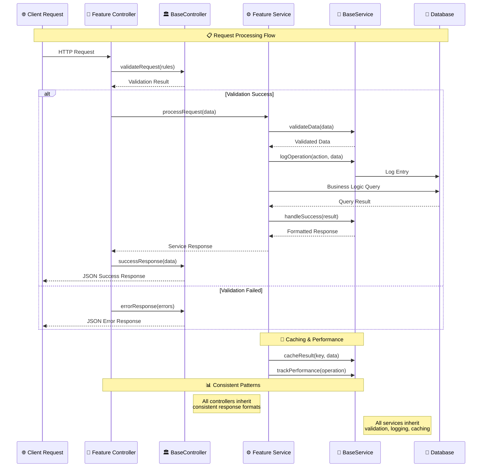
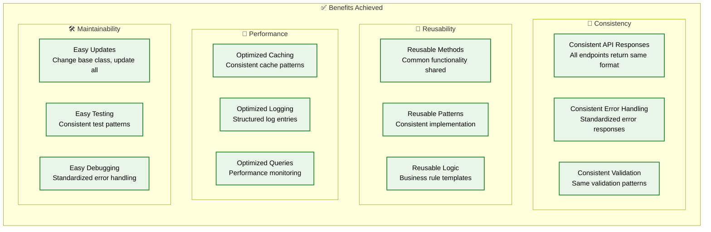

# 🏗️ Base Classes Architecture

> **Comprehensive documentation of the BaseService and BaseController architecture patterns**

## 📋 Overview

This document details the base architecture classes that provide consistent patterns across all features in the Laravel accounting platform.

---

## 🎯 **Base Classes Overview**

### **Architecture Foundation**

```mermaid
graph TB
    subgraph "🏗️ Base Architecture Foundation"
        subgraph "🎯 BaseController Class"
            BC[BaseController<br/>app/Shared/Controllers/Base/]
            BC_SUCCESS[successResponse()<br/>Standardized API responses]
            BC_ERROR[errorResponse()<br/>Consistent error handling]
            BC_VALIDATE[validateRequest()<br/>Common validation logic]
            BC_MIDDLEWARE[middleware()<br/>Shared middleware patterns]
        end
        
        subgraph "⚙️ BaseService Class"
            BS[BaseService<br/>app/Shared/Services/Base/]
            BS_VALIDATE[validateData()<br/>Data validation patterns]
            BS_ERROR[handleError()<br/>Error processing logic]
            BS_SUCCESS[handleSuccess()<br/>Success response formatting]
            BS_LOG[logOperation()<br/>Consistent logging]
            BS_CACHE[cacheResult()<br/>Caching patterns]
        end
        
        subgraph "🔧 Shared Utilities"
            INTER_BUS[InterModuleBus<br/>Cross-feature communication]
            COMMON_UTILS[Common Utilities<br/>Shared helper functions]
            SERVICE_PROXY[ServiceProxy<br/>Service discovery]
        end
    end
    
    %% Method Relationships
    BC --> BC_SUCCESS
    BC --> BC_ERROR
    BC --> BC_VALIDATE
    BC --> BC_MIDDLEWARE
    
    BS --> BS_VALIDATE
    BS --> BS_ERROR
    BS --> BS_SUCCESS
    BS --> BS_LOG
    BS --> BS_CACHE
    
    %% Utility Integration
    BS --> INTER_BUS
    BC --> COMMON_UTILS
    BS --> SERVICE_PROXY
    
    classDef baseClass fill:#fff3e0,stroke:#f57c00,stroke-width:3px,color:#000
    classDef method fill:#e8f5e8,stroke:#388e3c,stroke-width:2px,color:#000
    classDef utility fill:#e3f2fd,stroke:#1976d2,stroke-width:2px,color:#000
    
    class BC,BS baseClass
    class BC_SUCCESS,BC_ERROR,BC_VALIDATE,BC_MIDDLEWARE,BS_VALIDATE,BS_ERROR,BS_SUCCESS,BS_LOG,BS_CACHE method
    class INTER_BUS,COMMON_UTILS,SERVICE_PROXY utility
```

---

## 🎯 **BaseController Implementation**

### **Controller Pattern and Methods**

```mermaid
graph TB
    subgraph "🏛️ BaseController Architecture"
        subgraph "📋 Core Methods"
            SUCCESS[successResponse($data, $message, $code)<br/>✅ Standardized success responses]
            ERROR[errorResponse($message, $code, $errors)<br/>❌ Consistent error handling]
            VALIDATE[validateRequest($request, $rules)<br/>🔍 Common validation logic]
        end
        
        subgraph "🔧 Helper Methods"
            PAGINATE[paginateResponse($data)<br/>📄 Pagination formatting]
            TRANSFORM[transformData($data, $transformer)<br/>🔄 Data transformation]
            AUTHORIZE[authorizeAction($action, $resource)<br/>🔐 Authorization checks]
        end
        
        subgraph "📊 Response Formats"
            JSON_SUCCESS[JSON Success Format<br/>{success: true, data: {}, message: ''}]
            JSON_ERROR[JSON Error Format<br/>{success: false, error: '', code: 400}]
            VALIDATION_ERROR[Validation Error Format<br/>{success: false, errors: {field: []}}]
        end
    end
    
    subgraph "🎯 Feature Controller Implementation"
        subgraph "💰 AccountingController"
            ACC_INDEX[index() → successResponse()]
            ACC_STORE[store() → validateRequest() → successResponse()]
            ACC_ERROR_HANDLE[Exception → errorResponse()]
        end
        
        subgraph "📦 InventoryController"
            INV_INDEX[index() → successResponse()]
            INV_UPDATE[update() → validateRequest() → successResponse()]
            INV_ERROR_HANDLE[Exception → errorResponse()]
        end
        
        subgraph "⚡ BusinessOperationsController"
            BIZ_OPERATIONS[operations() → authorizeAction() → successResponse()]
            BIZ_REPORTS[reports() → paginateResponse()]
            BIZ_ERROR_HANDLE[Exception → errorResponse()]
        end
    end
    
    %% Method Usage
    SUCCESS --> JSON_SUCCESS
    ERROR --> JSON_ERROR
    VALIDATE --> VALIDATION_ERROR
    
    %% Feature Implementation
    ACC_INDEX -.-> SUCCESS
    ACC_STORE -.-> VALIDATE
    ACC_STORE -.-> SUCCESS
    ACC_ERROR_HANDLE -.-> ERROR
    
    INV_INDEX -.-> SUCCESS
    INV_UPDATE -.-> VALIDATE
    INV_UPDATE -.-> SUCCESS
    INV_ERROR_HANDLE -.-> ERROR
    
    BIZ_OPERATIONS -.-> AUTHORIZE
    BIZ_OPERATIONS -.-> SUCCESS
    BIZ_REPORTS -.-> PAGINATE
    BIZ_ERROR_HANDLE -.-> ERROR
    
    classDef coreMethod fill:#fff3e0,stroke:#f57c00,stroke-width:3px,color:#000
    classDef helperMethod fill:#e8f5e8,stroke:#388e3c,stroke-width:2px,color:#000
    classDef responseFormat fill:#f3e5f5,stroke:#7b1fa2,stroke-width:2px,color:#000
    classDef featureMethod fill:#e3f2fd,stroke:#1976d2,stroke-width:2px,color:#000
    
    class SUCCESS,ERROR,VALIDATE coreMethod
    class PAGINATE,TRANSFORM,AUTHORIZE helperMethod
    class JSON_SUCCESS,JSON_ERROR,VALIDATION_ERROR responseFormat
    class ACC_INDEX,ACC_STORE,ACC_ERROR_HANDLE,INV_INDEX,INV_UPDATE,INV_ERROR_HANDLE,BIZ_OPERATIONS,BIZ_REPORTS,BIZ_ERROR_HANDLE featureMethod
```

---

## ⚙️ **BaseService Implementation**

### **Service Pattern and Methods**

```mermaid
graph TB
    subgraph "⚙️ BaseService Architecture"
        subgraph "🔍 Validation Methods"
            VALIDATE_DATA[validateData($data, $rules)<br/>🔍 Data validation with custom rules]
            VALIDATE_BUSINESS[validateBusinessRules($data)<br/>📋 Business logic validation]
            SANITIZE[sanitizeInput($data)<br/>🧹 Input sanitization]
        end
        
        subgraph "🎯 Response Handling"
            HANDLE_SUCCESS[handleSuccess($data, $message)<br/>✅ Success response formatting]
            HANDLE_ERROR[handleError($exception, $context)<br/>❌ Error processing and logging]
            FORMAT_RESPONSE[formatResponse($data, $meta)<br/>📋 Response standardization]
        end
        
        subgraph "📊 Logging & Monitoring"
            LOG_OPERATION[logOperation($action, $data, $user)<br/>📝 Operation logging]
            LOG_ERROR[logError($exception, $context)<br/>🚨 Error logging]
            TRACK_PERFORMANCE[trackPerformance($operation)<br/>⚡ Performance monitoring]
        end
        
        subgraph "💾 Caching & Optimization"
            CACHE_RESULT[cacheResult($key, $data, $ttl)<br/>💾 Result caching]
            INVALIDATE_CACHE[invalidateCache($pattern)<br/>🔄 Cache invalidation]
            OPTIMIZE_QUERY[optimizeQuery($query)<br/>⚡ Query optimization]
        end
    end
    
    subgraph "🎯 Feature Service Implementation"
        subgraph "💰 AccountingService"
            ACC_CREATE[createTransaction() → validateData() → logOperation()]
            ACC_CALCULATE[calculateBalance() → cacheResult() → handleSuccess()]
            ACC_REPORT[generateReport() → optimizeQuery() → formatResponse()]
        end
        
        subgraph "📦 InventoryService"
            INV_UPDATE[updateStock() → validateBusinessRules() → logOperation()]
            INV_CHECK[checkAvailability() → cacheResult() → handleSuccess()]
            INV_ALERT[lowStockAlert() → trackPerformance() → handleSuccess()]
        end
        
        subgraph "⚡ BusinessOperationsService"
            BIZ_PROCESS[processOperation() → validateData() → logOperation()]
            BIZ_CONSOLIDATE[consolidateReports() → optimizeQuery() → cacheResult()]
            BIZ_ANALYZE[analyzeMetrics() → trackPerformance() → formatResponse()]
        end
    end
    
    %% Method Relationships
    VALIDATE_DATA --> SANITIZE
    HANDLE_SUCCESS --> FORMAT_RESPONSE
    HANDLE_ERROR --> LOG_ERROR
    LOG_OPERATION --> TRACK_PERFORMANCE
    CACHE_RESULT --> INVALIDATE_CACHE
    
    %% Feature Implementation
    ACC_CREATE -.-> VALIDATE_DATA
    ACC_CREATE -.-> LOG_OPERATION
    ACC_CALCULATE -.-> CACHE_RESULT
    ACC_CALCULATE -.-> HANDLE_SUCCESS
    ACC_REPORT -.-> OPTIMIZE_QUERY
    ACC_REPORT -.-> FORMAT_RESPONSE
    
    INV_UPDATE -.-> VALIDATE_BUSINESS
    INV_UPDATE -.-> LOG_OPERATION
    INV_CHECK -.-> CACHE_RESULT
    INV_CHECK -.-> HANDLE_SUCCESS
    INV_ALERT -.-> TRACK_PERFORMANCE
    INV_ALERT -.-> HANDLE_SUCCESS
    
    BIZ_PROCESS -.-> VALIDATE_DATA
    BIZ_PROCESS -.-> LOG_OPERATION
    BIZ_CONSOLIDATE -.-> OPTIMIZE_QUERY
    BIZ_CONSOLIDATE -.-> CACHE_RESULT
    BIZ_ANALYZE -.-> TRACK_PERFORMANCE
    BIZ_ANALYZE -.-> FORMAT_RESPONSE
    
    classDef validationMethod fill:#fff3e0,stroke:#f57c00,stroke-width:3px,color:#000
    classDef responseMethod fill:#e8f5e8,stroke:#388e3c,stroke-width:2px,color:#000
    classDef loggingMethod fill:#f3e5f5,stroke:#7b1fa2,stroke-width:2px,color:#000
    classDef cachingMethod fill:#e3f2fd,stroke:#1976d2,stroke-width:2px,color:#000
    classDef featureMethod fill:#fce4ec,stroke:#c2185b,stroke-width:2px,color:#000
    
    class VALIDATE_DATA,VALIDATE_BUSINESS,SANITIZE validationMethod
    class HANDLE_SUCCESS,HANDLE_ERROR,FORMAT_RESPONSE responseMethod
    class LOG_OPERATION,LOG_ERROR,TRACK_PERFORMANCE loggingMethod
    class CACHE_RESULT,INVALIDATE_CACHE,OPTIMIZE_QUERY cachingMethod
    class ACC_CREATE,ACC_CALCULATE,ACC_REPORT,INV_UPDATE,INV_CHECK,INV_ALERT,BIZ_PROCESS,BIZ_CONSOLIDATE,BIZ_ANALYZE featureMethod
```

---

## 🔄 **Inheritance Flow Diagram**

### **Base Class to Feature Implementation**



---

## 📊 **Implementation Benefits**

### **Consistency and Reusability Achievements**



---

## 🎯 **Usage Examples**

### **BaseController Usage**

```php
<?php

namespace App\Features\Accounting\Controllers;

use App\Shared\Controllers\Base\BaseController;

class AccountingController extends BaseController
{
    public function index()
    {
        try {
            $accounts = $this->accountingService->getAllAccounts();
            return $this->successResponse($accounts, 'Accounts retrieved successfully');
        } catch (\Exception $e) {
            return $this->errorResponse('Failed to retrieve accounts', 500);
        }
    }
    
    public function store(Request $request)
    {
        $rules = ['name' => 'required|string', 'type' => 'required|in:asset,liability'];
        
        if (!$this->validateRequest($request, $rules)) {
            return $this->errorResponse('Validation failed', 422, $this->getValidationErrors());
        }
        
        $account = $this->accountingService->createAccount($request->validated());
        return $this->successResponse($account, 'Account created successfully', 201);
    }
}
```

### **BaseService Usage**

```php
<?php

namespace App\Features\Accounting\Services;

use App\Shared\Services\Base\BaseService;

class AccountingService extends BaseService
{
    public function createAccount(array $data)
    {
        // Validate data using base method
        $validatedData = $this->validateData($data, [
            'name' => 'required|string|max:255',
            'type' => 'required|in:asset,liability,equity,revenue,expense'
        ]);
        
        try {
            // Log the operation
            $this->logOperation('create_account', $validatedData, auth()->user());
            
            // Create account
            $account = Account::create($validatedData);
            
            // Cache the result
            $this->cacheResult("account_{$account->id}", $account, 3600);
            
            return $this->handleSuccess($account, 'Account created successfully');
            
        } catch (\Exception $e) {
            return $this->handleError($e, ['action' => 'create_account', 'data' => $validatedData]);
        }
    }
}
```

---

## 🚀 **Next Steps**

### **Implementation Roadmap**

1. **✅ Completed**: Base classes created and documented
2. **🔄 In Progress**: Update existing controllers to extend BaseController
3. **📋 Next**: Update existing services to extend BaseService
4. **🎯 Future**: Add more specialized base classes for specific patterns

The base classes architecture provides a solid foundation for consistent, maintainable, and scalable Laravel development! 🎉

