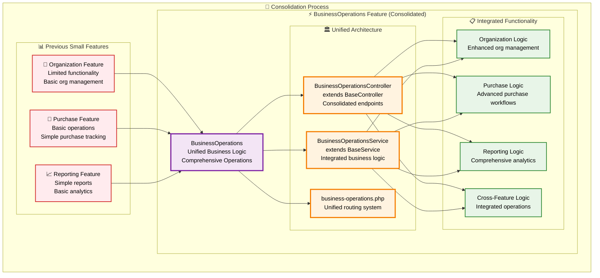
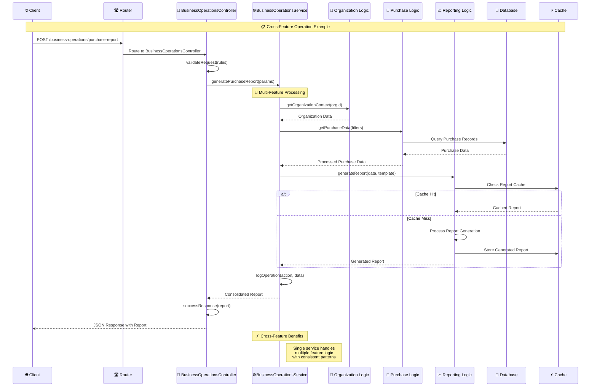
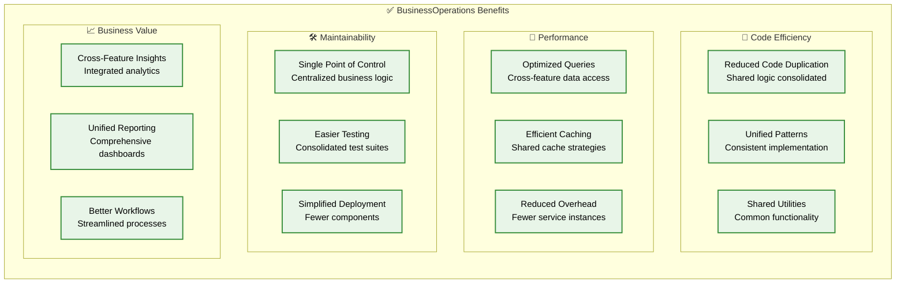

# ⚡ BusinessOperations Integration Architecture

> **Comprehensive documentation of the BusinessOperations consolidated feature**

## 📋 Overview

This document details the BusinessOperations feature that consolidates Organization, Purchase, and Reporting functionality into a unified, efficient business operations system.

---

## 🎯 **BusinessOperations Consolidation Strategy**

### **Feature Consolidation Overview**



---

## 🏛️ **BusinessOperations Architecture**

### **Unified Controller Structure**

```mermaid
graph TB
    subgraph "🎯 BusinessOperationsController Architecture"
        subgraph "🏢 Organization Endpoints"
            ORG_INDEX[GET /organizations<br/>List organizations]
            ORG_STORE[POST /organizations<br/>Create organization]
            ORG_UPDATE[PUT /organizations/{id}<br/>Update organization]
            ORG_DELETE[DELETE /organizations/{id}<br/>Delete organization]
        end
        
        subgraph "🛒 Purchase Endpoints"
            PUR_INDEX[GET /purchases<br/>List purchases]
            PUR_STORE[POST /purchases<br/>Create purchase]
            PUR_APPROVE[POST /purchases/{id}/approve<br/>Approve purchase]
            PUR_REPORTS[GET /purchases/reports<br/>Purchase reports]
        end
        
        subgraph "📈 Reporting Endpoints"
            REP_DASHBOARD[GET /reports/dashboard<br/>Business dashboard]
            REP_FINANCIAL[GET /reports/financial<br/>Financial reports]
            REP_OPERATIONS[GET /reports/operations<br/>Operations reports]
            REP_CUSTOM[POST /reports/custom<br/>Custom reports]
        end
        
        subgraph "⚡ Cross-Feature Endpoints"
            CROSS_ANALYTICS[GET /analytics<br/>Cross-feature analytics]
            CROSS_INSIGHTS[GET /insights<br/>Business insights]
            CROSS_EXPORT[POST /export<br/>Unified data export]
            CROSS_IMPORT[POST /import<br/>Unified data import]
        end
        
        subgraph "🏗️ Base Controller Methods"
            BASE_SUCCESS[successResponse()]
            BASE_ERROR[errorResponse()]
            BASE_VALIDATE[validateRequest()]
            BASE_AUTHORIZE[authorizeAction()]
        end
    end
    
    %% Method Usage
    ORG_INDEX -.-> BASE_SUCCESS
    ORG_STORE -.-> BASE_VALIDATE
    ORG_STORE -.-> BASE_SUCCESS
    ORG_UPDATE -.-> BASE_AUTHORIZE
    ORG_DELETE -.-> BASE_AUTHORIZE
    
    PUR_INDEX -.-> BASE_SUCCESS
    PUR_STORE -.-> BASE_VALIDATE
    PUR_APPROVE -.-> BASE_AUTHORIZE
    PUR_REPORTS -.-> BASE_SUCCESS
    
    REP_DASHBOARD -.-> BASE_SUCCESS
    REP_FINANCIAL -.-> BASE_AUTHORIZE
    REP_OPERATIONS -.-> BASE_SUCCESS
    REP_CUSTOM -.-> BASE_VALIDATE
    
    CROSS_ANALYTICS -.-> BASE_SUCCESS
    CROSS_INSIGHTS -.-> BASE_AUTHORIZE
    CROSS_EXPORT -.-> BASE_VALIDATE
    CROSS_IMPORT -.-> BASE_VALIDATE
    
    classDef orgEndpoint fill:#e3f2fd,stroke:#1976d2,stroke-width:2px,color:#000
    classDef purEndpoint fill:#e8f5e8,stroke:#388e3c,stroke-width:2px,color:#000
    classDef repEndpoint fill:#f3e5f5,stroke:#7b1fa2,stroke-width:2px,color:#000
    classDef crossEndpoint fill:#fff3e0,stroke:#f57c00,stroke-width:2px,color:#000
    classDef baseMethod fill:#fce4ec,stroke:#c2185b,stroke-width:3px,color:#000
    
    class ORG_INDEX,ORG_STORE,ORG_UPDATE,ORG_DELETE orgEndpoint
    class PUR_INDEX,PUR_STORE,PUR_APPROVE,PUR_REPORTS purEndpoint
    class REP_DASHBOARD,REP_FINANCIAL,REP_OPERATIONS,REP_CUSTOM repEndpoint
    class CROSS_ANALYTICS,CROSS_INSIGHTS,CROSS_EXPORT,CROSS_IMPORT crossEndpoint
    class BASE_SUCCESS,BASE_ERROR,BASE_VALIDATE,BASE_AUTHORIZE baseMethod
```

---

## ⚙️ **BusinessOperations Service Architecture**

### **Consolidated Service Logic**

```mermaid
graph TB
    subgraph "⚙️ BusinessOperationsService Architecture"
        subgraph "🏢 Organization Services"
            ORG_MGMT[Organization Management<br/>CRUD operations]
            ORG_HIERARCHY[Organization Hierarchy<br/>Parent-child relationships]
            ORG_SETTINGS[Organization Settings<br/>Configuration management]
            ORG_USERS[User Management<br/>Organization members]
        end
        
        subgraph "🛒 Purchase Services"
            PUR_WORKFLOW[Purchase Workflow<br/>Request → Approval → Order]
            PUR_VENDOR[Vendor Management<br/>Supplier relationships]
            PUR_BUDGET[Budget Control<br/>Spending limits & tracking]
            PUR_INTEGRATION[Integration Services<br/>External procurement systems]
        end
        
        subgraph "📈 Reporting Services"
            REP_GENERATOR[Report Generator<br/>Dynamic report creation]
            REP_SCHEDULER[Report Scheduler<br/>Automated report generation]
            REP_ANALYTICS[Analytics Engine<br/>Business intelligence]
            REP_EXPORT[Export Services<br/>Multiple format support]
        end
        
        subgraph "⚡ Cross-Feature Services"
            CROSS_VALIDATOR[Cross Validator<br/>Multi-feature validation]
            CROSS_AGGREGATOR[Data Aggregator<br/>Cross-feature data collection]
            CROSS_NOTIFIER[Notification Service<br/>Multi-feature alerts]
            CROSS_AUDIT[Audit Service<br/>Cross-feature tracking]
        end
        
        subgraph "🔧 Base Service Methods"
            BASE_VALIDATE[validateData()]
            BASE_ERROR[handleError()]
            BASE_SUCCESS[handleSuccess()]
            BASE_LOG[logOperation()]
            BASE_CACHE[cacheResult()]
        end
    end
    
    %% Service Integration
    ORG_MGMT --> CROSS_VALIDATOR
    PUR_WORKFLOW --> CROSS_VALIDATOR
    REP_GENERATOR --> CROSS_AGGREGATOR
    
    ORG_HIERARCHY --> CROSS_AUDIT
    PUR_BUDGET --> CROSS_NOTIFIER
    REP_SCHEDULER --> CROSS_NOTIFIER
    
    %% Base Method Usage
    ORG_MGMT -.-> BASE_VALIDATE
    ORG_MGMT -.-> BASE_LOG
    PUR_WORKFLOW -.-> BASE_VALIDATE
    PUR_WORKFLOW -.-> BASE_SUCCESS
    REP_GENERATOR -.-> BASE_CACHE
    REP_GENERATOR -.-> BASE_SUCCESS
    CROSS_VALIDATOR -.-> BASE_ERROR
    CROSS_AGGREGATOR -.-> BASE_CACHE
    
    classDef orgService fill:#e3f2fd,stroke:#1976d2,stroke-width:2px,color:#000
    classDef purService fill:#e8f5e8,stroke:#388e3c,stroke-width:2px,color:#000
    classDef repService fill:#f3e5f5,stroke:#7b1fa2,stroke-width:2px,color:#000
    classDef crossService fill:#fff3e0,stroke:#f57c00,stroke-width:2px,color:#000
    classDef baseMethod fill:#fce4ec,stroke:#c2185b,stroke-width:3px,color:#000
    
    class ORG_MGMT,ORG_HIERARCHY,ORG_SETTINGS,ORG_USERS orgService
    class PUR_WORKFLOW,PUR_VENDOR,PUR_BUDGET,PUR_INTEGRATION purService
    class REP_GENERATOR,REP_SCHEDULER,REP_ANALYTICS,REP_EXPORT repService
    class CROSS_VALIDATOR,CROSS_AGGREGATOR,CROSS_NOTIFIER,CROSS_AUDIT crossService
    class BASE_VALIDATE,BASE_ERROR,BASE_SUCCESS,BASE_LOG,BASE_CACHE baseMethod
```

---

## 🔄 **Integration Flow Diagram**

### **BusinessOperations Request Processing**



---

## 📊 **Integration Benefits**

### **Consolidation Advantages**



---

## 🎯 **Implementation Examples**

### **BusinessOperationsController Example**

```php
<?php

namespace App\Features\BusinessOperations\Controllers;

use App\Shared\Controllers\Base\BaseController;
use App\Features\BusinessOperations\Services\BusinessOperationsService;

class BusinessOperationsController extends BaseController
{
    protected $businessOperationsService;
    
    public function __construct(BusinessOperationsService $service)
    {
        $this->businessOperationsService = $service;
    }
    
    /**
     * Generate cross-feature business report
     */
    public function generateBusinessReport(Request $request)
    {
        $rules = [
            'organization_id' => 'required|uuid',
            'date_range' => 'required|array',
            'report_type' => 'required|in:financial,operational,comprehensive'
        ];
        
        if (!$this->validateRequest($request, $rules)) {
            return $this->errorResponse('Validation failed', 422, $this->getValidationErrors());
        }
        
        try {
            $report = $this->businessOperationsService->generateCrossFeatureReport(
                $request->validated()
            );
            
            return $this->successResponse($report, 'Business report generated successfully');
            
        } catch (\Exception $e) {
            return $this->errorResponse('Failed to generate report', 500);
        }
    }
    
    /**
     * Process purchase with organization context
     */
    public function processPurchaseWithContext(Request $request)
    {
        $this->authorizeAction('process_purchase', $request->organization_id);
        
        $result = $this->businessOperationsService->processPurchaseWithOrganizationContext(
            $request->all()
        );
        
        return $this->successResponse($result, 'Purchase processed successfully');
    }
}
```

### **BusinessOperationsService Example**

```php
<?php

namespace App\Features\BusinessOperations\Services;

use App\Shared\Services\Base\BaseService;

class BusinessOperationsService extends BaseService
{
    /**
     * Generate cross-feature report combining org, purchase, and reporting data
     */
    public function generateCrossFeatureReport(array $params)
    {
        // Validate input data
        $validatedData = $this->validateData($params, [
            'organization_id' => 'required|uuid',
            'date_range' => 'required|array',
            'report_type' => 'required|string'
        ]);
        
        try {
            // Log the operation
            $this->logOperation('generate_cross_feature_report', $validatedData, auth()->user());
            
            // Get organization context
            $orgContext = $this->getOrganizationContext($validatedData['organization_id']);
            
            // Get purchase data
            $purchaseData = $this->getPurchaseData($validatedData);
            
            // Generate comprehensive report
            $report = $this->generateComprehensiveReport($orgContext, $purchaseData, $validatedData);
            
            // Cache the result
            $cacheKey = "business_report_{$validatedData['organization_id']}_" . md5(serialize($validatedData));
            $this->cacheResult($cacheKey, $report, 3600);
            
            return $this->handleSuccess($report, 'Cross-feature report generated successfully');
            
        } catch (\Exception $e) {
            return $this->handleError($e, ['action' => 'generate_cross_feature_report', 'params' => $validatedData]);
        }
    }
    
    /**
     * Process purchase with full organization context
     */
    public function processPurchaseWithOrganizationContext(array $data)
    {
        // Cross-feature validation
        $this->validateCrossFeatureData($data);
        
        // Process with integrated logic
        $result = $this->processIntegratedPurchase($data);
        
        // Update cross-feature metrics
        $this->updateCrossFeatureMetrics($result);
        
        return $this->handleSuccess($result, 'Purchase processed with full context');
    }
}
```

---

## 🚀 **Migration Strategy**

### **From Separate Features to BusinessOperations**

1. **✅ Phase 1 - Completed**: Created BusinessOperations feature structure
2. **🔄 Phase 2 - Current**: Implement consolidated controller and service
3. **📋 Phase 3 - Next**: Migrate existing Organization/Purchase/Reporting logic
4. **🎯 Phase 4 - Future**: Deprecate old separate features and routes

The BusinessOperations integration provides a powerful, unified approach to business logic management! 🎉

