# 🏗️ System Architecture Documentation

## 📋 **Table of Contents**

- [🎯 Architecture Overview](#-architecture-overview)
- [🏗️ System Components](#️-system-components)
- [🔄 Data Flow Diagrams](#-data-flow-diagrams)
- [🚀 Deployment Architecture](#-deployment-architecture)
- [🔒 Security Architecture](#-security-architecture)
- [📊 Performance Architecture](#-performance-architecture)
- [🤝 Collaboration Architecture](#-collaboration-architecture)

---

## 🎯 **Architecture Overview**

The Laravel Accounting Platform follows a modern, microservices-inspired architecture with clear separation of concerns, real-time capabilities, and enterprise-grade security.

### **🏗️ Architecture Reference**

> **📋 For the complete high-level architecture, see [System Architecture Overview](../../README.md#-complete-system-architecture) in the main README.**

This document provides detailed component-level architecture and implementation specifics.

---

## 🏗️ **System Components**

### **1. 🎨 Frontend Architecture**

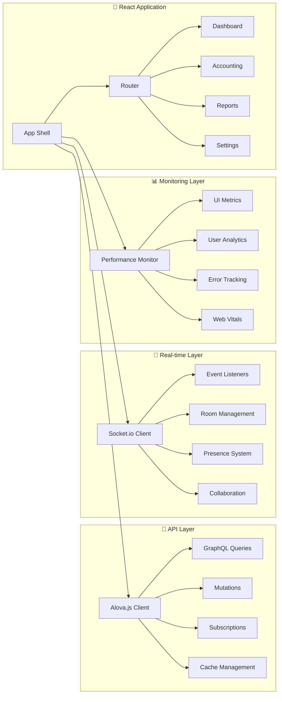

### **2. ⚡ Backend Architecture**

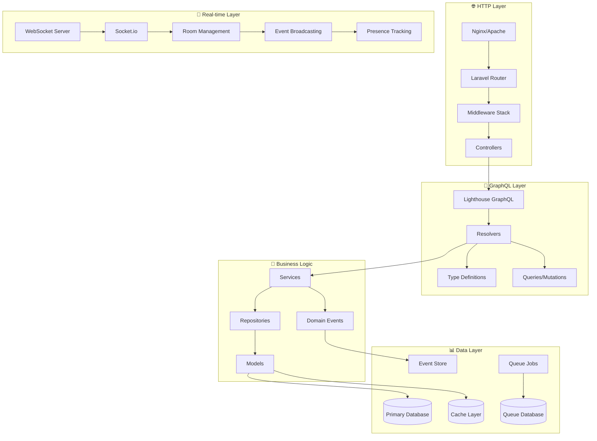

### **3. 🔒 Security Architecture**

```mermaid
graph LR
    subgraph "🛡️ Perimeter Security"
        A[WAF] --> B[DDoS Protection]
        B --> C[Rate Limiting]
        C --> D[IP Filtering]
    end
    
    subgraph "🔐 Authentication"
        E[Multi-Factor Auth] --> F[JWT Tokens]
        F --> G[Refresh Tokens]
        G --> H[Session Management]
    end
    
    subgraph "👥 Authorization"
        I[RBAC] --> J[Permissions]
        J --> K[Resource Access]
        K --> L[Data Filtering]
    end
    
    subgraph "🔍 Monitoring"
        M[Security Events] --> N[Threat Detection]
        N --> O[Risk Scoring]
        O --> P[Alert System]
    end
    
    D --> E
    H --> I
    L --> M
```

---

## 🔄 **Data Flow Diagrams**

### **1. 📊 Dashboard Data Flow**

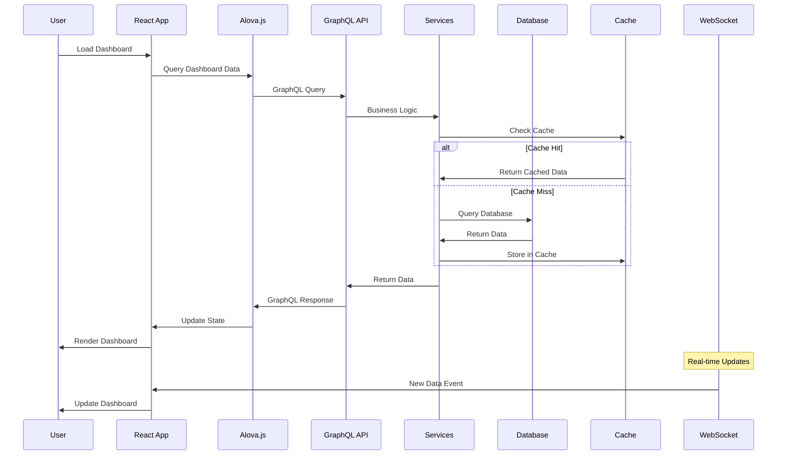

### **2. 🤝 Collaboration Data Flow**

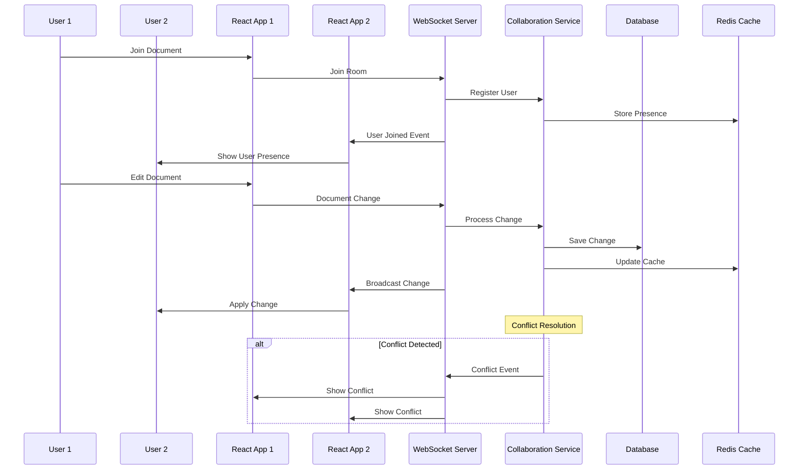

### **3. 🔒 Security Event Flow**

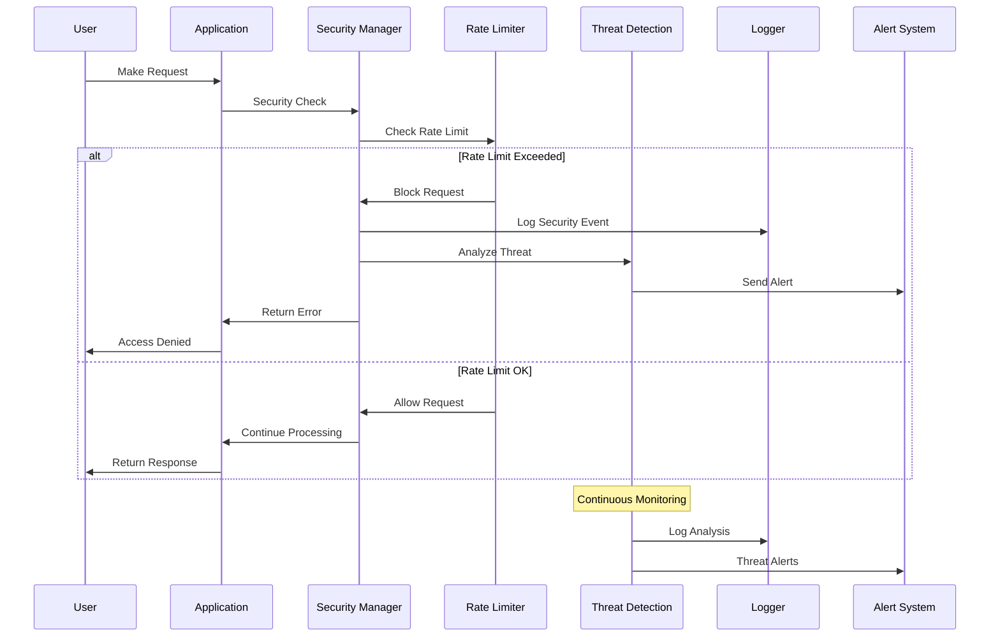

---

## 🚀 **Deployment Architecture**

### **1. ☁️ Kubernetes Deployment**

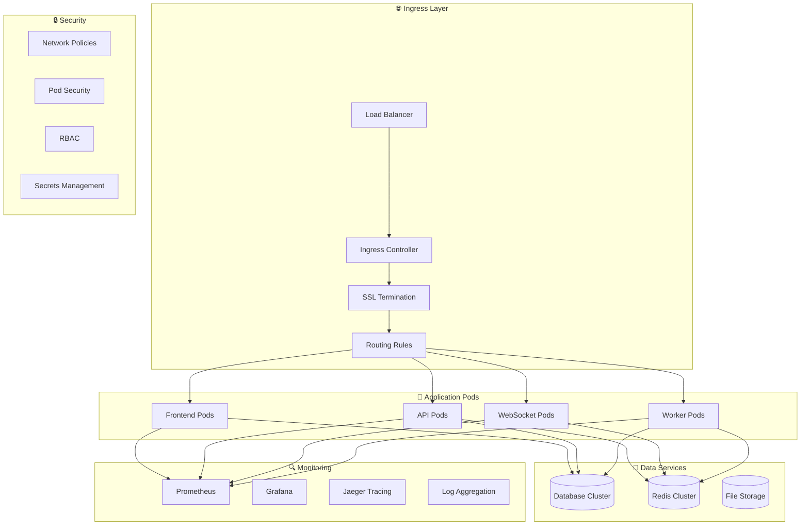

### **2. 🐳 Container Architecture**

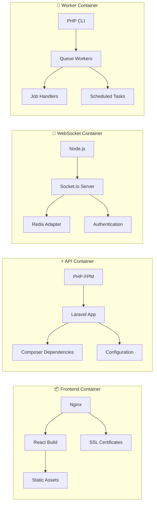

### **3. 🌍 Multi-Environment Setup**

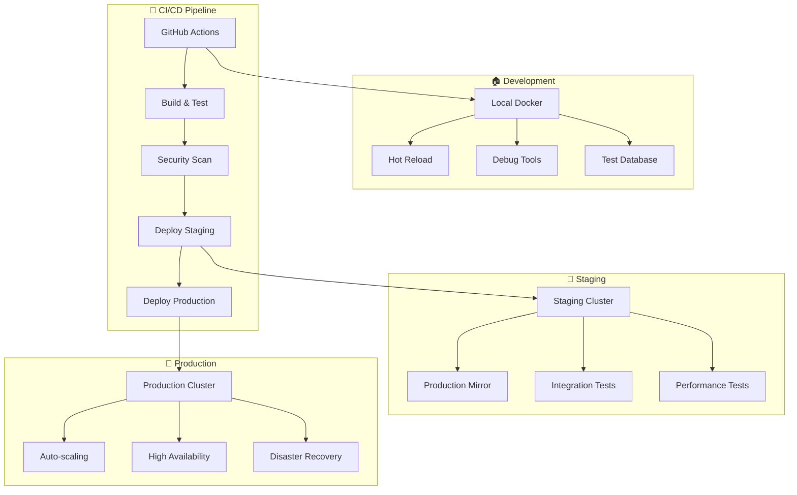

---

## 🔒 **Security Architecture**

### **1. 🛡️ Defense in Depth**

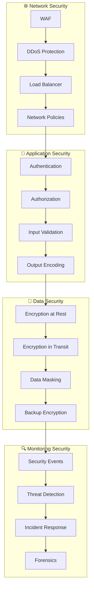

### **2. 🔑 Authentication & Authorization Flow**

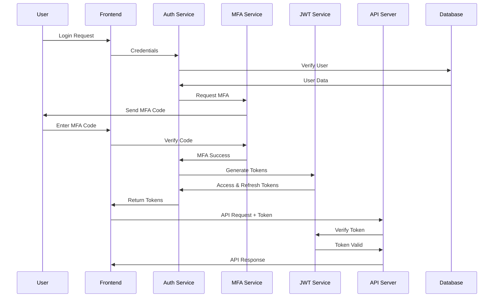

### **3. 🚨 Threat Detection System**

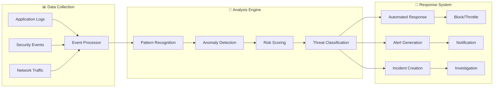

---

## 📊 **Performance Architecture**

### **1. ⚡ Caching Strategy**

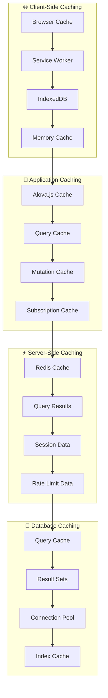

### **2. 📈 Performance Monitoring**

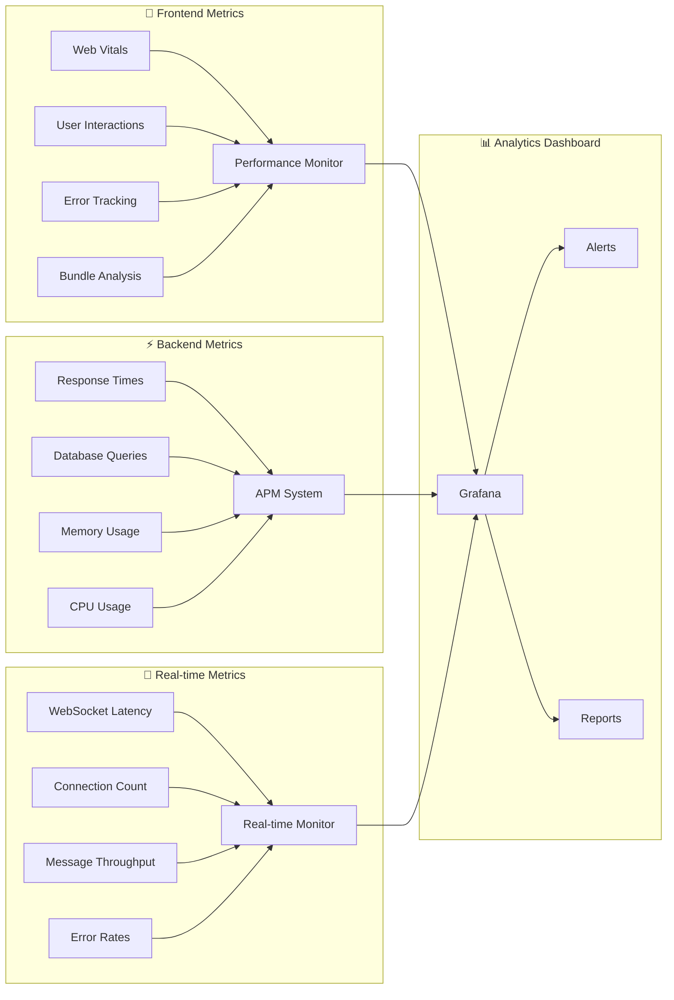

### **3. 🚀 Optimization Pipeline**

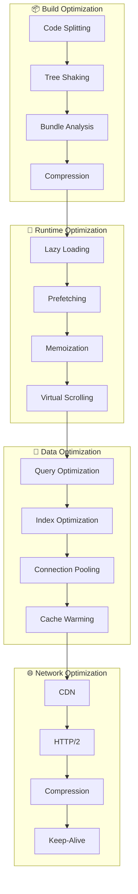

---

## 🤝 **Collaboration Architecture**

### **1. 🔄 Real-time Collaboration System**

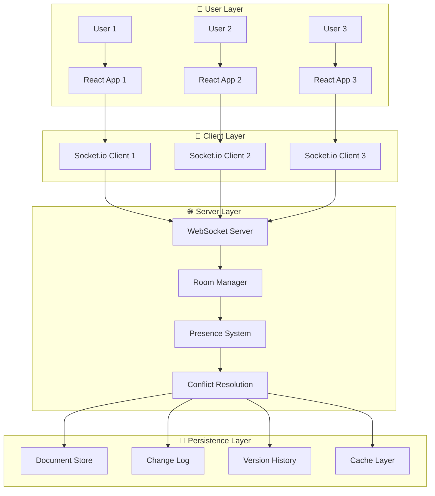

### **2. 📝 Document Collaboration Flow**

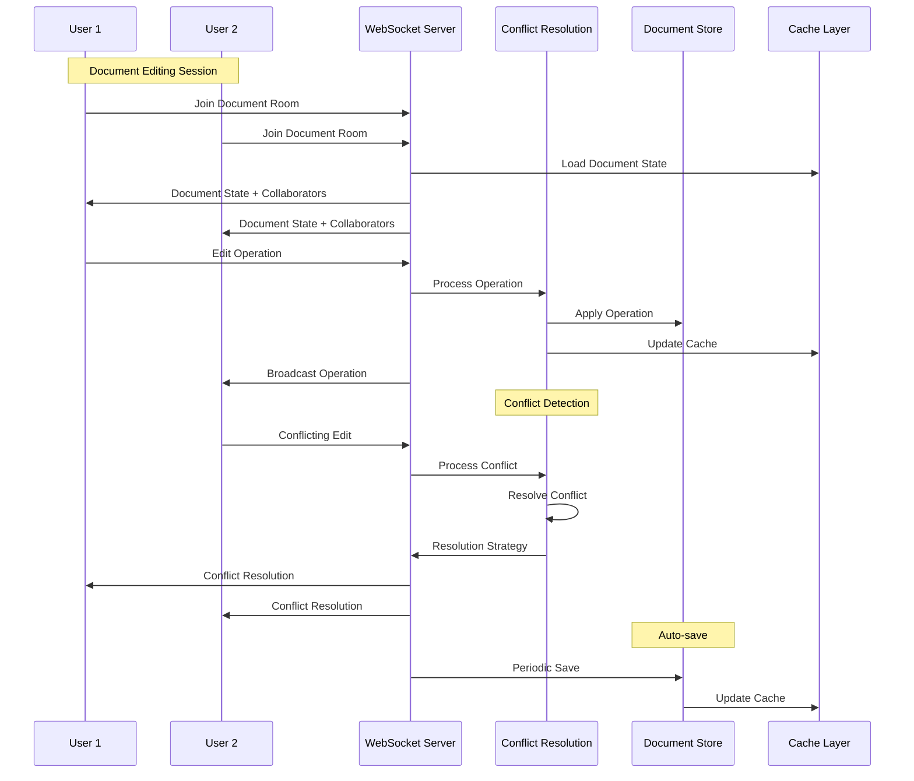

### **3. 🎯 Presence & Awareness System**

```mermaid
graph LR
    subgraph "👤 User Presence"
        A[Active Users] --> B[User Status]
        B --> C[Cursor Position]
        C --> D[Selection Range]
        D --> E[Typing Indicator]
    end
    
    subgraph "🎨 Visual Indicators"
        F[User Avatars] --> G[Colored Cursors]
        G --> H[Selection Highlights]
        H --> I[Activity Badges]
    end
    
    subgraph "📊 Awareness Data"
        J[Document Focus] --> K[Edit History]
        K --> L[Collaboration Stats]
        L --> M[Session Duration]
    end
    
    subgraph "🔄 Real-time Updates"
        N[Presence Events] --> O[State Synchronization]
        O --> P[UI Updates]
        P --> Q[Notification System]
    end
    
    E --> F
    I --> J
    M --> N
```

---

## 🎯 **Architecture Principles**

### **1. 🏗️ Design Principles**

- **Separation of Concerns**: Clear boundaries between layers
- **Single Responsibility**: Each component has one clear purpose
- **Dependency Inversion**: Depend on abstractions, not concretions
- **Open/Closed Principle**: Open for extension, closed for modification
- **Interface Segregation**: Many specific interfaces over one general interface

### **2. 🚀 Performance Principles**

- **Lazy Loading**: Load resources only when needed
- **Caching Strategy**: Multi-tier caching for optimal performance
- **Bundle Optimization**: Minimize bundle size and maximize efficiency
- **Real-time Optimization**: Efficient WebSocket communication
- **Database Optimization**: Query optimization and intelligent indexing

### **3. 🔒 Security Principles**

- **Defense in Depth**: Multiple layers of security
- **Principle of Least Privilege**: Minimal necessary permissions
- **Zero Trust Architecture**: Verify everything, trust nothing
- **Security by Design**: Security considerations from the start
- **Continuous Monitoring**: Real-time threat detection and response

### **4. 📊 Scalability Principles**

- **Horizontal Scaling**: Scale out rather than up
- **Stateless Design**: Stateless components for easy scaling
- **Event-Driven Architecture**: Loose coupling through events
- **Microservices Ready**: Modular design for future decomposition
- **Cloud Native**: Designed for cloud deployment and scaling

---

## 📚 **Related Documentation**

- [🔒 Security Guide](../security/SECURITY_GUIDE.md)
- [🚀 Deployment Guide](../deployment/DEPLOYMENT_GUIDE.md)
- [📊 Performance Guide](../performance/PERFORMANCE_GUIDE.md)
- [🤝 Collaboration Guide](../collaboration/COLLABORATION_GUIDE.md)
- [🧪 Testing Guide](../testing/TESTING_GUIDE.md)

---

**This architecture documentation provides a comprehensive overview of the Laravel Accounting Platform's system design, ensuring scalability, security, and maintainability for enterprise deployment.**
