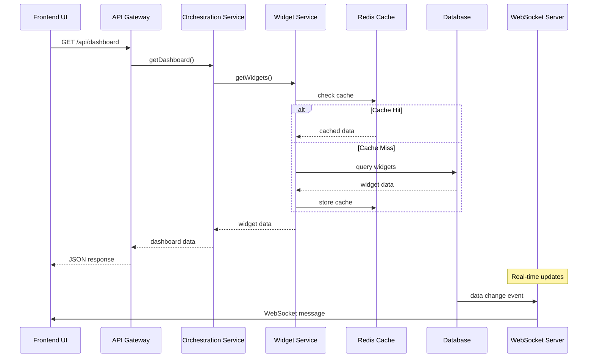
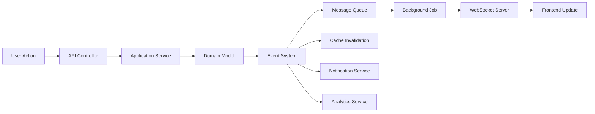

# Dashboard Services Architecture

## Overview

The Dashboard system is built using a layered architecture that separates concerns and provides clear boundaries between different components. This document describes the service architecture and how components interact.

## Architecture Layers

### 1. Frontend Layer

The frontend layer consists of React components and services that handle user interaction and data presentation.

#### Components
- **React Dashboard UI**: Main desktop dashboard interface
- **Mobile Dashboard**: Touch-optimized mobile interface
- **PWA Service Worker**: Offline functionality and caching
- **WebSocket Client**: Real-time data synchronization

#### Key Features
- Responsive design for all screen sizes
- Real-time updates via WebSocket
- Offline support through PWA
- Touch gestures for mobile interaction
- Progressive enhancement

### 2. API Layer

The API layer provides RESTful endpoints and handles HTTP requests, authentication, and rate limiting.

#### Components
- **API Gateway**: Central entry point for all API requests
- **Dashboard API Controller**: Main dashboard operations
- **Widget API Controller**: Widget-specific operations
- **Authentication Middleware**: JWT/Sanctum authentication
- **Rate Limiting**: Request throttling and abuse prevention

#### Responsibilities
- Request routing and validation
- Authentication and authorization
- Rate limiting and security
- Response formatting
- Error handling

### 3. Application Services Layer

The application services layer contains business logic and orchestrates domain operations.

#### Services

##### Widget Management Service
- **Purpose**: Manages widget lifecycle and operations
- **Responsibilities**:
  - Widget creation, update, deletion
  - Widget positioning and ordering
  - Widget activation/deactivation
  - Widget duplication and cloning

##### Widget Rendering Service
- **Purpose**: Handles widget data rendering and visualization
- **Responsibilities**:
  - Data fetching from external services
  - Data transformation and formatting
  - Chart and visualization generation
  - Performance optimization

##### Widget Configuration Service
- **Purpose**: Manages widget configuration and schemas
- **Responsibilities**:
  - Configuration validation
  - Schema management
  - Default configuration handling
  - Configuration migration

##### Dashboard Analytics Service
- **Purpose**: Provides analytics and insights
- **Responsibilities**:
  - Usage tracking and metrics
  - Performance monitoring
  - User behavior analysis
  - Recommendation generation

##### Dashboard Customization Service
- **Purpose**: Handles dashboard personalization
- **Responsibilities**:
  - Layout management
  - Theme and styling
  - User preferences
  - Responsive breakpoints

##### Dashboard Export Service
- **Purpose**: Handles data export and reporting
- **Responsibilities**:
  - PDF generation
  - Excel/CSV export
  - Report generation
  - File management

### 4. Domain Layer

The domain layer contains core business logic and domain models.

#### Components
- **Dashboard Orchestration Service**: Coordinates all dashboard operations
- **Event System**: Handles domain events and notifications
- **Domain Models**: Core business entities and value objects

#### Domain Models
- **DashboardWidget**: Widget entity with configuration
- **DashboardLayout**: Layout and positioning information
- **DashboardPreference**: User preferences and settings
- **WidgetConfiguration**: Widget-specific configuration
- **AnalyticsData**: Usage and performance metrics

### 5. Data Layer

The data layer handles data persistence, caching, and external data access.

#### Components
- **Redis Cache**: High-performance caching
- **PostgreSQL Database**: Primary data storage
- **File Storage**: Document and export storage
- **Search Index**: Full-text search capabilities

#### Data Access Patterns
- **Repository Pattern**: Abstracted data access
- **Unit of Work**: Transaction management
- **Caching Strategy**: Multi-level caching
- **Event Sourcing**: Audit trail and history

### 6. External Services Layer

Integration with external services and APIs.

#### Services
- **Accounting Service**: Financial data integration
- **Budget Service**: Budget and forecast data
- **Reporting Service**: Advanced reporting capabilities
- **Notification Service**: Email and push notifications

### 7. Real-time Layer

Handles real-time communication and background processing.

#### Components
- **WebSocket Server**: Real-time communication
- **Message Queue**: Asynchronous processing
- **Background Jobs**: Scheduled and queued tasks

## Service Interactions

### Data Flow



### Event Flow



## Service Contracts

### Widget Management Service Interface

```typescript
interface WidgetManagementServiceInterface {
  // Widget CRUD operations
  createWidget(data: CreateWidgetRequest): Promise<DashboardWidget>;
  updateWidget(id: number, data: UpdateWidgetRequest): Promise<DashboardWidget>;
  deleteWidget(id: number): Promise<boolean>;
  getWidget(id: number): Promise<DashboardWidget>;
  getWidgets(filters: WidgetFilters): Promise<PaginatedWidgets>;
  
  // Widget operations
  duplicateWidget(id: number, options?: DuplicateOptions): Promise<DashboardWidget>;
  reorderWidgets(order: number[]): Promise<boolean>;
  activateWidget(id: number): Promise<boolean>;
  deactivateWidget(id: number): Promise<boolean>;
}
```

### Widget Rendering Service Interface

```typescript
interface WidgetRenderingServiceInterface {
  // Data rendering
  renderWidget(widget: DashboardWidget): Promise<WidgetRenderResult>;
  refreshWidgetData(id: number): Promise<WidgetData>;
  getWidgetData(id: number, filters?: DataFilters): Promise<WidgetData>;
  
  // Performance optimization
  preloadWidgetData(ids: number[]): Promise<void>;
  cacheWidgetData(id: number, data: WidgetData): Promise<void>;
  invalidateWidgetCache(id: number): Promise<void>;
}
```

### Dashboard Analytics Service Interface

```typescript
interface DashboardAnalyticsServiceInterface {
  // Analytics data
  getUsageMetrics(period: TimePeriod): Promise<UsageMetrics>;
  getPerformanceMetrics(): Promise<PerformanceMetrics>;
  getUserBehaviorAnalytics(userId: number): Promise<BehaviorAnalytics>;
  
  // Insights and recommendations
  generateInsights(data: AnalyticsData): Promise<Insight[]>;
  getWidgetRecommendations(userId: number): Promise<WidgetRecommendation[]>;
  trackUserAction(action: UserAction): Promise<void>;
}
```

## Configuration Management

### Service Configuration

Services are configured through Laravel's service container and configuration files:

```php
// config/dashboard.php
return [
    'services' => [
        'widget_management' => [
            'cache_ttl' => 3600,
            'max_widgets_per_user' => 20,
            'allowed_widget_types' => [
                'financial_summary',
                'revenue_chart',
                'expense_chart',
                'cash_flow',
                'budget_overview',
                'kpi_metrics'
            ]
        ],
        'analytics' => [
            'track_usage' => true,
            'retention_days' => 90,
            'batch_size' => 100
        ],
        'export' => [
            'max_file_size' => '50MB',
            'allowed_formats' => ['pdf', 'excel', 'csv'],
            'storage_path' => 'exports'
        ]
    ]
];
```

### Dependency Injection

Services are registered in the Laravel service provider:

```php
class DashboardServiceProvider extends ServiceProvider
{
    public function register()
    {
        $this->app->bind(
            WidgetManagementServiceInterface::class,
            WidgetManagementService::class
        );
        
        $this->app->bind(
            WidgetRenderingServiceInterface::class,
            WidgetRenderingService::class
        );
        
        $this->app->bind(
            DashboardAnalyticsServiceInterface::class,
            DashboardAnalyticsService::class
        );
    }
}
```

## Error Handling

### Service-Level Error Handling

Each service implements consistent error handling:

```php
class WidgetManagementService implements WidgetManagementServiceInterface
{
    public function createWidget(array $data): DashboardWidget
    {
        try {
            DB::beginTransaction();
            
            $widget = $this->repository->create($data);
            $this->eventDispatcher->dispatch(new WidgetCreated($widget));
            
            DB::commit();
            return $widget;
            
        } catch (ValidationException $e) {
            DB::rollBack();
            throw new WidgetValidationException($e->getMessage());
        } catch (Exception $e) {
            DB::rollBack();
            Log::error('Widget creation failed', ['error' => $e->getMessage()]);
            throw new WidgetCreationException('Failed to create widget');
        }
    }
}
```

### Error Types

- **ValidationException**: Input validation errors
- **AuthorizationException**: Permission denied errors
- **NotFoundException**: Resource not found errors
- **ServiceException**: Service-specific business logic errors
- **SystemException**: System-level errors

## Performance Considerations

### Caching Strategy

- **L1 Cache**: Application-level caching (Redis)
- **L2 Cache**: Database query caching
- **L3 Cache**: CDN and browser caching

### Optimization Techniques

- **Lazy Loading**: Load data only when needed
- **Batch Processing**: Group operations for efficiency
- **Connection Pooling**: Reuse database connections
- **Query Optimization**: Efficient database queries
- **Async Processing**: Background job processing

## Security

### Authentication & Authorization

- **JWT Tokens**: Stateless authentication
- **Role-Based Access**: Permission-based authorization
- **Rate Limiting**: Request throttling
- **Input Validation**: Sanitize all inputs

### Data Protection

- **Encryption**: Sensitive data encryption
- **Audit Logging**: Track all changes
- **Data Masking**: Hide sensitive information
- **Secure Communication**: HTTPS/WSS only

## Monitoring & Observability

### Metrics Collection

- **Performance Metrics**: Response times, throughput
- **Business Metrics**: Widget usage, user engagement
- **System Metrics**: CPU, memory, database performance
- **Error Metrics**: Error rates, failure patterns

### Logging Strategy

- **Structured Logging**: JSON format with context
- **Log Levels**: DEBUG, INFO, WARN, ERROR, FATAL
- **Correlation IDs**: Track requests across services
- **Centralized Logging**: Aggregated log collection

### Health Checks

- **Service Health**: Individual service status
- **Dependency Health**: External service status
- **Database Health**: Connection and query performance
- **Cache Health**: Redis connectivity and performance
