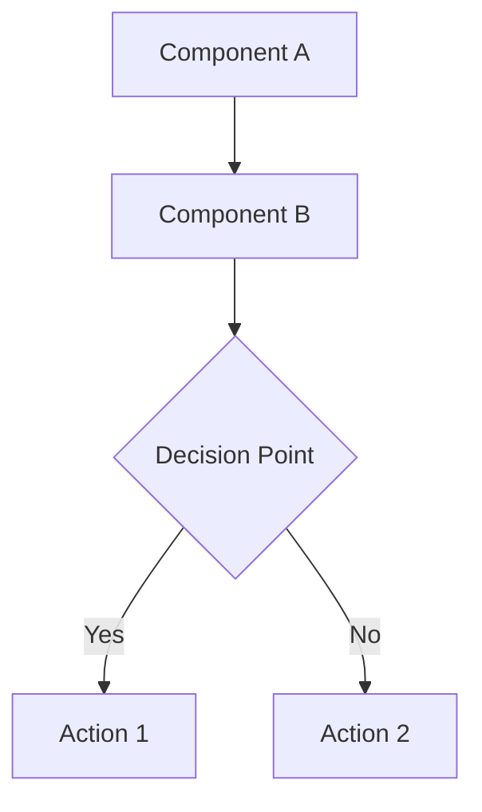

# 📊 Diagram Library

This directory contains all visual documentation for the Laravel Accounting Platform, organized by category and purpose.

## 📁 Diagram Categories

### 🏗️ `/architecture/`
System architecture and component diagrams:
- **system-overview.md** - High-level system architecture
- **component-architecture.md** - Component relationships and dependencies
- **service-layer.md** - Service layer architecture and patterns
- **database-schema.md** - Database structure and relationships

### 🔄 `/data-flow/`
Data flow and process diagrams:
- **user-authentication.md** - Authentication and authorization flows
- **accounting-workflows.md** - Accounting process flows
- **real-time-collaboration.md** - Real-time data synchronization
- **api-request-flow.md** - API request/response patterns

### 🚀 `/deployment/`
Infrastructure and deployment diagrams:
- **kubernetes-architecture.md** - Kubernetes cluster setup
- **ci-cd-pipeline.md** - Continuous integration and deployment
- **monitoring-setup.md** - Monitoring and alerting infrastructure
- **security-architecture.md** - Security layers and controls

### 👥 `/user-flows/`
User experience and interaction flows:
- **onboarding-flow.md** - User registration and setup
- **accounting-workflows.md** - Core accounting user journeys
- **dashboard-navigation.md** - Dashboard and navigation patterns
- **mobile-responsive.md** - Mobile user experience flows

## 🎨 Diagram Standards

### **Mermaid Syntax**
All diagrams use Mermaid syntax for consistency and maintainability:



### **Color Coding**
- **🔵 Blue**: Core system components
- **🟢 Green**: External services and integrations
- **🟡 Yellow**: User interfaces and interactions
- **🔴 Red**: Security and authentication layers
- **🟣 Purple**: Data storage and persistence

### **Naming Conventions**
- Use kebab-case for file names: `user-authentication-flow.md`
- Include descriptive titles and context
- Add creation/update dates in frontmatter
- Include links to related documentation

## 📝 Usage Guidelines

### **Creating New Diagrams**
1. Choose the appropriate category directory
2. Use the diagram template from `/docs/templates/diagram-template.md`
3. Follow the naming conventions above
4. Include proper metadata and context
5. Link to related documentation

### **Updating Existing Diagrams**
1. Update the diagram content
2. Update the "Last Updated" date
3. Add a brief description of changes
4. Update any related documentation links

### **Referencing Diagrams**
When referencing diagrams in other documentation:

```markdown
See the [System Architecture Diagram](../diagrams/architecture/system-overview.md) for a complete overview.
```

## 🔗 Quick Links

### **Most Referenced Diagrams**
- [System Overview](architecture/system-overview.md) - Complete system architecture
- [User Authentication Flow](data-flow/user-authentication.md) - Login and security
- [Accounting Workflows](data-flow/accounting-workflows.md) - Core business processes
- [Deployment Architecture](deployment/kubernetes-architecture.md) - Infrastructure setup

### **Recently Updated**
- [Real-time Collaboration](data-flow/real-time-collaboration.md) - Updated Oct 2024
- [Component Architecture](architecture/component-architecture.md) - Updated Oct 2024
- [CI/CD Pipeline](deployment/ci-cd-pipeline.md) - Updated Oct 2024

---

**Note**: All diagrams are version controlled and changes should be reviewed through the standard PR process. For complex diagrams, consider creating a draft version for review before finalizing.
