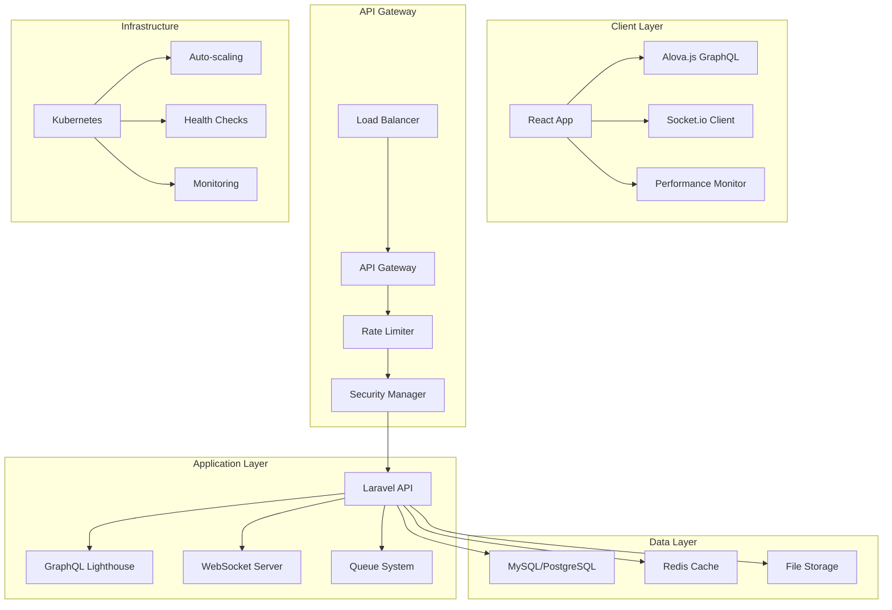

# System Overview Architecture

**Last Updated**: October 2024  
**Category**: Architecture  
**Complexity**: High  

## Overview

This diagram shows the complete system architecture of the Laravel Accounting Platform, including all major components and their relationships across different layers.

## Architecture Diagram

## Component Descriptions

### Client Layer
- **React App**: Frontend application built with React 18 and TypeScript
- **Alova.js GraphQL**: Lightweight GraphQL client for data fetching
- **Socket.io Client**: Real-time communication client
- **Performance Monitor**: Client-side performance tracking and analytics

### API Gateway
- **Load Balancer**: Distributes incoming requests across multiple instances
- **API Gateway**: Central entry point for all API requests
- **Rate Limiter**: Prevents abuse and ensures fair usage
- **Security Manager**: Handles authentication, authorization, and security policies

### Application Layer
- **Laravel API**: Core backend application built with Laravel 10
- **GraphQL Lighthouse**: GraphQL server implementation
- **WebSocket Server**: Real-time communication server
- **Queue System**: Background job processing with Laravel Horizon

### Data Layer
- **MySQL/PostgreSQL**: Primary relational database
- **Redis Cache**: High-performance caching and session storage
- **File Storage**: Document and asset storage system

### Infrastructure
- **Kubernetes**: Container orchestration platform
- **Auto-scaling**: Automatic scaling based on demand
- **Health Checks**: Service health monitoring and recovery
- **Monitoring**: Comprehensive system monitoring with Prometheus/Grafana

## Related Documentation

- [Component Architecture](component-architecture.md) - Detailed component relationships
- [Service Layer Architecture](service-layer.md) - Service layer patterns
- [Deployment Architecture](../deployment/kubernetes-architecture.md) - Infrastructure setup
- [API Documentation](../../api-reference/README.md) - API reference guide

## Technical Specifications

- **Frontend**: React 18, TypeScript, Vite, TailwindCSS
- **Backend**: Laravel 10, PHP 8.2+, GraphQL Lighthouse
- **Database**: MySQL 8.0+ or PostgreSQL 13+
- **Cache**: Redis 6.0+
- **Infrastructure**: Kubernetes 1.24+, Docker
- **Monitoring**: Prometheus, Grafana, Jaeger
