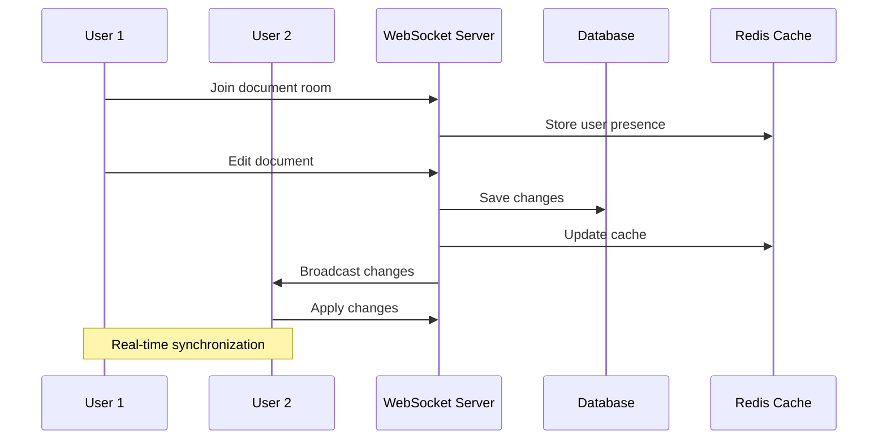

# Real-time Collaboration Flow

**Last Updated**: October 2024  
**Category**: Data Flow  
**Complexity**: Medium  

## Overview

This sequence diagram illustrates the real-time collaboration flow between users, showing how changes are synchronized across multiple clients through WebSocket connections.

## Collaboration Flow Diagram



## Flow Description

### 1. Room Joining
- **User 1** connects to a specific document room via WebSocket
- **WebSocket Server** registers the user's presence in Redis cache
- Other users in the room are notified of the new participant

### 2. Document Editing
- **User 1** makes changes to the document
- Changes are immediately sent to the WebSocket server
- Server validates the changes and user permissions

### 3. Data Persistence
- **WebSocket Server** saves changes to the primary database
- Cache is updated with the latest document state
- Change history is maintained for audit purposes

### 4. Change Broadcasting
- **WebSocket Server** broadcasts changes to all connected users in the room
- **User 2** receives the changes in real-time
- Conflict resolution is handled automatically

### 5. Synchronization
- All users maintain synchronized document state
- Optimistic updates provide immediate feedback
- Server reconciliation ensures data consistency

## Technical Implementation

### WebSocket Events
- `join-room`: User joins a document room
- `leave-room`: User leaves a document room
- `document-change`: Document content changes
- `user-presence`: User presence updates
- `cursor-position`: Real-time cursor tracking

### Conflict Resolution
- **Operational Transformation**: Handles concurrent edits
- **Last-Write-Wins**: Simple conflict resolution for metadata
- **Version Vectors**: Maintains change history and ordering

### Performance Optimizations
- **Debounced Updates**: Reduces server load from rapid changes
- **Delta Compression**: Only sends changed portions
- **Connection Pooling**: Efficient WebSocket connection management

## Related Documentation

- [WebSocket API Reference](../../api-reference/websocket-api.md) - WebSocket event documentation
- [Authentication Flow](user-authentication.md) - User authentication process
- [System Architecture](../architecture/system-overview.md) - Overall system design
- [Performance Monitoring](../deployment/monitoring-setup.md) - Real-time performance tracking

## Configuration

### Redis Configuration
```yaml
redis:
  host: redis-cluster
  port: 6379
  db: 0
  keyspace: collaboration:*
```

### WebSocket Configuration
```yaml
websocket:
  port: 6001
  transports: ['websocket', 'polling']
  cors:
    origin: ['https://app.example.com']
    credentials: true
```

## Monitoring & Analytics

- **Connection Metrics**: Active connections, connection duration
- **Message Throughput**: Messages per second, latency measurements
- **Error Rates**: Connection failures, message delivery failures
- **User Engagement**: Collaboration session duration, active participants
