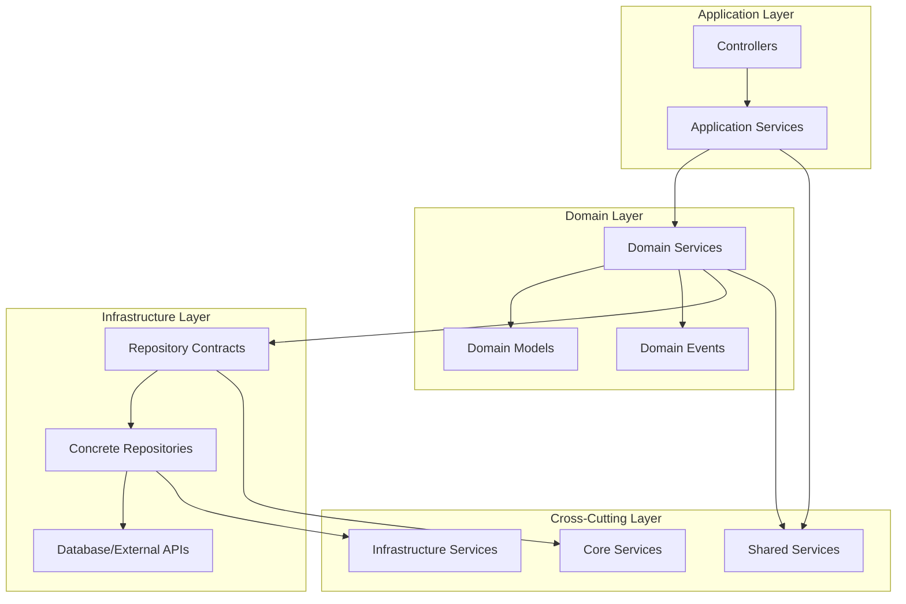

# 🔧 Service Layer Architecture Improvement Plan

## 🎯 Executive Summary

This document outlines a comprehensive plan to simplify, standardize, and unify the service layer architecture of the Laravel Modular Accounting Platform. The current three-tier service organization (Global, Shared, Feature-specific) needs clearer boundaries and consistent patterns to improve maintainability and developer experience.

---

## 📊 Current Service Layer Analysis

### **Current Service Distribution**

#### **Global Services (`app/Services/`)**
```php
AuthService.php                    # 11,846 lines - User authentication
TenantProvisioningService.php      # 15,737 lines - Tenant management  
TenantResolver.php                 # 12,455 lines - Tenant resolution
Core/                              # Core system services
Performance/                       # Performance monitoring services
```

#### **Shared Services (`app/Shared/Services/`)**
```php
// Cross-cutting services used by multiple features
// Currently contains utility and integration services
```

#### **Feature Services (`app/Features/*/Services/`)**
```php
// Accounting Services
AccountingService.php              # 16,264 lines - Core accounting logic
BudgetService.php                  # 15,617 lines - Budget management
ForecastingService.php             # 22,916 lines - Financial forecasting
TaxService.php                     # 14,001 lines - Tax calculations

// Other feature services distributed across modules
```

### **Issues Identified**

1. **Oversized Services**: Some services exceed 20,000 lines (ForecastingService.php)
2. **Unclear Boundaries**: Overlap between global and feature services
3. **Inconsistent Patterns**: Different dependency injection and caching approaches
4. **Tight Coupling**: Services directly accessing models from other features
5. **Missing Abstractions**: No interfaces or contracts for service boundaries

---

## 🏗️ Proposed Service Architecture

### **1. Three-Layer Service Architecture**



### **2. Service Classification Matrix**

| Service Type | Location | Responsibility | Examples |
|--------------|----------|----------------|----------|
| **Core Services** | `app/Services/Core/` | System-wide functionality | Authentication, Authorization, Tenant Management |
| **Infrastructure Services** | `app/Services/Infrastructure/` | External integrations | Email, Storage, Cache, Queue |
| **Shared Services** | `app/Shared/Services/` | Cross-feature utilities | Validation, Formatting, Calculations |
| **Domain Services** | `app/Features/*/Services/` | Business logic | Accounting, Inventory, Reporting |
| **Application Services** | `app/Features/*/Services/Application/` | Use case orchestration | Command handlers, Query handlers |

---

## 🔧 Implementation Plan

### **Phase 1: Service Boundary Definition (Week 1-2)**

#### **1.1 Core Services Restructuring**
```php
// app/Services/Core/
├── AuthenticationService.php      # Core auth logic
├── AuthorizationService.php       # Permission management
├── TenantService.php              # Tenant operations
├── UserService.php                # User management
└── SecurityService.php            # Security utilities

// Responsibilities:
- System-wide authentication and authorization
- Multi-tenant context management
- Core user operations
- Security and compliance features
```

#### **1.2 Infrastructure Services Organization**
```php
// app/Services/Infrastructure/
├── CacheService.php               # Caching operations
├── QueueService.php               # Queue management
├── StorageService.php             # File storage
├── NotificationService.php        # Email/SMS/Push notifications
├── IntegrationService.php         # External API integrations
└── MonitoringService.php          # Performance monitoring

// Responsibilities:
- External system integrations
- Infrastructure concerns
- Cross-cutting technical services
```

#### **1.3 Shared Services Standardization**
```php
// app/Shared/Services/
├── ValidationService.php          # Common validation rules
├── FormattingService.php          # Data formatting utilities
├── CalculationService.php         # Mathematical operations
├── AuditService.php               # Audit logging
├── ReportingService.php           # Cross-feature reporting
└── WorkflowService.php            # Business process workflows

// Responsibilities:
- Utilities used by multiple features
- Common business logic
- Cross-feature operations
```

### **Phase 2: Domain Service Refactoring (Week 3-6)**

#### **2.1 Accounting Services Breakdown**
```php
// Current: Single large service (16,264 lines)
AccountingService.php

// Proposed: Multiple focused services
app/Features/Accounting/Services/
├── Application/
│   ├── AccountManagementService.php      # Account CRUD operations
│   ├── TransactionProcessingService.php  # Transaction handling
│   └── ReportGenerationService.php       # Financial reports
├── Domain/
│   ├── ChartOfAccountsService.php        # COA business logic
│   ├── JournalEntryService.php           # Journal entry rules
│   ├── BalanceCalculationService.php     # Balance calculations
│   └── AuditTrailService.php             # Accounting audit trail
└── Integration/
    ├── TaxIntegrationService.php         # Tax system integration
    ├── BankingIntegrationService.php     # Bank API integration
    └── PayrollIntegrationService.php     # Payroll system integration
```

#### **2.2 Service Size Guidelines**
```php
// Service complexity guidelines:
- Application Services: 200-500 lines (orchestration)
- Domain Services: 300-800 lines (business logic)
- Integration Services: 100-400 lines (external APIs)
- Utility Services: 50-200 lines (helpers)

// If a service exceeds these limits, consider:
1. Breaking into multiple services
2. Extracting helper classes
3. Moving logic to domain models
4. Creating service composition patterns
```

### **Phase 3: Service Contracts & Interfaces (Week 7-8)**

#### **3.1 Service Contracts Definition**
```php
// app/Contracts/Services/
├── Core/
│   ├── AuthenticationServiceInterface.php
│   ├── TenantServiceInterface.php
│   └── UserServiceInterface.php
├── Infrastructure/
│   ├── CacheServiceInterface.php
│   ├── NotificationServiceInterface.php
│   └── StorageServiceInterface.php
└── Features/
    ├── AccountingServiceInterface.php
    ├── InventoryServiceInterface.php
    └── ReportingServiceInterface.php
```

#### **3.2 Dependency Injection Configuration**
```php
// app/Providers/ServiceLayerProvider.php
class ServiceLayerProvider extends ServiceProvider
{
    public function register()
    {
        // Core Services
        $this->app->singleton(
            AuthenticationServiceInterface::class,
            AuthenticationService::class
        );
        
        // Infrastructure Services
        $this->app->singleton(
            CacheServiceInterface::class,
            CacheService::class
        );
        
        // Feature Services
        $this->app->scoped(
            AccountingServiceInterface::class,
            AccountingService::class
        );
    }
}
```

### **Phase 4: Service Communication Patterns (Week 9-10)**

#### **4.1 Event-Driven Communication**
```php
// Instead of direct service calls between features
// Use events for cross-feature communication

// Before: Direct service dependency
class OrderService
{
    public function __construct(
        private InventoryService $inventoryService,
        private AccountingService $accountingService
    ) {}
    
    public function createOrder($data)
    {
        // Direct calls create tight coupling
        $this->inventoryService->reserveStock($data);
        $this->accountingService->createTransaction($data);
    }
}

// After: Event-driven approach
class OrderService
{
    public function createOrder($data)
    {
        $order = Order::create($data);
        
        // Dispatch events instead of direct calls
        event(new OrderCreated($order));
        
        return $order;
    }
}

// Event listeners handle cross-feature operations
class ReserveStockListener
{
    public function handle(OrderCreated $event)
    {
        $this->inventoryService->reserveStock($event->order);
    }
}
```

#### **4.2 Service Bus Pattern**
```php
// app/Services/Core/ServiceBus.php
class ServiceBus
{
    public function dispatch(Command $command): mixed
    {
        $handler = $this->resolveHandler($command);
        return $handler->handle($command);
    }
    
    public function query(Query $query): mixed
    {
        $handler = $this->resolveHandler($query);
        return $handler->handle($query);
    }
}

// Usage in controllers
class AccountingController
{
    public function __construct(private ServiceBus $bus) {}
    
    public function createAccount(Request $request)
    {
        $command = new CreateAccountCommand($request->validated());
        $account = $this->bus->dispatch($command);
        
        return response()->json($account);
    }
}
```

---

## 📋 Service Refactoring Examples

### **Example 1: Breaking Down Large Services**

#### **Before: Monolithic AccountingService**
```php
class AccountingService
{
    // 16,264 lines of mixed responsibilities:
    // - Account management
    // - Transaction processing
    // - Report generation
    // - Tax calculations
    // - Audit logging
    // - Integration with external systems
}
```

#### **After: Focused Services**
```php
// app/Features/Accounting/Services/Application/
class AccountManagementService
{
    public function createAccount(array $data): Account
    {
        // Focused on account CRUD operations
        // 200-300 lines
    }
    
    public function updateAccount(Account $account, array $data): Account
    {
        // Account update logic
    }
}

class TransactionProcessingService
{
    public function processTransaction(array $data): Transaction
    {
        // Focused on transaction processing
        // 300-400 lines
    }
}

class ReportGenerationService
{
    public function generateFinancialReport(array $criteria): Report
    {
        // Focused on report generation
        // 400-500 lines
    }
}
```

### **Example 2: Service Communication Improvement**

#### **Before: Tight Coupling**
```php
class AccountingService
{
    public function __construct(
        private InventoryService $inventoryService,
        private TaxService $taxService,
        private AuditService $auditService
    ) {}
    
    public function processTransaction($data)
    {
        // Direct dependencies create tight coupling
        $inventory = $this->inventoryService->updateStock($data);
        $tax = $this->taxService->calculateTax($data);
        $this->auditService->logTransaction($data);
    }
}
```

#### **After: Loose Coupling with Events**
```php
class TransactionProcessingService
{
    public function processTransaction($data): Transaction
    {
        $transaction = Transaction::create($data);
        
        // Dispatch events for cross-cutting concerns
        event(new TransactionCreated($transaction));
        
        return $transaction;
    }
}

// Separate listeners handle cross-feature operations
class UpdateInventoryListener
{
    public function handle(TransactionCreated $event)
    {
        // Handle inventory updates
    }
}

class CalculateTaxListener
{
    public function handle(TransactionCreated $event)
    {
        // Handle tax calculations
    }
}
```

---

## 🎯 Service Layer Standards

### **1. Service Naming Conventions**
```php
// Application Services (orchestration)
AccountManagementService.php
TransactionProcessingService.php
ReportGenerationService.php

// Domain Services (business logic)
ChartOfAccountsService.php
JournalEntryService.php
BalanceCalculationService.php

// Infrastructure Services (external concerns)
EmailNotificationService.php
FileStorageService.php
CacheManagementService.php

// Integration Services (external APIs)
BankingIntegrationService.php
TaxSystemIntegrationService.php
PayrollIntegrationService.php
```

### **2. Service Method Patterns**
```php
class AccountManagementService
{
    // Command methods (state changes)
    public function createAccount(CreateAccountData $data): Account
    public function updateAccount(Account $account, UpdateAccountData $data): Account
    public function deleteAccount(Account $account): bool
    
    // Query methods (data retrieval)
    public function findAccount(int $id): ?Account
    public function getAccountsByType(string $type): Collection
    public function searchAccounts(SearchCriteria $criteria): Collection
    
    // Business logic methods
    public function calculateAccountBalance(Account $account): Money
    public function validateAccountHierarchy(Account $account): ValidationResult
    public function generateAccountCode(Account $parent): string
}
```

### **3. Error Handling Standards**
```php
class TransactionProcessingService
{
    public function processTransaction(TransactionData $data): Transaction
    {
        try {
            DB::beginTransaction();
            
            $this->validateTransaction($data);
            $transaction = $this->createTransaction($data);
            $this->updateBalances($transaction);
            
            DB::commit();
            
            event(new TransactionProcessed($transaction));
            
            return $transaction;
            
        } catch (ValidationException $e) {
            DB::rollBack();
            throw new TransactionValidationException($e->getMessage());
            
        } catch (Exception $e) {
            DB::rollBack();
            Log::error('Transaction processing failed', [
                'data' => $data,
                'error' => $e->getMessage()
            ]);
            throw new TransactionProcessingException('Failed to process transaction');
        }
    }
}
```

### **4. Caching Patterns**
```php
class ReportGenerationService
{
    public function generateFinancialReport(ReportCriteria $criteria): Report
    {
        $cacheKey = $this->generateCacheKey($criteria);
        
        return Cache::remember($cacheKey, 3600, function () use ($criteria) {
            return $this->buildReport($criteria);
        });
    }
    
    private function generateCacheKey(ReportCriteria $criteria): string
    {
        return sprintf(
            'financial_report_%s_%s_%s',
            $criteria->organizationId,
            $criteria->type,
            md5(serialize($criteria))
        );
    }
}
```

---

## 📊 Migration Timeline

### **Phase 1: Foundation (Weeks 1-2)**
- [ ] Define service boundaries and responsibilities
- [ ] Create service contracts and interfaces
- [ ] Set up dependency injection configuration
- [ ] Document service layer standards

### **Phase 2: Core Services (Weeks 3-4)**
- [ ] Refactor core authentication and authorization services
- [ ] Implement tenant management service improvements
- [ ] Create infrastructure service abstractions
- [ ] Add comprehensive error handling

### **Phase 3: Feature Services (Weeks 5-8)**
- [ ] Break down large accounting services
- [ ] Refactor inventory management services
- [ ] Improve reporting service architecture
- [ ] Implement service communication patterns

### **Phase 4: Integration & Testing (Weeks 9-10)**
- [ ] Implement event-driven communication
- [ ] Add service bus pattern for command/query handling
- [ ] Create comprehensive service tests
- [ ] Performance optimization and monitoring

### **Phase 5: Documentation & Training (Weeks 11-12)**
- [ ] Complete service layer documentation
- [ ] Create developer guidelines
- [ ] Conduct team training sessions
- [ ] Establish code review standards

---

## 🎯 Success Metrics

### **Quantitative Metrics**
- **Service Size Reduction**: Average service size < 500 lines
- **Coupling Reduction**: 80% reduction in direct service dependencies
- **Test Coverage**: 90%+ coverage for all services
- **Performance**: 20% improvement in response times

### **Qualitative Metrics**
- **Developer Experience**: Improved ease of finding and modifying services
- **Code Maintainability**: Easier to understand and modify service logic
- **Feature Development**: Faster implementation of new features
- **Bug Resolution**: Quicker identification and fixing of issues

---

## 🚀 Benefits

### **1. Improved Maintainability**
- Smaller, focused services are easier to understand and modify
- Clear boundaries reduce the risk of unintended side effects
- Better separation of concerns improves code organization

### **2. Enhanced Testability**
- Smaller services are easier to unit test
- Clear interfaces enable better mocking and stubbing
- Reduced dependencies simplify test setup

### **3. Better Scalability**
- Services can be optimized independently
- Clear boundaries enable microservice migration if needed
- Event-driven communication improves system resilience

### **4. Developer Productivity**
- Consistent patterns reduce cognitive load
- Clear service boundaries improve code navigation
- Better abstractions enable faster feature development

---

**Last Updated**: 2024-10-16  
**Status**: Implementation Plan Ready  
**Next Phase**: Team review and approval for Phase 1 implementation

