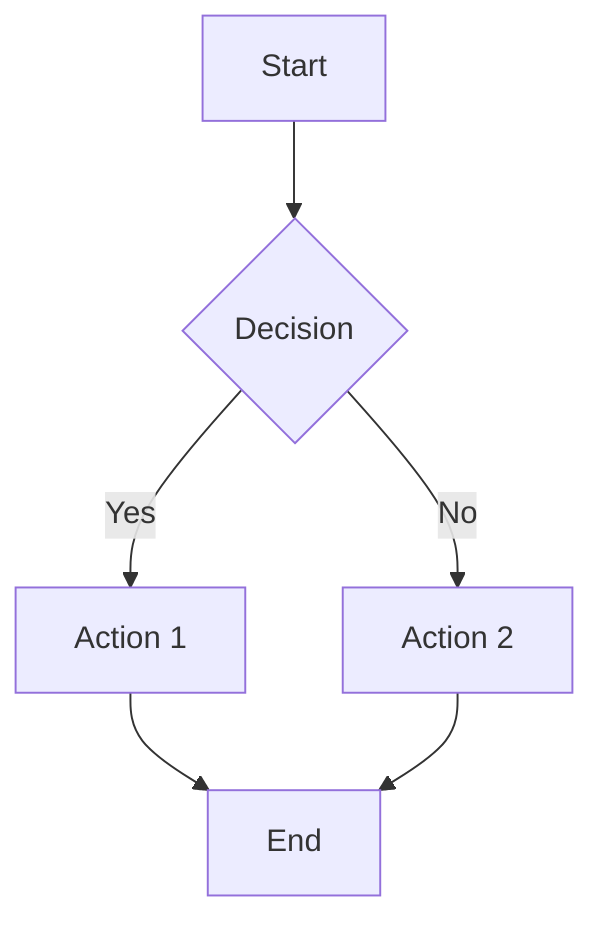

# 📝 Documentation Standards

This document outlines the standards and guidelines for creating and maintaining documentation in the Laravel Accounting Platform project.

## 🎯 Documentation Principles

### **1. User-Centric**
- Write for your audience (users, developers, DevOps)
- Use clear, concise language
- Provide practical examples and use cases
- Include troubleshooting and common issues

### **2. Maintainable**
- Keep documentation close to code when possible
- Use version control for all documentation
- Regular reviews and updates
- Clear ownership and responsibility

### **3. Discoverable**
- Logical information architecture
- Consistent navigation and cross-references
- Search-friendly structure and metadata
- Clear naming conventions

### **4. Accessible**
- Follow web accessibility guidelines
- Use semantic markup
- Provide alternative text for images
- Support screen readers

## 📁 Documentation Structure

### **Directory Organization**
```
docs/
├── user-guide/          # End-user documentation
├── developer-guide/     # Developer documentation
├── api-reference/       # API documentation
├── deployment/          # Deployment and operations
├── security/           # Security documentation
├── diagrams/           # Visual documentation
├── templates/          # Document templates
├── standards/          # Documentation standards
└── troubleshooting/    # Common issues and solutions
```

### **File Naming Conventions**
- Use kebab-case: `user-authentication-guide.md`
- Be descriptive: `kubernetes-deployment-guide.md`
- Include version when needed: `api-v2-migration-guide.md`
- Use consistent prefixes for related docs

## ✍️ Writing Guidelines

### **Document Structure**
Every document should follow this structure:

```markdown
# Document Title

**Last Updated**: Month Year  
**Audience**: [Users|Developers|DevOps|All]  
**Complexity**: [Beginner|Intermediate|Advanced]  

## Overview
Brief description of what this document covers.

## Prerequisites
What the reader needs to know or have before starting.

## Main Content
The core content organized in logical sections.

## Related Documentation
Links to related documents and resources.

## Troubleshooting
Common issues and solutions (if applicable).
```

### **Writing Style**
- **Active voice**: "Configure the database" not "The database should be configured"
- **Present tense**: "The system validates" not "The system will validate"
- **Second person**: "You can configure" not "One can configure"
- **Concise**: Remove unnecessary words and phrases
- **Consistent**: Use the same terms throughout

### **Code Examples**
- Always test code examples before publishing
- Include complete, runnable examples when possible
- Use syntax highlighting with language specification
- Provide context and explanation for code blocks
- Include expected output when relevant

```bash
# Good: Complete example with context
# Install dependencies and start the development server
composer install
php artisan serve

# Expected output:
# Laravel development server started: http://127.0.0.1:8000
```

### **Links and References**
- Use descriptive link text: `[Installation Guide](installation.md)` not `[click here](installation.md)`
- Prefer relative links for internal documentation
- Check links regularly for validity
- Include external link indicators when appropriate

## 🎨 Formatting Standards

### **Headings**
- Use sentence case: "Getting started" not "Getting Started"
- Be descriptive and specific
- Use consistent hierarchy (H1 → H2 → H3)
- Include emoji for visual hierarchy when appropriate

### **Lists**
- Use bullet points for unordered lists
- Use numbers for sequential steps
- Keep list items parallel in structure
- Use consistent punctuation

### **Tables**
- Include headers for all columns
- Keep content concise
- Use consistent alignment
- Include table descriptions when needed

### **Images and Diagrams**
- Include alt text for accessibility
- Use consistent image sizes and formats
- Store images in appropriate directories
- Include captions when helpful

## 📊 Diagram Standards

### **Mermaid Diagrams**
All diagrams should use Mermaid syntax for consistency:



### **Diagram Guidelines**
- Use consistent colors and styling
- Include legends when necessary
- Keep diagrams simple and focused
- Update diagrams when systems change
- Store diagrams in the `/docs/diagrams/` directory

## 🔍 Review Process

### **Documentation Reviews**
All documentation changes should be reviewed for:
- **Accuracy**: Technical correctness
- **Clarity**: Easy to understand
- **Completeness**: Covers all necessary information
- **Consistency**: Follows established standards
- **Accessibility**: Meets accessibility guidelines

### **Review Checklist**
- [ ] Content is accurate and up-to-date
- [ ] Writing follows style guidelines
- [ ] Code examples are tested and working
- [ ] Links are valid and appropriate
- [ ] Images have alt text
- [ ] Document follows template structure
- [ ] Cross-references are updated
- [ ] Spelling and grammar are correct

## 🔧 Tools and Automation

### **Recommended Tools**
- **Markdown Editor**: VS Code with Markdown extensions
- **Link Checker**: markdown-link-check
- **Spell Checker**: cspell
- **Diagram Editor**: Mermaid Live Editor
- **Screenshot Tool**: Consistent screenshot tool for UI documentation

### **Automated Checks**
We use GitHub Actions to automatically:
- Check for broken links
- Validate Markdown syntax
- Spell check content
- Ensure consistent formatting
- Update table of contents

## 📅 Maintenance Schedule

### **Regular Reviews**
- **Monthly**: Review and update frequently accessed documents
- **Quarterly**: Comprehensive review of all documentation
- **Release-based**: Update documentation with each major release
- **As-needed**: Update when features change or issues are reported

### **Deprecation Process**
When deprecating documentation:
1. Mark as deprecated with clear notice
2. Provide migration path to new documentation
3. Set removal date (minimum 6 months)
4. Archive rather than delete when possible

## 📋 Templates

### **Document Templates**
Use these templates for consistency:
- [User Guide Template](../templates/user-guide-template.md)
- [API Documentation Template](../templates/api-doc-template.md)
- [Tutorial Template](../templates/tutorial-template.md)
- [Troubleshooting Template](../templates/troubleshooting-template.md)

### **Pull Request Template**
When submitting documentation changes:
- Use the documentation PR template
- Include screenshots for UI changes
- Test all code examples
- Update related documentation
- Request review from documentation team

## 🎯 Success Metrics

### **Documentation Quality Metrics**
- User feedback and ratings
- Time to complete tasks using documentation
- Support ticket reduction
- Documentation usage analytics
- Community contributions

### **Continuous Improvement**
- Regular user surveys
- Analytics on most/least used documentation
- Feedback collection on each page
- A/B testing for different approaches
- Community feedback integration

---

## 📞 Questions and Support

For questions about documentation standards or help with writing:
- 💬 **Slack**: #documentation channel
- 📧 **Email**: docs@accounting-platform.com
- 🐛 **Issues**: Use the "documentation" label on GitHub issues
- 📖 **Wiki**: Internal documentation wiki for team resources

---

**Remember**: Good documentation is a product feature that enables users to be successful with our platform. Invest the time to make it excellent!
